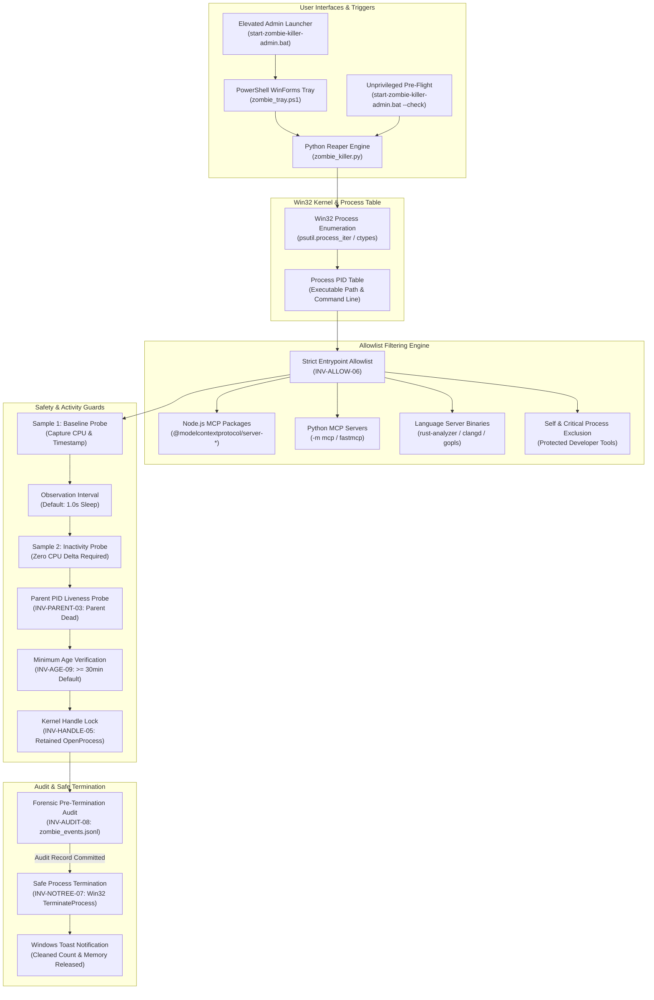
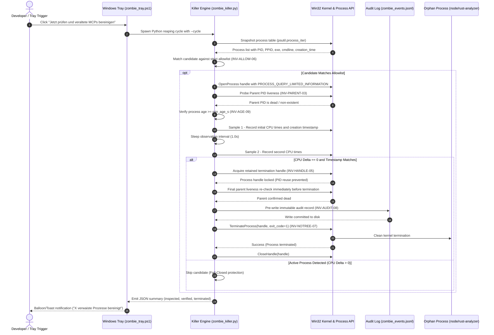

# Zombie Killer Tray


> Conservative Windows system tray utility for safely cleaning up orphaned Model Context Protocol (MCP) and language server processes without blanket process-tree kills.

[](NOTICE)
[](CHANGELOG.md)
[](tests/test_metadata.py)
[](pyproject.toml)
[](#)
[](SECURITY.md)
[](SECURITY.md)
[](SECURITY.md)
[](https://github.com/astral-sh/ruff)
[](LICENSE)
[](THIRD_PARTY_LICENSES.md)
[](https://github.com/dev-bricks)
[](https://github.com/open-bricks)
[](llms.txt)
[](CHANGELOG.md)

[English](README.md) · [Deutsch](README_de.md)

> [!NOTE]
> Machine-readable architecture, invariants, and safety guidelines for AI agents are indexed in [llms.txt](llms.txt).

---

### 🧭 Quick Navigation

- [1. Overview & Problem Statement](#overview--problem-statement)
- [2. System Architecture & Topology](#system-architecture--topology)
- [3. Complete Lifecycle Sequence](#complete-lifecycle-sequence)
- [4. Governance & Runtime Invariants](#governance--runtime-invariants)
- [5. Target Personas & Discoverability](#target-personas--discoverability)
- [6. Comparative Matrix & Alternatives](#comparative-matrix--alternatives)
- [7. Sibling Ecosystem & Partner Tools](#sibling-ecosystem--partner-tools)
- [8. Features & Capabilities](#features--capabilities)
- [9. Windows Tray Interface & User Experience](#windows-tray-interface--ux)
- [10. Requirements & Platform Compatibility](#requirements--platform-compatibility)
- [11. Start & Execution Modes](#start--execution-modes)
- [12. Allowlist Configuration & Reaping Rules](#allowlist-configuration--reaping-rules)
- [13. Audit Logging & Forensic Event Schema](#audit-logging--forensic-event-schema)
- [14. Testing & Quality Assurance](#testing--quality-assurance)
- [15. Security Policy & Privacy Governance](#security-policy--privacy-governance)
- [16. Third-Party Transparency & Level 1 SBOM](#third-party-transparency--level-1-sbom)
- [17. Development, Build & Packaging](#development-build--packaging)
- [18. Statutory Notice (§ 521 BGB) & License Attribution](#statutory-notice--521-bgb--license-attribution)

---

<a id="sec-01"></a><a id="overview--problem-statement"></a><a id="ueberblick--problemstellung"></a><a id="überblick--problemstellung"></a>
## 1. Overview & Problem Statement

When local AI agent frameworks (Claude Code, Codex CLI, Gemini Antigravity, Kimi) or IDEs disconnect or exit abruptly, backend Model Context Protocol (MCP) servers (`node.exe`, `python.exe`) and language servers (`rust-analyzer.exe`, `clangd.exe`, `gopls.exe`, `pylsp`) can linger indefinitely in the background. Over multiple coding turns, these unmanaged processes accumulate silently, consuming gigabytes of system RAM and retaining filesystem locks on active source trees.

Standard administrative cleanup techniques on Windows are fraught with risk:
- Blind PowerShell or cmd one-liners like `taskkill /F /IM node.exe` terminate active development sessions, foreground servers, or web tooling indiscriminately.
- Recursive tree-kills (`taskkill /T`) can wipe out entire terminal sessions or developer IDEs.
- Naive PID inspection is vulnerable to Windows PID-reuse race conditions, where a terminated process's PID is reassigned to an unrelated fresh process before termination commands execute.

`zombie-killer-tray` solves this through a conservative, fail-closed multi-stage verification pipeline. It verifies process incarnation, dead-parent state across distinct time samples, zero CPU activity, and a minimum age grace period (default 30 minutes), and retains a Win32 kernel process handle (`OpenProcess`) to eliminate PID-reuse hazards before any termination syscall is executed.

---

<a id="sec-02"></a><a id="system-architecture--topology"></a><a id="systemarchitektur--topologie"></a>
## 2. System Architecture & Topology



---

<a id="sec-03"></a><a id="complete-lifecycle-sequence"></a><a id="vollstaendiger-ausfuehrungsablauf"></a><a id="vollständiger-ausführungsablauf"></a>
## 3. Complete Lifecycle Sequence



---

<a id="sec-04"></a><a id="governance--runtime-invariants"></a><a id="sicherheitsmodell--governance-invarianten"></a>
## 4. Governance & Runtime Invariants

The application enforces 10 immutable architectural and governance invariants across inspection, verification, and termination:

| Invariant Code | Guarantee Name | Category | Enforcement Mechanism |
|:---|:---|:---|:---|
| **INV-LOCAL-01** | Local-First & Zero Egress | Network Privacy | Pure standard library + `psutil`; zero network sockets; zero telemetry |
| **INV-SEC-02** | Unprivileged Inspection | Security Privilege | `start-zombie-killer-admin.bat --check` and Python CLI inspect without elevation (`RunAsInvoker`) |
| **INV-PARENT-03** | Dead-Parent Verification | Process Safety | Parent PID confirmed dead across multiple samples and prior to kill |
| **INV-STABLE-04** | Two-Sample CPU & Identity Stability | Mutation Safety | Two consecutive snapshots require 0 CPU delta and identical creation time |
| **INV-HANDLE-05** | PID-Reuse Protection via Pinned Handle | Kernel Safety | Retains explicit Win32 `OpenProcess` handle to lock kernel object |
| **INV-ALLOW-06** | Strict Allowlist of Entrypoints | Scope Boundary | Only exact allowlisted MCP servers and language servers can match |
| **INV-NOTREE-07** | No Blanket Tree Kills | Safety Isolation | Individual process handle termination only; no recursive tree kills |
| **INV-AUDIT-08** | Pre-Termination Audit Logging | Auditability | Pre-write event record to `zombie_events.jsonl`; failure aborts termination |
| **INV-AGE-09** | Minimum Process Age Gate | Timing Safety | Conservative minimum age threshold (30 minutes default) protects active work |
| **INV-SLA-10** | Dual Security Response SLA | Governance & Triage | 48h initial response, 5 business days triage codified in `SECURITY.md` |

---

<a id="sec-05"></a><a id="target-personas--discoverability"></a><a id="zielgruppen--auffindbarkeit"></a>
## 5. Target Personas & Discoverability

`zombie-killer-tray` is engineered for four primary developer personas across Windows desktop development:

| Persona | Profile & Intent | Primary Pain Point | Solution & Workflow |
|:---|:---|:---|:---|
| **[PERSONA-01] AI Engineers & Multi-Agent Developers** | Engineers running autonomous agent swarms (Claude Code, Codex CLI, Gemini Antigravity, Kimi). | Abrupt agent exits leave behind dozens of orphaned `node.exe` and `python.exe` MCP servers holding memory and sockets. | Conservative background detection and termination of dead-parent MCP processes without touching active agent sessions. |
| **[PERSONA-02] Windows DevOps & Workstation Reliability Engineers** | SREs managing multi-developer workstations and CI/CD self-hosted runner nodes. | Blanket `taskkill /F` scripts terminate active terminal jobs, background services, or IDEs. | Two-sample CPU verification, pinned kernel handle protection, and deterministic allowlists ensure zero false-positive kills. |
| **[PERSONA-03] Full-Stack Developers & Language Server Users** | Developers writing Rust, C++, Go, or Python in VS Code, Neovim, or JetBrains IDEs. | Lingering `rust-analyzer` or `clangd` binaries hold locks on build directories after IDE close. | Reaping only occurs when the parent editor PID is verified dead and the process CPU activity is completely flat. |
| **[PERSONA-04] Enterprise Security & Compliance Auditors** | Compliance officers requiring local-only software with full audit trails. | Background cleanup utilities bundled with opaque telemetry, cloud uploads, or unverified admin execution. | 100% Zero-Egress (`INV-LOCAL-01`), unprivileged verification (`INV-SEC-02`), local JSONL audit trail, and Level 1 SBOM. |

#### High-Intent Search Queries
- **English (EN):** `windows mcp zombie process killer`, `safe orphaned language server cleanup windows`, `clean orphaned node mcp servers python`, `conservative windows process reaper`, `mcp process hygiene developer tools`, `zombie-killer-tray`
- **Deutsch (DE):** `verwaiste mcp server prozesse beenden windows`, `language server prozesse bereinigen python tray`, `sichere prozesshygiene windows entwickler tools`, `mcp zombie prozesse loeschen windows`, `zombie-killer-tray`

---

<a id="sec-06"></a><a id="comparative-matrix--alternatives"></a><a id="vergleichsmatrix--alternativen"></a>
## 6. Comparative Matrix & Alternatives

| Capability & Dimension | zombie-killer-tray | Windows Task Manager | Ad-Hoc Scripts / taskkill | Generic Cleaners (CCleaner) | Cloud APM / Heavy Telemetry |
|:---|:---|:---|:---|:---|:---|
| **1. Local-First & Zero-Egress (INV-LOCAL-01)** | **Full Guarantee (0 telemetry)** | Offline native tool | Dependent on script | ❌ Bundled cloud telemetry | ❌ Continuous data egress |
| **2. Unprivileged Check Mode (INV-SEC-02)** | **Full Support (RunAsInvoker)** | ⚠️ Often prompts UAC | ⚠️ Requires UAC for kill | ❌ Full admin required | ❌ System service daemon |
| **3. Dead-Parent Verification (INV-PARENT-03)** | **Strict Two-Sample Verification** | ❌ Manual visual check | ❌ Blind name matching | ❌ No parent PID check | ⚠️ Metric only, no gate |
| **4. CPU & Identity Stability (INV-STABLE-04)** | **Two-Sample Zero-Delta Gate** | ❌ None | ❌ None | ❌ None | ⚠️ Rolling average only |
| **5. Retained Kernel Handle Lock (INV-HANDLE-05)** | **Win32 OpenProcess Pin** | ❌ Race-prone PID | ❌ Highly race-prone | ❌ None | ❌ None |
| **6. Strict Entrypoint Allowlist (INV-ALLOW-06)** | **Exact Match & Self-Exclusion** | ❌ Blind terminate | ❌ Regex / name match | ❌ Broad categories | ❌ None |
| **7. No Blanket Process Tree Kills (INV-NOTREE-07)** | **Individual Target Only** | ⚠️ Prompts End Process Tree | ❌ Indiscriminate /T kill | ❌ Blind killing | ❌ N/A |
| **8. Pre-Termination Audit Trail (INV-AUDIT-08)** | **Immutable JSONL Pre-Write** | ❌ None | ❌ Ad-hoc / missing | ❌ Proprietary opaque logs | ⚠️ Cloud-transmitted logs |
| **9. Process Age Grace Window (INV-AGE-09)** | **Configurable 30m Floor** | ❌ None | ❌ None | ❌ None | ❌ None |
| **10. Security SLA & Contract Tests (INV-SLA-10)** | **48h SLA & 100% Green Test Suite** | N/A | ❌ No test harness | ❌ Closed source | ⚠️ Vendor SLA |

---

<a id="sec-07"></a><a id="sibling-ecosystem--partner-tools"></a><a id="geschwister-oekosystem--partner-tools"></a><a id="geschwister-ökosystem--partner-tools"></a>
## 7. Sibling Ecosystem & Partner Tools

`zombie-killer-tray` integrates seamlessly with sibling developer tools across the `dev-bricks`, `ellmos-ai`, and `open-bricks` ecosystems:

| Partner Tool | Organization | Role & Capabilities | Synergies with Zombie Killer Tray |
|:---|:---:|:---|:---|
| **[CareCenter-for-Codex](https://github.com/dev-bricks/CareCenter-for-Codex)** | `dev-bricks` | Windows desktop app maintenance & SQLite optimizer for Codex | Cooperates in cleaning hung desktop processes and orphan MCP backends |
| **[safe-start-for-codex](https://github.com/dev-bricks/safe-start-for-codex)** | `dev-bricks` | Startup gating, launch burst mitigation, and automation pause | Ensures clean startup environments free of conflicting zombie locks |
| **[MethodenAnalyser](https://github.com/dev-bricks/MethodenAnalyser)** | `dev-bricks` | Static AST analysis and method-level complexity analyzer | Provides architectural and contract testing validation for Python code |
| **[ellmos-filecommander-mcp](https://github.com/ellmos-ai/ellmos-filecommander-mcp)** | `ellmos-ai` | Robust local-first filesystem management MCP server | Target MCP server managed and supervised by zombie-killer-tray |
| **[ellmos-codecommander-mcp](https://github.com/ellmos-ai/ellmos-codecommander-mcp)** | `ellmos-ai` | Code refactoring, formatting, and structural editing MCP | Target MCP server kept free of lingering orphaned instances |
| **[ellmos-controlcenter-mcp](https://github.com/ellmos-ai/ellmos-controlcenter-mcp)** | `ellmos-ai` | Multi-agent control center, bundle router, and governance hub | Coordinates agent work sessions and monitors tool process boundaries |
| **[n8n-manager-mcp](https://github.com/ellmos-ai/n8n-manager-mcp)** | `ellmos-ai` | Local workflow automation manager and n8n runner integration | Supervises workflow execution processes on developer workstations |
| **[CloudLockFixer](https://github.com/file-bricks/CloudLockFixer)** | `file-bricks` | Multi-host cloud synchronization unlocker & conflict resolver | Shares file lock defense discipline and conflict copy prevention |
| **[DokuZen](https://github.com/doc-bricks/DokuZen)** | `doc-bricks` | Local-first document OCR, PDF redaction, and batch processing | Desktop companion tool benefiting from zero-egress process isolation |

---

<a id="sec-08"></a><a id="features--capabilities"></a><a id="kernfunktionen--faehigkeiten"></a><a id="kernfunktionen--fähigkeiten"></a>
## 8. Features & Capabilities

- **Win32 Retained Process Handle Pinning (`INV-HANDLE-05`):** Acquires an explicit `OpenProcess` handle on candidate processes before sampling. The handle pins the underlying kernel object, eliminating PID-reuse race conditions.
- **Two-Sample CPU & Identity Stability (`INV-STABLE-04`):** Takes two distinct measurements across an observation window (default: 1.0 second). If the candidate process registers any CPU time increase or changes creation time, it is discarded immediately.
- **Dead-Parent Verification (`INV-PARENT-03`):** Validates that the recorded parent PID no longer exists in the OS process table in both samples and re-verifies immediately before calling `TerminateProcess`.
- **Pre-Termination Audit Record (`INV-AUDIT-08`):** Writes an immutable JSON record to `zombie_events.jsonl` prior to termination. If the audit log cannot be written (disk full or permission error), termination is aborted fail-closed.
- **Minimum Age Grace Period (`INV-AGE-09`):** Processes must be at least 30 minutes old (`min_age_s = 1800`) before becoming eligible for reaping, ensuring newly started compilation or indexing tasks are never disrupted.
- **Unprivileged Pre-Flight Mode (`INV-SEC-02`):** Run pre-flight health checks and process scans using `start-zombie-killer-admin.bat --check` without triggering Windows UAC elevation prompts (`RunAsInvoker`).
- **Zero-Egress Guarantee (`INV-LOCAL-01`):** Complete execution boundary is contained within the local workstation. No external network connections, analytics, or telemetry.

---

<a id="sec-09"></a><a id="windows-tray-interface--ux"></a><a id="windows-tray-bedienoberflaeche--benutzererlebnis"></a><a id="windows-tray-bedienoberfläche--benutzererlebnis"></a>
## 9. Windows Tray Interface & User Experience

The tray user interface is built on PowerShell WinForms (`System.Windows.Forms.NotifyIcon`), providing a native, lightweight footprint without requiring heavy browser or web view dependencies:

- **Notification Area Icon:** Sits unobtrusively in the Windows system tray notification area.
- **Single-Click / Double-Click Action:** Triggers an immediate inspection and safe cleanup cycle.
- **Context Menu:**
  - **Jetzt prüfen und veraltete MCPs bereinigen:** Manual trigger for instant orphan detection. Available regardless of the Automatik state below.
  - **Automatik (checkbox) + Intervall submenu:** Toggles a continuous background reap worker on/off and picks its check interval — 5/10/20/30/60 min, 3/5/10/15/20 h, or 24 h (daily); default 30 min. Automatik off means no background worker runs at all — only the manual item above ever reaps.
  - **Mindestwartezeit submenu:** How long a candidate process must already have been orphaned (`zombie_killer.py`'s `--min-age`) before it becomes eligible for termination — 5/10/15/30/60 min or 2/6/12/24 h; default 30 min (unchanged from the prior hardcoded value). Both choices persist locally (`zombie_state.json`, gitignored, next to the scripts) and survive a tray restart; the hard floor in `zombie_killer.py` itself (`min_age >= 30s`, `interval >= 3s`) is unaffected — this menu only narrows the offered range.
  - **Protokoll anzeigen:** Opens the local audit log (`zombie_events.jsonl`) in the default editor.
  - **Beenden:** Gracefully shuts down the tray process without terminating any managed child processes.
- **Windows Balloon / Toast Notifications:** Displays clear, non-intrusive feedback indicating the number of cleaned processes and freed resources.

---

<a id="sec-10"></a><a id="requirements--platform-compatibility"></a><a id="voraussetzungen--plattform-kompatibilitaet"></a><a id="voraussetzungen--plattform-kompatibilität"></a>
## 10. Requirements & Platform Compatibility

- **Operating System:** Microsoft Windows 10 (64-bit) or Windows 11 (64-bit).
- **Python Runtime:** Python 3.12 or 3.13 (pure standard library + `psutil`).
- **PowerShell:** Windows PowerShell 5.1 (built into Windows) or PowerShell 7+ (`pwsh`).
- **Permissions:**
  - Elevated Administrator mode for background process termination across user sessions (`start-zombie-killer-admin.bat`).
  - Standard User mode (`RunAsInvoker`) for pre-flight testing and syntax inspection (`start-zombie-killer-admin.bat --check`).

---

<a id="sec-11"></a><a id="start--execution-modes"></a><a id="start--ausfuehrungsmodi"></a><a id="start--ausführungsmodi"></a>
## 11. Start & Execution Modes

### 1. Elevated Tray Mode (Recommended for Daily Operation)

Double-click `start-zombie-killer-admin.bat`. Windows requests UAC elevation, and the tray starts minimized in the notification area:

```bat
start-zombie-killer-admin.bat
```

### 2. Unprivileged Pre-Flight Mode (`RunAsInvoker`)

Run environment checks, verify allowlists, and test process table enumeration without requesting elevation:

```bat
start-zombie-killer-admin.bat --check
```

### 3. Direct Python CLI Inspection

Run the core engine directly from PowerShell:

```powershell
# Inspect candidates without terminating (read-only audit)
python zombie_killer.py --list

# Run a single conservative cleanup cycle
python zombie_killer.py --cycle

# Run with custom minimum age threshold (e.g. 15 minutes)
python zombie_killer.py --cycle --min-age 900
```

---

<a id="sec-12"></a><a id="allowlist-configuration--reaping-rules"></a><a id="allowlist-konfiguration--reaping-regeln"></a>
## 12. Allowlist Configuration & Reaping Rules

Candidate processes must match strict entrypoint criteria in `zombie_killer.py`:

```python
# Language Server Executables
LSP_BINARIES = {
    "rust-analyzer.exe",
    "clangd.exe",
    "gopls.exe",
    "pylsp.exe",
    "pyright-langserver.exe",
}

# Node.js MCP Server Modules
NODE_MCP_INDICATORS = {
    "@modelcontextprotocol/server-",
    "mcp-server-",
    "server-filesystem",
    "server-memory",
    "server-sequential-thinking",
}

# Python MCP Server Packages
PYTHON_MCP_MODULES = {
    "mcp",
    "fastmcp",
    "mcp_server",
}
```

Critical processes (such as Windows system processes, active shell sessions, explorer.exe, and the killer's own process hierarchy) are explicitly excluded by design.

---

<a id="sec-13"></a><a id="audit-logging--forensic-event-schema"></a><a id="audit-protokollierung--forensisches-ereignis-schema"></a>
## 13. Audit Logging & Forensic Event Schema

Audit events are appended to `zombie_events.jsonl` (gitignored for privacy). Each record adheres to the following structured schema:

```json
{
  "timestamp": "2026-09-23T14:00:00+02:00",
  "action": "terminate",
  "pid": 14208,
  "ppid": 8192,
  "parent_dead": true,
  "name": "node.exe",
  "cmdline": ["node.exe", "C:\\Users\\User\\AppData\\Roaming\\npm\\node_modules\\@modelcontextprotocol\\server-filesystem\\dist\\index.js"],
  "create_time": 1758620000.0,
  "age_seconds": 3600.0,
  "cpu_delta": 0.0,
  "handle_locked": true,
  "status": "success"
}
```

If the audit log cannot be written, the termination syscall is aborted fail-closed (`INV-AUDIT-08`).

---

<a id="sec-14"></a><a id="testing--quality-assurance"></a><a id="tests--qualitaetssicherung"></a><a id="tests--qualitätssicherung"></a>
## 14. Testing & Quality Assurance

The codebase is protected by automated unit and contract test suites:

```powershell
# Run the complete test suite via pytest
python -m pytest -ra -v

# Run unit tests directly via unittest
python -m unittest -v test_zombie_killer
python -m unittest -v tests/test_metadata.py

# Run static analysis and linting via ruff
ruff check .

# Verify bytecode compilation
python -m compileall -q .
```

---

<a id="sec-15"></a><a id="security-policy--privacy-governance"></a><a id="sicherheitsrichtlinie--datenschutz-governance"></a>
## 15. Security Policy & Privacy Governance

`zombie-killer-tray` operates under a zero-trust, privacy-first model:
- **Zero Egress (`INV-LOCAL-01`):** No network requests or telemetry.
- **Security Response SLA (`INV-SLA-10`):** 48-hour response acknowledgement and 5-business-day triage commitment.
- **Reporting:** Security vulnerabilities should be reported directly to `security@dev-bricks.org` and `security@open-bricks.org` in accordance with [SECURITY.md](SECURITY.md).

---

<a id="sec-16"></a><a id="third-party-transparency--level-1-sbom"></a><a id="drittanbieter-transparenz--level-1-sbom"></a>
## 16. Third-Party Transparency & Level 1 SBOM

All runtime and development dependencies are 100% permissive open-source software (MIT, Apache-2.0, PSFL-2.0, BSD-3-Clause) with zero copyleft. Complete dependency inventory, license texts, and the Invariant Cross-Reference Matrix are documented in [THIRD_PARTY_LICENSES.md](THIRD_PARTY_LICENSES.md).

Attribution notices for Lukas Geiger, `dev-bricks`, and the `open-bricks` umbrella ecosystem are codified in [NOTICE](NOTICE).

---

<a id="sec-17"></a><a id="development-build--packaging"></a><a id="entwicklung-build--packaging"></a>
## 17. Development, Build & Packaging

The repository utilizes modern PEP 517/621 packaging standards configured via `pyproject.toml` and built with Hatchling:

```powershell
# Install development dependencies
pip install -e .[dev]

# Build distributable source and wheel packages
python -m build
```

---

<a id="sec-18"></a><a id="statutory-notice--521-bgb--license-attribution"></a><a id="gesetzlicher-hinweis--521-bgb--lizenz-attribution"></a>
## 18. Statutory Notice (§ 521 BGB) & License Attribution

### Statutory Liability Limitation (§ 521 BGB - Gefälligkeitsrecht)

This software and its associated automation harnesses are provided free of charge without commercial consideration. In accordance with statutory German law (§ 521 BGB - *Gefälligkeitsrecht*), liability for defects in quality and title is strictly limited to fraudulent concealment, gross negligence, or intentional misconduct. The software is provided "as is", without warranty of any kind, express or implied.

### License & Attribution

Distributed under the terms of the [MIT License](LICENSE). Copyright © 2026 Lukas Geiger, dev-bricks, and open-bricks umbrella ecosystem.
