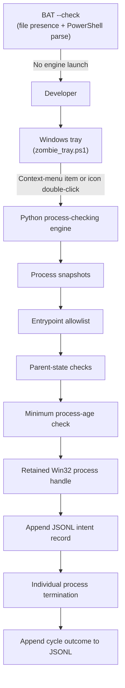
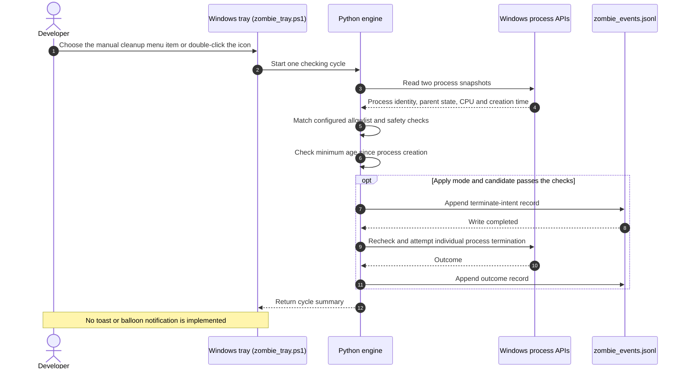

# Zombie Killer Tray

> Conservative Windows system tray utility for checking and optionally cleaning selected orphaned Model Context Protocol (MCP) and language server processes without blanket process-tree kills.

[](NOTICE)
[](CHANGELOG.md)
[](https://github.com/dev-bricks/zombie-killer-tray/actions/workflows/tests.yml)
[](pyproject.toml)
[](#)
[](https://github.com/astral-sh/ruff)
[](LICENSE)
[](THIRD_PARTY_LICENSES.md)
[](https://github.com/dev-bricks)
[](https://github.com/open-bricks)
[](llms.txt)
[](CHANGELOG.md)
[](CHANGELOG.md)

[English](README.md) · [Deutsch](README_de.md) · [Español](README_es.md) · [简体中文](README_zh.md) · [日本語](README_ja.md) · [Русский](README_ru.md)

> [!NOTE]
> Machine-readable project behavior, setup, and boundary notes for AI agents are indexed in [llms.txt](llms.txt).

---

### 🧭 Quick Navigation

- [1. Overview & Problem Statement](#overview--problem-statement)
- [2. System Architecture & Topology](#system-architecture--topology)
- [3. Complete Lifecycle Sequence](#complete-lifecycle-sequence)
- [4. Documented Runtime Safeguards](#governance--runtime-invariants)
- [5. Target Users & Discoverability](#target-personas--discoverability)
- [6. Scope & Alternatives](#comparative-matrix--alternatives)
- [7. Related Projects](#sibling-ecosystem--partner-tools)
- [8. Features & Capabilities](#features--capabilities)
- [9. Windows Tray Interface & User Experience](#windows-tray-interface--ux)
- [10. Requirements & Platform Compatibility](#requirements--platform-compatibility)
- [11. Start & Execution Modes](#start--execution-modes)
- [12. Allowlist & Candidate Rules](#allowlist-configuration--reaping-rules)
- [13. Audit Logging & Event Shape](#audit-logging--forensic-event-schema)
- [14. Testing & Quality Assurance](#testing--quality-assurance)
- [15. Security Policy & Privacy](#security-policy--privacy-governance)
- [16. Third-Party Dependency Licenses](#third-party-transparency--level-1-sbom)
- [17. Development, Build & Packaging](#development-build--packaging)
- [18. License & Attribution](#statutory-notice--521-bgb--license-attribution)

---

<a id="sec-01"></a><a id="overview--problem-statement"></a><a id="ueberblick--problemstellung"></a><a id="überblick--problemstellung"></a>
## 1. Overview & Problem Statement

When local AI agent frameworks (Claude Code, Codex CLI, Gemini Antigravity, Kimi) or IDEs disconnect or exit abruptly, backend Model Context Protocol (MCP) servers (`node.exe`, `python.exe`) and language servers (`rust-analyzer.exe`, `clangd.exe`, `gopls.exe`, `pylsp`) can linger indefinitely in the background. Over multiple coding turns, these unmanaged processes accumulate silently, consuming gigabytes of system RAM and retaining filesystem locks on active source trees.

Standard administrative cleanup techniques on Windows are fraught with risk:
- Blind PowerShell or cmd one-liners like `taskkill /F /IM node.exe` terminate active development sessions, foreground servers, or web tooling indiscriminately.
- Recursive tree-kills (`taskkill /T`) can wipe out entire terminal sessions or developer IDEs.
- Naive PID inspection is vulnerable to Windows PID-reuse race conditions, where a terminated process's PID is reassigned to an unrelated fresh process before termination commands execute.

`zombie-killer-tray` solves this through a conservative multi-stage verification pipeline. It compares process identity, parent state across observations, CPU time, and a minimum age from process creation (default 30 minutes). The Windows engine retains a process handle through its checks and termination path, which helps avoid acting on a different process after PID reuse.

---

<a id="sec-02"></a><a id="system-architecture--topology"></a><a id="systemarchitektur--topologie"></a>
## 2. System Architecture & Topology

The tray and Python engine inspect a narrow set of candidate processes. The `--check` launcher option only checks that the tray script exists and parses as PowerShell; it does not start the engine or inspect processes.



The retained process handle helps keep verification and the termination attempt attached to the same process object. The project does not claim that this removes every possible operating-system race.

<a id="sec-03"></a><a id="complete-lifecycle-sequence"></a><a id="vollstaendiger-ausfuehrungsablauf"></a><a id="vollständiger-ausführungsablauf"></a>
## 3. Complete Lifecycle Sequence



The engine skips a candidate when a required check fails. The age threshold is measured from process creation time, not from the time its parent exited. In apply mode, failure to append the pre-termination intent record prevents the termination attempt. JSONL records are ordinary append writes and can be edited.

<a id="sec-04"></a><a id="governance--runtime-invariants"></a><a id="sicherheitsmodell--governance-invarianten"></a>
## 4. Documented Runtime Safeguards

The table describes behavior visible in the current source. These implementation notes are not a certification, an operating-system sandbox, or a guarantee against every failure.

| Label | Current behavior | Boundary |
|:---|:---|:---|
| **INV-LOCAL-01** | The reviewed first-party process-checking and tray source contains no outbound network request code. | This is not an OS-level network block or an independent guarantee about every dependency or host. |
| **INV-SEC-02** | `start-zombie-killer-admin.bat --check` checks the tray file and asks PowerShell to parse it. | It does not scan processes, validate Python, or lower the caller's security token. |
| **INV-PARENT-03** | Parent state is sampled and checked again before an apply attempt. | A failed or incomplete check skips the candidate. |
| **INV-STABLE-04** | The engine compares two process observations, including process identity and CPU time. | This narrows eligibility but does not establish risk-free behavior. |
| **INV-HANDLE-05** | The Windows engine retains a process handle during its checks and termination path. | This helps avoid targeting a reused PID; it is not described as eliminating every race. |
| **INV-ALLOW-06** | Candidate matching uses a limited set of configured MCP and language-server entrypoints. | The allowlist is not a general process manager. |
| **INV-NOTREE-07** | The engine attempts to terminate an individual selected process, not a recursive process tree. | It does not make every process eligible or guarantee success. |
| **INV-AUDIT-08** | In apply mode, an intent record is appended before the termination attempt; a failed intent write aborts that attempt. | The JSONL file is an ordinary local append log and should not be treated as tamper-evident. |
| **INV-AGE-09** | A minimum age from process creation is required; the default is 1,800 seconds (30 minutes), subject to supported settings. | It does not measure time since orphaning. |
| **Response timing** | Security reporting details are listed in `SECURITY.md`. | No response or triage time is promised. |

<a id="sec-05"></a><a id="target-personas--discoverability"></a><a id="zielgruppen--auffindbarkeit"></a>
## 5. Target Users & Discoverability

`zombie-killer-tray` is a Windows utility for developers who want a narrow, repeated check of selected MCP and language-server processes.

| User context | Typical concern | What this project does |
|:---|:---|:---|
| **AI and multi-agent developers** | An abruptly closed client may leave a matching backend process running. | Checks selected entrypoints and requires the configured process and parent-state conditions before an apply attempt. |
| **Windows workstation maintainers** | Broad name-based cleanup can target unrelated work. | Limits candidates with an allowlist and checks multiple observations. |
| **Language-server users** | A server may remain after its editor closes. | Checks parent state and minimum process age; it does not infer the time the process became orphaned. |
| **Developers reviewing local process data** | Process logs can reveal command-line arguments and local paths. | Writes local JSONL audit records; users should protect and inspect those files as needed. |

#### Search terms
- **English (EN):** `windows mcp process cleanup`, `orphaned language server windows`, `node mcp server cleanup`, `zombie-killer-tray`
- **German (DE):** `Windows-MCP-Prozesse prüfen`, `verwaiste Sprachserver unter Windows`, `MCP- und Sprachserverprozesse bereinigen`

<a id="sec-06"></a><a id="comparative-matrix--alternatives"></a><a id="vergleichsmatrix--alternativen"></a>
## 6. Scope & Alternatives

This project covers one narrow workflow: checking a configured set of Windows MCP and language-server candidates, then optionally attempting individual termination after its checks. Built-in process tools support manual inspection and operator-directed actions. Custom scripts vary by their own matching and safety logic. This README does not make performance, privacy, safety, or feature claims about third-party products.

<a id="sec-07"></a><a id="sibling-ecosystem--partner-tools"></a><a id="geschwister-oekosystem--partner-tools"></a><a id="geschwister-ökosystem--partner-tools"></a>
## 7. Related Projects

The following links identify projects in related developer organizations. Their listing does not imply a technical integration or shared runtime.

- [CareCenter-for-Codex](https://github.com/dev-bricks/CareCenter-for-Codex) - `dev-bricks`
- [safe-start-for-codex](https://github.com/dev-bricks/safe-start-for-codex) - `dev-bricks`
- [MethodenAnalyser](https://github.com/dev-bricks/MethodenAnalyser) - `dev-bricks`
- [ellmos-filecommander-mcp](https://github.com/ellmos-ai/ellmos-filecommander-mcp) - `ellmos-ai`
- [ellmos-codecommander-mcp](https://github.com/ellmos-ai/ellmos-codecommander-mcp) - `ellmos-ai`
- [ellmos-controlcenter-mcp](https://github.com/ellmos-ai/ellmos-controlcenter-mcp) - `ellmos-ai`
- [n8n-manager-mcp](https://github.com/ellmos-ai/n8n-manager-mcp) - `ellmos-ai`
- [CloudLockFixer](https://github.com/file-bricks/CloudLockFixer) - `file-bricks`
- [DokuZen](https://github.com/doc-bricks/DokuZen) - `doc-bricks`

<a id="sec-08"></a><a id="features--capabilities"></a><a id="kernfunktionen--faehigkeiten"></a><a id="kernfunktionen--fähigkeiten"></a>
## 8. Features & Capabilities

- **Process-handle checks (INV-HANDLE-05):** The Windows engine retains a process handle through its checks and termination path. This helps keep the operation attached to the observed process object; it is not a claim that all operating-system races are impossible.
- **Two observations (INV-STABLE-04):** The engine compares process identity and CPU time across observations separated by a wait. A candidate that changes or does not pass the checks is skipped.
- **Parent-state checks (INV-PARENT-03):** Parent state is checked during the cycle and before an apply attempt.
- **Local JSONL records (INV-AUDIT-08):** Apply mode appends a termination-intent record before the attempt and then records an outcome. If the intent write fails, that attempt is aborted. The log can be edited.
- **Minimum process age (INV-AGE-09):** A candidate must meet the configured age since process creation. The default is 1,800 seconds (30 minutes); the interface offers a finite set of choices.
- **Launcher syntax check:** `start-zombie-killer-admin.bat --check` checks for the tray script and parses it with PowerShell. It does not run the Python engine or inspect the process table.
- **Network behavior:** The reviewed first-party process and tray code has no outbound request path. The program does not install an operating-system network block, and this README does not claim an operating-system-enforced network boundary.

<a id="sec-09"></a><a id="windows-tray-interface--ux"></a><a id="windows-tray-bedienoberflaeche--benutzererlebnis"></a><a id="windows-tray-bedienoberfläche--benutzererlebnis"></a>
## 9. Windows Tray Interface & User Experience

The tray uses PowerShell WinForms and a Windows notification-area icon.

- **Manual cleanup:** The context menu has a manual cleanup command. Double-clicking the tray icon also starts a manual cycle; a single click does not.
- **Context menu:** The menu provides automatic checking, interval choices, minimum-age choices, language selection, opening the local log, and quitting the tray.
- **Six interface languages:** The tray menu, tooltip, and selector support English, German, Spanish, Simplified Chinese, Japanese, and Russian. Initial selection follows the Windows UI culture with English as a fallback. The selected language is stored in `zombie_state.json`; technical logs remain in English.
- **Intervals:** The menu offers 5/10/20/30/60 minutes, 3/5/10/15/20 hours, or 24 hours; the default interval is 30 minutes.
- **Minimum age:** The menu offers 5/10/15/30/60 minutes or 2/6/12/24 hours; the default is 30 minutes. The engine's lower bounds remain 30 seconds for minimum age and 3 seconds for interval; the menu presents its supported choices.
- **Notifications:** The current tray behavior uses its icon, tooltip, and context menu; balloon and toast notifications are not implemented.
- **Quit:** Quitting closes the tray and stops its owned background worker. It does not send a termination command to candidate processes.

<a id="sec-10"></a><a id="requirements--platform-compatibility"></a><a id="voraussetzungen--plattform-kompatibilitaet"></a><a id="voraussetzungen--plattform-kompatibilität"></a>
## 10. Requirements & Platform Compatibility

- **Operating system:** Windows 10 or Windows 11 (64-bit).
- **Python:** Python 3.12 or newer, as declared in `pyproject.toml`; the current workflow tests Python 3.12 on Windows.
- **PowerShell:** Windows PowerShell 5.1 or PowerShell 7 on Windows.
- **Runtime dependency:** From the repository root, install the declared dependency with `python -m pip install -r requirements.txt` before starting the Python engine.
- **Permissions:** The batch launcher requests administrator elevation for normal tray operation. The `--check` option only performs the script-file and PowerShell-parse checks described above; it does not modify the current token or inspect processes.

<a id="sec-11"></a><a id="start--execution-modes"></a><a id="start--ausfuehrungsmodi"></a><a id="start--ausführungsmodi"></a>
## 11. Start & Execution Modes

### 1. Start the tray

Double-click `start-zombie-killer-admin.bat`. The launcher requests Windows UAC elevation and starts the tray:

```bat
start-zombie-killer-admin.bat
```

### 2. Check the launcher script

```bat
start-zombie-killer-admin.bat --check
```

This checks that the tray script exists and parses with PowerShell. It does not launch the tray, validate Python, inspect processes, or lower the caller's token.

### 3. Preview candidates from the Python CLI

```powershell
# Read-only candidate scan
python zombie_killer.py scan

# Preview one reap cycle without applying termination
python zombie_killer.py reap --min-age 900
```

The CLI accepts the actions `scan`, `reap`, `watch`, and `broker-report`. A `reap` or `watch` action only attempts termination when `--yes` is supplied; review the code and candidates before enabling apply mode.

### 4. Use the installed Python package

The package distribution name is `zombie-killer-tray`. The repository also provides the package under `src/zombie_killer_tray/`:

```bash
python -m zombie_killer_tray scan
```

The engine writes its JSONL audit and worker-error files in the process current working directory (`Path.cwd()`). The tray sets that directory to the repository root; another caller or package consumer uses its own working directory.

<a id="sec-12"></a><a id="allowlist-configuration--reaping-rules"></a><a id="allowlist-konfiguration--reaping-regeln"></a>
## 12. Allowlist & Candidate Rules

Candidates must match one of the source-defined entrypoint sets in [`killer.py`](src/zombie_killer_tray/killer.py#L17-L26):

- **LSP executables:** `rust-analyzer.exe`, `clangd.exe`, `gopls.exe`, `zls.exe`.
- **Node entrypoints:** `typescript-language-server`, `pyright-langserver`, `yaml-language-server`, `bash-language-server`, `vscode-json-languageserver`.
- **MCP packages:** `ellmos-filecommander-mcp`, `ellmos-codecommander-mcp`, `ellmos-controlcenter-mcp`, `ellmos-clatcher-mcp`, `ellmos-n8n-manager-mcp`, `n8n-manager-mcp`, `@modelcontextprotocol/server-filesystem`, `@modelcontextprotocol/server-memory`, `@modelcontextprotocol/server-sequential-thinking`, `@upstash/context7-mcp`.
- **Python modules:** `pylsp`, `jedi_language_server`, `mcp_server_git`, `mcp_server_fetch`, `mcp_server_time`.

These sets describe matching entrypoints, not every process check. The engine also checks process identity, parent state, process age, and other safety conditions in the same source module. A matching entrypoint alone does not make a process eligible.

<a id="sec-13"></a><a id="audit-logging--forensic-event-schema"></a><a id="audit-protokollierung--forensisches-ereignis-schema"></a>
## 13. Audit Logging & Event Shape

The engine appends JSON records to `zombie_events.jsonl` in its process current working directory. The tray sets its worker's working directory to the repository root; other callers use their own current working directory. The file is ignored by Git. A representative record shape is:

```json
{
  "at": 1790940000.0,
  "event": "terminate-intent",
  "child": {
    "pid": 14208,
    "ppid": 8192,
    "born": 134000000000000000,
    "cpu": 0,
    "exe": "node.exe",
    "argv": ["node.exe", "<local arguments omitted>"],
    "kind": "mcp",
    "parent_dead": true
  },
  "parent_last_observed": null
}
```

The follow-up outcome record includes `child`, `parent_last_observed`, `killed`, and `reason`; cycle summaries use `cycle_at`, `apply`, and `count`. Fields depend on the event. These are ordinary append writes and can be edited. Logs can contain process identifiers, executable names, command-line arguments, and local paths; protect them accordingly. In apply mode, failure to append the intent record aborts that termination attempt.

<a id="sec-14"></a><a id="testing--quality-assurance"></a><a id="tests--qualitaetssicherung"></a><a id="tests--qualitätssicherung"></a>
## 14. Testing & Quality Assurance

The repository includes Python tests, Ruff linting, and Windows checks in GitHub Actions. The following commands are available for local verification; their results depend on the environment and are not summarized by a static badge.

```powershell
# Run the tests
python -m pytest -ra -v .

# Run the unittest-compatible checks
python -m unittest -v test_zombie_killer
python -m unittest -v tests/test_metadata.py

# Run Ruff lint checks
python -m ruff check .

# Compile Python sources
python -m compileall -q .
```

<a id="sec-15"></a><a id="security-policy--privacy-governance"></a><a id="sicherheitsrichtlinie--datenschutz-governance"></a>
## 15. Security Policy & Privacy

The project source and its logs have different privacy properties:

- The reviewed first-party process and tray source contains no outbound network request code. This is a source observation, not a network isolation feature or an absolute egress guarantee.
- The tray's `--check` mode only checks for the tray script and asks PowerShell to parse it. It does not enumerate or inspect processes and does not alter the caller's privilege token.
- The local JSONL and diagnostic logs can contain process identifiers, executable names, command-line arguments, timestamps, and paths. Treat them as potentially sensitive local data.
- See `SECURITY.md` for the repository's published reporting instructions. This README makes no claim that a particular mailbox is monitored or that a response-time or triage SLA applies.

<a id="sec-16"></a><a id="third-party-transparency--level-1-sbom"></a><a id="drittanbieter-transparenz--level-1-sbom"></a>
## 16. Third-Party Dependency Licenses

`THIRD_PARTY_LICENSES.md` and its plain-text companion `THIRD_PARTY_LICENSES.txt` summarize direct runtime and development dependencies and their recorded licenses. This overview is scoped to the listed direct dependencies; it is not a complete transitive-dependency SBOM or a legal certification. The project metadata currently declares `psutil` as its runtime dependency; its upstream license is BSD-3-Clause.

<a id="sec-17"></a><a id="development-build--packaging"></a><a id="entwicklung-build--packaging"></a>
## 17. Development, Build & Packaging

The repository declares its Python package metadata in `pyproject.toml` and builds through the configured PEP 517 backend:

```powershell
# Install runtime dependencies
python -m pip install -r requirements.txt

# Install the declared development dependencies
python -m pip install -e .[dev]

# Install the build frontend
python -m pip install build

# Build source and wheel distributions
python -m build
```

For contributor setup and the documented quality checks, see [CONTRIBUTING.md](CONTRIBUTING.md).

---

<a id="sec-18"></a><a id="statutory-notice--521-bgb--license-attribution"></a><a id="gesetzlicher-hinweis--521-bgb--lizenz-attribution"></a>
## 18. License & Attribution

This project is distributed under the [MIT License](LICENSE). Copyright (c) 2026 Lukas Geiger, dev-bricks, and the open-bricks umbrella ecosystem.

This section does not provide a project-specific legal interpretation of statutory warranty or liability rules.
