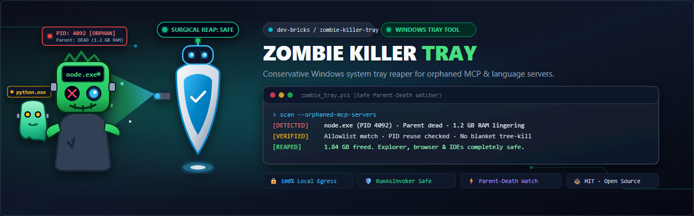
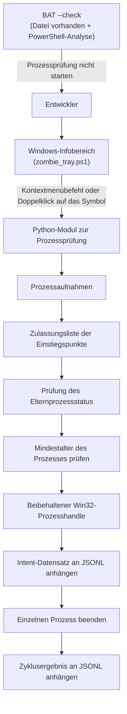
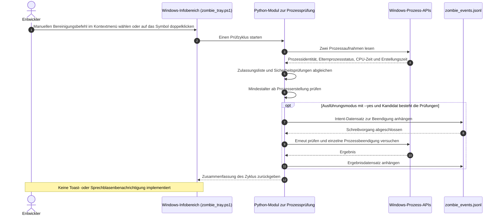

# Zombie Killer Tray

> Ein zurückhaltendes Windows-Programm für den Infobereich: Es prüft ausgewählte verwaiste Prozesse von Model Context Protocol (MCP)-Servern und Sprachservern und kann sie nach den vorgesehenen Prüfungen einzeln beenden. Ganze Prozessbäume werden nicht pauschal beendet.



[](NOTICE)
[](CHANGELOG.md)
[](https://github.com/dev-bricks/zombie-killer-tray/actions/workflows/tests.yml)
[](pyproject.toml)
[](#)
[](https://github.com/astral-sh/ruff)
[](LICENSE)
[](THIRD_PARTY_LICENSES.md)
[](https://github.com/dev-bricks)
[](https://github.com/open-bricks)
[](llms.txt)
[](CHANGELOG.md)
[](CHANGELOG.md)

[Englisch](README.md) · [Deutsch](README_de.md) · [Español](README_es.md) · [简体中文](README_zh.md) · [日本語](README_ja.md) · [Russisch](README_ru.md)

> [!NOTE]
> Maschinenlesbare Hinweise zu Verhalten, Einrichtung und Grenzen des Projekts für KI-Agenten stehen in [llms.txt](llms.txt).

---

### 🧭 Schnelle Navigation

- [1. Übersicht und Problemstellung](#overview--problem-statement)
- [2. Systemarchitektur und Topologie](#system-architecture--topology)
- [3. Vollständige Lebenszyklussequenz](#complete-lifecycle-sequence)
- [4. Dokumentierte Laufzeitsicherungen](#governance--runtime-invariants)
- [5. Zielbenutzer und Auffindbarkeit](#target-personas--discoverability)
- [6. Umfang und Alternativen](#comparative-matrix--alternatives)
- [7. Verwandte Projekte](#sibling-ecosystem--partner-tools)
- [8. Merkmale und Fähigkeiten](#features--capabilities)
- [9. Windows-Infobereich: Oberfläche und Bedienung](#windows-tray-interface--ux)
- [10. Anforderungen und Plattformkompatibilität](#requirements--platform-compatibility)
- [11. Start- und Ausführungsmodi](#start--execution-modes)
- [12. Zulassungsliste und Regeln für Prozesskandidaten](#allowlist-configuration--reaping-rules)
- [13. Audit-Protokollierung und Ereignisform](#audit-logging--forensic-event-schema)
- [14. Prüfung und Qualitätssicherung](#testing--quality-assurance)
- [15. Sicherheitsrichtlinie und Datenschutz](#security-policy--privacy-governance)
- [16. Abhängigkeitslizenzen von Drittanbietern](#third-party-transparency--level-1-sbom)
- [17. Entwicklung, Bau und Verpackung](#development-build--packaging)
- [18. Lizenz und Namensnennung](#statutory-notice--521-bgb--license-attribution)

---

<a id="sec-01"></a><a id="overview--problem-statement"></a><a id="ueberblick--problemstellung"></a><a id="überblick--problemstellung"></a>
## 1. Überblick und Problemstellung

Wenn lokale KI-Agent-Frameworks (Claude Code, Codex CLI, Gemini Antigravity, Kimi) oder IDEs die Verbindung verlieren oder unerwartet beendet werden, können Backend-Server des Model Context Protocol (MCP) (`node.exe`, `python.exe`) und Sprachserver (`rust-analyzer.exe`, `clangd.exe`, `gopls.exe`, `pylsp`) im Hintergrund weiterlaufen. Mit der Zeit sammeln sich solche nicht mehr verwalteten Prozesse an, verbrauchen Arbeitsspeicher und können Dateien in aktiven Quellverzeichnissen sperren.

Übliche administrative Bereinigungsmethoden unter Windows bergen Risiken:
- Einfache PowerShell- oder cmd-Befehle wie `taskkill /F /IM node.exe` können aktive Entwicklungssitzungen, Vordergrundserver oder Webwerkzeuge wahllos beenden.
- Rekursive Prozessbaum-Beendigungen (`taskkill /T`) können ganze Terminalsitzungen oder Entwickler-IDEs beenden.
- Eine einfache PID-Prüfung ist anfällig für Wettlaufsituationen durch wiederverwendete Windows-PIDs: Eine PID kann nach dem Ende eines Prozesses einem anderen Prozess zugewiesen werden, bevor der Beendigungsbefehl ausgeführt wird.

`zombie-killer-tray` verwendet mehrere aufeinanderfolgende Prüfungen. Verglichen werden Prozessidentität, Zustand des Elternprozesses in mehreren Beobachtungen, CPU-Zeit und ein Mindestalter ab Prozesserstellung (standardmäßig 30 Minuten). Das Windows-Modul zur Prozessprüfung hält während der Prüfungen und des Beendigungsversuchs einen Prozesshandle offen. Das hilft, nach einer PID-Wiederverwendung nicht versehentlich einen anderen Prozess anzusprechen.

---

<a id="sec-02"></a><a id="system-architecture--topology"></a><a id="systemarchitektur--topologie"></a>
## 2. Systemarchitektur und Topologie

Das Tray-Programm und das Python-Modul zur Prozessprüfung untersuchen eine eng begrenzte Auswahl von Prozesskandidaten. Die Launcher-Option `--check` prüft nur, ob das Tray-Skript vorhanden ist und von PowerShell geparst werden kann. Sie startet das Prozessprüfungsmodul nicht und untersucht keine Prozesse.



Der gehaltene Prozesshandle hilft, Prüfung und Beendigungsversuch an dasselbe Prozessobjekt zu binden. Das Projekt behauptet nicht, dadurch sämtliche möglichen Wettlaufsituationen im Betriebssystem auszuschließen.

<a id="sec-03"></a><a id="complete-lifecycle-sequence"></a><a id="vollstaendiger-ausfuehrungsablauf"></a><a id="vollständiger-ausführungsablauf"></a>
## 3. Vollständiger Ablauf eines Zyklus



Die Engine überspringt einen Kandidaten, wenn eine erforderliche Prüfung fehlschlägt. Das Mindestalter wird ab der Prozesserstellung gemessen, nicht ab dem Ende des Elternprozesses. Im Ausführungsmodus mit `--yes` wird ein Prozess nicht beendet, wenn der vorherige Intent-Datensatz nicht geschrieben werden kann. JSONL-Einträge werden gewöhnlich angehängt und können bearbeitet werden.

<a id="sec-04"></a><a id="governance--runtime-invariants"></a><a id="sicherheitsmodell--governance-invarianten"></a>
## 4. Dokumentierte Laufzeitschutzmaßnahmen

Die Tabelle beschreibt Verhalten, das in der aktuellen Quelle sichtbar ist. Diese Hinweise sind weder eine Zertifizierung noch eine Betriebssystem-Sandbox oder eine Garantie gegen jeden möglichen Fehler.

| Kennung | Aktuelles Verhalten | Grenze |
|:---|:---|:---|
| **INV-LOCAL-01** | Der geprüfte Quellcode des Projekts für Prozessprüfung und Infobereich enthält keine ausgehenden Netzwerkanfragen. | Das ist weder eine Netzwerksperre des Betriebssystems noch eine unabhängige Garantie für jede Abhängigkeit oder jeden Host. |
| **INV-SEC-02** | `start-zombie-killer-admin.bat --check` prüft die Tray-Datei und lässt sie von PowerShell parsen. | Der Befehl untersucht keine Prozesse, prüft Python nicht und senkt das Sicherheitstoken des aufrufenden Prozesses nicht ab. |
| **INV-PARENT-03** | Der Zustand des Elternprozesses wird erfasst und vor einem Beendigungsversuch erneut geprüft. | Bei einer fehlgeschlagenen oder unvollständigen Prüfung wird der Kandidat übersprungen. |
| **INV-STABLE-04** | Das Prozessprüfungsmodul vergleicht zwei Prozessbeobachtungen, einschließlich Prozessidentität und CPU-Zeit. | Das schränkt die Auswahl ein, garantiert aber kein risikofreies Verhalten. |
| **INV-HANDLE-05** | Die Windows-Engine hält während der Prüfungen und des Beendigungsversuchs einen Prozesshandle offen. | Das hilft, eine wiederverwendete PID nicht mit dem ursprünglichen Prozess zu verwechseln; Wettlaufsituationen werden dadurch nicht ausgeschlossen. |
| **INV-ALLOW-06** | Für den Abgleich wird eine begrenzte Liste konfigurierter MCP- und Sprachserver-Einstiegspunkte verwendet. | Die Zulassungsliste ist kein allgemeiner Prozessmanager. |
| **INV-NOTREE-07** | Die Engine versucht, einen ausgewählten Prozess einzeln zu beenden, nicht rekursiv einen Prozessbaum. | Dadurch ist nicht jeder Prozess ein Kandidat und ein erfolgreicher Abschluss nicht garantiert. |
| **INV-AUDIT-08** | Im Ausführungsmodus mit `--yes` wird vor dem Beendigungsversuch ein Intent-Datensatz angehängt. Kann dieser nicht geschrieben werden, wird der Versuch abgebrochen. | Die JSONL-Datei ist ein gewöhnliches lokales Anhangprotokoll und nicht manipulationssicher. |
| **INV-AGE-09** | Ein Mindestalter ab Prozesserstellung ist erforderlich. Standardmäßig sind es 1.800 Sekunden (30 Minuten); unterstützte Einstellungen können den Wert ändern. | Gemessen wird nicht die Zeit seit dem Verwaisen des Prozesses. |
| **Antwortzeiten** | Hinweise zur Meldung von Sicherheitsproblemen stehen in `SECURITY.md`. | Es wird keine Reaktions- oder Triagezeit zugesagt. |

<a id="sec-05"></a><a id="target-personas--discoverability"></a><a id="zielgruppen--auffindbarkeit"></a>
## 5. Zielbenutzer und Auffindbarkeit

`zombie-killer-tray` ist ein Windows-Werkzeug für Entwickler, die ausgewählte MCP- und Sprachserverprozesse regelmäßig prüfen möchten.

| Benutzerkontext | Typisches Problem | Was dieses Projekt bewirkt |
|:---|:---|:---|
| **KI- und Multi-Agent-Entwicklung** | Nach einem unerwarteten Ende eines Clients kann ein passender Backend-Prozess weiterlaufen. | Das Programm prüft ausgewählte Einstiegspunkte und verlangt vor einem Beendigungsversuch passende Prozess- und Elternprozessbedingungen. |
| **Betreuung von Windows-Arbeitsplätzen** | Eine Bereinigung allein nach Prozessnamen kann unbeteiligte Prozesse treffen. | Eine Zulassungsliste begrenzt die Kandidaten; mehrere Beobachtungen werden geprüft. |
| **Nutzung von Sprachservern** | Ein Sprachserver kann nach dem Schließen des Editors weiterlaufen. | Geprüft werden der Zustand des Elternprozesses und das Mindestalter; der Zeitpunkt, zu dem der Prozess verwaiste, wird nicht ermittelt. |
| **Prüfung lokaler Prozessdaten** | Protokolle können Befehlszeilenargumente und lokale Pfade offenlegen. | Das Programm schreibt lokale JSONL-Datensätze. Diese Dateien sollten geschützt und bei Bedarf geprüft werden. |

#### Suchbegriffe
- **Englisch (EN):** `windows mcp process cleanup`, `orphaned language server windows`, `node mcp server cleanup`, `zombie-killer-tray`
- **Deutsch (DE):** `Windows-MCP-Prozesse prüfen`, `verwaiste Sprachserver unter Windows`, `MCP- und Sprachserverprozesse bereinigen`

<a id="sec-06"></a><a id="comparative-matrix--alternatives"></a><a id="vergleichsmatrix--alternativen"></a>
## 6. Umfang und Alternativen

Das Projekt deckt einen eng umrissenen Ablauf ab: Es prüft eine konfigurierte Auswahl von MCP- und Sprachserverprozessen unter Windows und kann nach den Prüfungen versuchen, einzelne Prozesse zu beenden. Integrierte Prozesstools eignen sich zur manuellen Prüfung und für direkt ausgelöste Aktionen. Eigene Skripte unterscheiden sich in ihrer Auswahl- und Sicherheitslogik. Diese README macht keine Leistungs-, Datenschutz-, Sicherheits- oder Funktionsaussagen über Produkte Dritter.

<a id="sec-07"></a><a id="sibling-ecosystem--partner-tools"></a><a id="geschwister-oekosystem--partner-tools"></a><a id="geschwister-ökosystem--partner-tools"></a>
## 7. Verwandte Projekte

[CareCenter-for-Codex](https://github.com/dev-bricks/CareCenter-for-Codex) kann optional eine festgelegte Version von Zombie Killer Tray im Watch-Modus als separaten Prozess starten. Die verlinkten MCP-Server sind optionale Kandidaten für die Prozesspflege. Ein laufender Prozess kommt nur infrage, wenn sein Aufruf dem unterstützten `node_modules`-Paketeinstiegspunkt entspricht und alle bestehenden Prozess- und Apply-Prüfungen erfüllt. Die Links machen die Server weder zu Projektabhängigkeiten noch zu importierten Modulen.

- [ellmos-filecommander-mcp](https://github.com/ellmos-ai/ellmos-filecommander-mcp) — optionaler MCP-Serverkandidat
- [ellmos-codecommander-mcp](https://github.com/ellmos-ai/ellmos-codecommander-mcp) — optionaler MCP-Serverkandidat
- [ellmos-controlcenter-mcp](https://github.com/ellmos-ai/ellmos-controlcenter-mcp) — optionaler MCP-Serverkandidat
- [n8n-manager-mcp](https://github.com/ellmos-ai/n8n-manager-mcp) — optionaler MCP-Serverkandidat
- [ellmos-clatcher-mcp](https://github.com/ellmos-ai/ellmos-clatcher-mcp) — optionaler MCP-Serverkandidat

<a id="sec-08"></a><a id="features--capabilities"></a><a id="kernfunktionen--faehigkeiten"></a><a id="kernfunktionen--fähigkeiten"></a>
## 8. Funktionen und Fähigkeiten

- **Prozesshandle-Prüfung (INV-HANDLE-05):** Das Windows-Modul zur Prozessprüfung hält während der Prüfungen und des Beendigungsversuchs einen Prozesshandle offen. Dadurch bleibt der Versuch an das beobachtete Prozessobjekt gebunden; Wettlaufsituationen im Betriebssystem werden dadurch nicht ausgeschlossen.
- **Zwei Beobachtungen (INV-STABLE-04):** Die Engine vergleicht Prozessidentität und CPU-Zeit in zwei zeitlich getrennten Beobachtungen. Ein veränderter Kandidat oder ein Kandidat, der die Prüfungen nicht besteht, wird übersprungen.
- **Elternprozess-Prüfung (INV-PARENT-03):** Der Zustand des Elternprozesses wird während des Zyklus und vor einem Beendigungsversuch geprüft.
- **Lokale JSONL-Datensätze (INV-AUDIT-08):** Im Ausführungsmodus mit `--yes` wird vor dem Versuch ein Intent-Datensatz angehängt und danach das Ergebnis aufgezeichnet. Schlägt das Schreiben des Intent-Datensatzes fehl, wird der Versuch abgebrochen. Das Protokoll kann bearbeitet werden.
- **Mindestalter (INV-AGE-09):** Ein Kandidat muss das eingestellte Mindestalter seit seiner Prozesserstellung erreicht haben. Standardmäßig sind es 1.800 Sekunden (30 Minuten); die Oberfläche bietet eine begrenzte Auswahl an Werten.
- **Syntaxprüfung des Launchers:** `start-zombie-killer-admin.bat --check` prüft, ob das Tray-Skript vorhanden ist und von PowerShell geparst werden kann. Die Python-Engine wird nicht gestartet und die Prozesstabelle nicht untersucht.
- **Netzwerkverhalten:** Im geprüften Erstparteicode für Prozessprüfung und Infobereich gibt es keinen ausgehenden Anfragepfad. Das Programm richtet keine Netzwerksperre des Betriebssystems ein; diese README behauptet keine vom Betriebssystem erzwungene Netzwerkgrenze.

<a id="sec-09"></a><a id="windows-tray-interface--ux"></a><a id="windows-tray-bedienoberflaeche--benutzererlebnis"></a><a id="windows-tray-bedienoberfläche--benutzererlebnis"></a>
## 9. Windows-Infobereich: Oberfläche und Bedienung

Die Oberfläche verwendet PowerShell WinForms und ein Symbol im Windows-Infobereich.

- **Manuelle Bereinigung:** Das Kontextmenü enthält einen Befehl für einen manuellen Zyklus. Ein Doppelklick auf das Infobereichssymbol startet ebenfalls einen Zyklus; ein einfacher Klick tut das nicht.
- **Kontextmenü:** Es bietet automatische Prüfungen, Intervall- und Mindestalterauswahl, Sprachauswahl, das Öffnen des lokalen Protokolls und das Beenden des Tray-Programms.
- **Sechs Oberflächensprachen:** Menü, QuickInfo und Sprachauswahl unterstützen Englisch, Deutsch, Spanisch, vereinfachtes Chinesisch, Japanisch und Russisch. Die erste Auswahl richtet sich nach der Windows-Anzeigesprache; Englisch ist die Rückfalleinstellung. Die gewählte Sprache wird in `zombie_state.json` gespeichert. Technische Protokolle bleiben auf Englisch.
- **Intervalle:** Zur Auswahl stehen 5/10/20/30/60 Minuten, 3/5/10/15/20 Stunden oder 24 Stunden. Das Standardintervall beträgt 30 Minuten.
- **Mindestalter:** Zur Auswahl stehen 5/10/15/30/60 Minuten oder 2/6/12/24 Stunden. Standard sind 30 Minuten. Die Untergrenzen des Prozessprüfungsmoduls liegen weiterhin bei 30 Sekunden für das Mindestalter und 3 Sekunden für das Intervall; im Menü werden die unterstützten Werte angeboten.
- **Benachrichtigungen:** Das Tray verwendet sein Symbol, die QuickInfo und das Kontextmenü. Sprechblasen- oder Toast-Benachrichtigungen sind nicht implementiert.
- **Beenden:** Beim Beenden schließt sich das Tray-Programm und sein eigener Hintergrund-Worker wird gestoppt. An Prozesskandidaten wird kein Beendigungsbefehl gesendet.

<a id="sec-10"></a><a id="requirements--platform-compatibility"></a><a id="voraussetzungen--plattform-kompatibilitaet"></a><a id="voraussetzungen--plattform-kompatibilität"></a>
## 10. Anforderungen und Plattformkompatibilität

- **Betriebssystem:** Windows 10 oder Windows 11 (64-Bit).
- **Python:** Python 3.12 oder neuer, wie in `pyproject.toml` deklariert; der aktuelle Workflow testet Python 3.12 unter Windows.
- **PowerShell:** Windows PowerShell 5.1 oder PowerShell 7 unter Windows.
- **Laufzeitabhängigkeit:** Installieren Sie im Stammverzeichnis des Repositorys vor dem Start der Python-Engine die deklarierte Abhängigkeit mit `python -m pip install -r requirements.txt`.
- **Berechtigungen:** Der Batch-Launcher fordert für den normalen Tray-Betrieb Administratorrechte an. `--check` führt nur die oben beschriebenen Datei- und PowerShell-Prüfungen aus; es ändert das Sicherheitstoken des aufrufenden Prozesses nicht und untersucht keine Prozesse.

<a id="sec-11"></a><a id="start--execution-modes"></a><a id="start--ausfuehrungsmodi"></a><a id="start--ausführungsmodi"></a>
## 11. Start und Ausführungsmodi

### 1. Tray starten

Doppelklicken Sie auf `start-zombie-killer-admin.bat`. Der Launcher fordert über die Windows-Benutzerkontensteuerung (UAC) Administratorrechte an und startet das Tray-Programm:

```bat
start-zombie-killer-admin.bat
```

### 2. Das Launcher-Skript prüfen

```bat
start-zombie-killer-admin.bat --check
```

Damit wird geprüft, ob das Tray-Skript vorhanden ist und von PowerShell geparst werden kann. Das Tray-Programm wird nicht gestartet, Python nicht geprüft, die Prozesstabelle nicht untersucht und das Sicherheitstoken des aufrufenden Prozesses nicht abgesenkt.

### 3. Prozesskandidaten über die Python-CLI anzeigen

```powershell
# Nur lesende Kandidatensuche
python zombie_killer.py scan

# Einen Bereinigungszyklus anzeigen, ohne Prozesse zu beenden
python zombie_killer.py reap --min-age 900
```

Die CLI unterstützt die Aktionen `scan`, `reap`, `watch` und `broker-report`. `reap` und `watch` versuchen nur dann, Prozesse zu beenden, wenn `--yes` angegeben ist. Prüfen Sie Code und Kandidaten, bevor Sie den Ausführungsmodus mit `--yes` verwenden.

### 4. Das installierte Python-Paket verwenden

Der Distributionsname des Pakets lautet `zombie-killer-tray`. Das Repository stellt es unter `src/zombie_killer_tray/` bereit:

```bash
python -m zombie_killer_tray scan
```

Die Engine schreibt ihr JSONL-Protokoll und Fehlerdateien des Workers in das aktuelle Arbeitsverzeichnis des Prozesses (`Path.cwd()`). Das Tray-Programm setzt das Arbeitsverzeichnis des Workers auf das Repository-Stammverzeichnis. Andere Aufrufer oder Paketnutzer verwenden jeweils ihr eigenes Arbeitsverzeichnis.

<a id="sec-12"></a><a id="allowlist-configuration--reaping-rules"></a><a id="allowlist-konfiguration--reaping-regeln"></a>
## 12. Zulassungsliste und Regeln für Prozesskandidaten

Ein Kandidat muss zu einem der in der Quelle definierten Einstiegspunktsätze in [`killer.py`](src/zombie_killer_tray/killer.py#L17-L26) passen:

- **LSP-Programme:** `rust-analyzer.exe`, `clangd.exe`, `gopls.exe`, `zls.exe`.
- **Node-Einstiegspunkte:** `typescript-language-server`, `pyright-langserver`, `yaml-language-server`, `bash-language-server`, `vscode-json-languageserver`.
- **MCP-Pakete:** `ellmos-filecommander-mcp`, `ellmos-codecommander-mcp`, `ellmos-controlcenter-mcp`, `ellmos-clatcher-mcp`, `ellmos-n8n-manager-mcp`, `n8n-manager-mcp`, `@modelcontextprotocol/server-filesystem`, `@modelcontextprotocol/server-memory`, `@modelcontextprotocol/server-sequential-thinking`, `@upstash/context7-mcp`.
- **Python-Module:** `pylsp`, `jedi_language_server`, `mcp_server_git`, `mcp_server_fetch`, `mcp_server_time`.

Diese Listen beschreiben Einstiegspunkte für den Abgleich, nicht sämtliche Prozessprüfungen. Die Engine prüft im selben Quellmodul zusätzlich Prozessidentität, Zustand des Elternprozesses, Prozessalter und weitere Bedingungen. Ein passender Einstiegspunkt allein macht einen Prozess noch nicht zum Kandidaten.

<a id="sec-13"></a><a id="audit-logging--forensic-event-schema"></a><a id="audit-protokollierung--forensisches-ereignis-schema"></a>
## 13. Protokollierung und Ereignisfelder

Die Engine hängt JSON-Datensätze an `zombie_events.jsonl` im aktuellen Arbeitsverzeichnis des Prozesses an. Das Tray-Programm setzt das Arbeitsverzeichnis seines Workers auf das Repository-Stammverzeichnis; andere Aufrufer verwenden ihr eigenes aktuelles Arbeitsverzeichnis. Git ignoriert diese Datei. Ein beispielhafter Datensatz sieht so aus:

```json
{
  "at": 1790940000.0,
  "event": "terminate-intent",
  "child": {
    "pid": 14208,
    "ppid": 8192,
    "born": 134000000000000000,
    "cpu": 0,
    "exe": "node.exe",
    "argv": ["node.exe", "<local arguments omitted>"],
    "kind": "mcp",
    "parent_dead": true
  },
  "parent_last_observed": null
}
```

Der Ergebnisdatensatz enthält `child`, `parent_last_observed`, `killed` und `reason`; Zykluszusammenfassungen verwenden `cycle_at`, `apply` und `count`. Welche Felder vorkommen, hängt vom Ereignistyp ab. Die Datensätze werden gewöhnlich angehängt und können bearbeitet werden. Protokolle können Prozesskennungen, Programmnamen, Befehlszeilenargumente und lokale Pfade enthalten; schützen Sie sie entsprechend. Im Ausführungsmodus mit `--yes` wird der Beendigungsversuch abgebrochen, wenn der Intent-Datensatz nicht geschrieben werden kann.

<a id="sec-14"></a><a id="testing--quality-assurance"></a><a id="tests--qualitaetssicherung"></a><a id="tests--qualitätssicherung"></a>
## 14. Tests und Qualitätssicherung

Das Repository enthält Python-Tests, Ruff-Lintprüfungen und Windows-Prüfungen in GitHub Actions. Die folgenden Befehle können lokal ausgeführt werden; die Ergebnisse hängen von der jeweiligen Umgebung ab und werden nicht durch ein statisches Abzeichen behauptet.

```powershell
# Tests ausführen
python -m pytest -ra -v .

# unittest-kompatible Prüfungen ausführen
python -m unittest -v test_zombie_killer
python -m unittest -v tests/test_metadata.py

# Ruff-Lintprüfungen ausführen
python -m ruff check .

# Python-Quellen kompilieren
python -m compileall -q .
```

<a id="sec-15"></a><a id="security-policy--privacy-governance"></a><a id="sicherheitsrichtlinie--datenschutz-governance"></a>
## 15. Sicherheitsrichtlinie und Datenschutz

Quellcode und Protokolle des Projekts haben unterschiedliche Datenschutzmerkmale:
- Der geprüfte Erstparteicode für Prozessprüfung und Infobereich enthält keine ausgehenden Netzwerkanfragen. Das ist eine Beobachtung am Quellcode, keine Netzwerkisolation oder absolute Garantie gegen ausgehenden Datenverkehr.
- `--check` prüft nur das Tray-Skript und lässt es von PowerShell parsen. Der Modus listet keine Prozesse auf, untersucht sie nicht und ändert das Berechtigungstoken des aufrufenden Prozesses nicht.
- Lokale JSONL- und Diagnoseprotokolle können Prozesskennungen, Programmnamen, Befehlszeilenargumente, Zeitstempel und Pfade enthalten. Behandeln Sie sie als möglicherweise sensible lokale Daten.
Die veröffentlichten Hinweise zur Meldung von Sicherheitsproblemen stehen in `SECURITY.md`. Diese README sagt weder zu, dass ein bestimmtes Postfach überwacht wird, noch verspricht sie Antwort- oder Triagezeiten.

<a id="sec-16"></a><a id="third-party-transparency--level-1-sbom"></a><a id="drittanbieter-transparenz--level-1-sbom"></a>
## 16. Lizenzen direkter Drittanbieter-Abhängigkeiten

`THIRD_PARTY_LICENSES.md` und die Klartextdatei `THIRD_PARTY_LICENSES.txt` führen ausgewählte direkte Laufzeit- und Entwicklungsabhängigkeiten sowie die dazu erfassten Lizenzen auf. Die Übersicht umfasst nicht den vollständigen transitiven Abhängigkeitsbaum und ist weder eine vollständige SBOM noch eine rechtliche Zertifizierung. Laut Projektmetadaten ist `psutil` die Laufzeitabhängigkeit; seine Upstream-Lizenz ist BSD-3-Clause.

<a id="sec-17"></a><a id="development-build--packaging"></a><a id="entwicklung-build--packaging"></a>
## 17. Entwicklung, Build und Paketierung

Die Python-Paketmetadaten stehen in `pyproject.toml`; gebaut wird über das dort konfigurierte PEP-517-Backend:

```powershell
# Laufzeitabhängigkeiten installieren
python -m pip install -r requirements.txt

# Deklarierte Entwicklungsabhängigkeiten installieren
python -m pip install -e .[dev]

# Build-Frontend installieren
python -m pip install build

# Quell- und Wheel-Distributionen erstellen
python -m build
```

Hinweise zur Mitwirkung und zu den dokumentierten Qualitätsprüfungen stehen in [CONTRIBUTING.md](CONTRIBUTING.md).

---

<a id="sec-18"></a><a id="statutory-notice--521-bgb--license-attribution"></a><a id="gesetzlicher-hinweis--521-bgb--lizenz-attribution"></a>
## 18. Lizenz und Namensnennung

Dieses Projekt wird unter der [MIT-Lizenz](LICENSE) veröffentlicht. Copyright (c) 2026 Lukas Geiger, dev-bricks und das open-bricks-Dachökosystem.

Dieser Abschnitt enthält keine projektspezifische rechtliche Auslegung gesetzlicher Gewährleistungs- oder Haftungsregeln.
