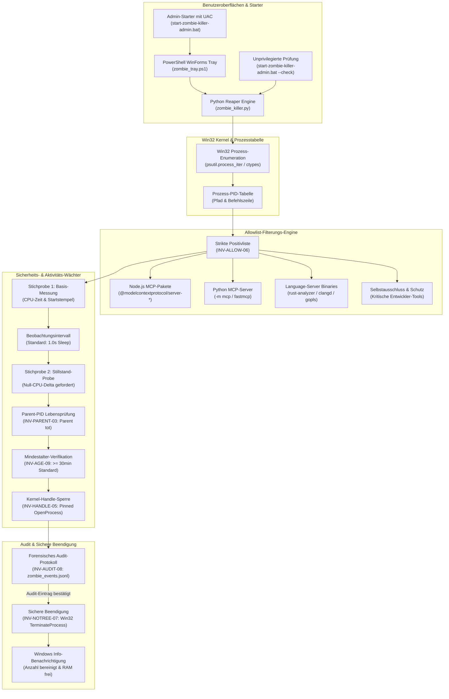
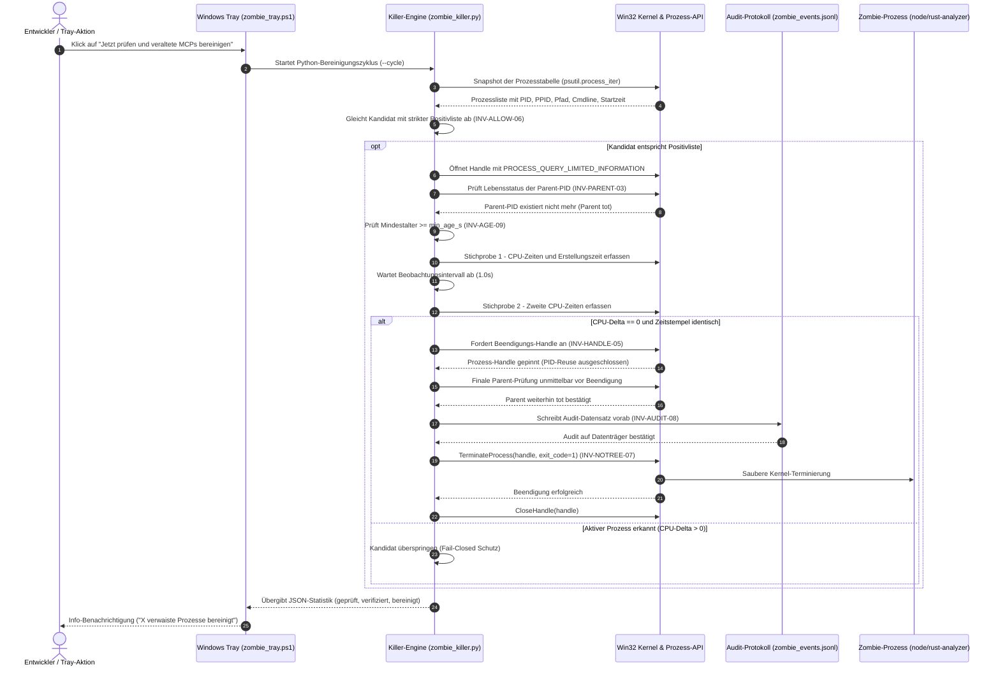

# Zombie Killer Tray


> Konservatives Windows-System-Tray-Dienstprogramm zur sicheren Bereinigung verwaister Model Context Protocol (MCP) und Language-Server-Hintergrundprozesse ohne pauschale Prozessbaum-Kills.

[](NOTICE)
[](CHANGELOG.md)
[](tests/test_metadata.py)
[](pyproject.toml)
[](#)
[](SECURITY.md)
[](SECURITY.md)
[](SECURITY.md)
[](https://github.com/astral-sh/ruff)
[](LICENSE)
[](THIRD_PARTY_LICENSES.txt)
[](https://github.com/dev-bricks)
[](https://github.com/open-bricks)
[](llms.txt)
[](CHANGELOG.md)
[](CHANGELOG.md)

[English](README.md) · [Deutsch](README_de.md)

> [!NOTE]
> Maschinenlesbare Architektur, Invarianten und Sicherheitsrichtlinien für KI-Agenten sind in [llms.txt](llms.txt) indexiert.

---

### 🧭 Schnellnavigation

- [1. Überblick & Problemstellung](#ueberblick--problemstellung)
- [2. Systemarchitektur & Topologie](#systemarchitektur--topologie)
- [3. Vollständiger Ausführungsablauf](#vollstaendiger-ausfuehrungsablauf)
- [4. Sicherheitsmodell & Governance-Invarianten](#sicherheitsmodell--governance-invarianten)
- [5. Zielgruppen & Auffindbarkeit](#zielgruppen--auffindbarkeit)
- [6. Vergleichsmatrix & Alternativen](#vergleichsmatrix--alternativen)
- [7. Geschwister-Ökosystem & Partner-Tools](#geschwister-oekosystem--partner-tools)
- [8. Kernfunktionen & Fähigkeiten](#kernfunktionen--faehigkeiten)
- [9. Windows-Tray-Bedienoberfläche & Benutzererlebnis](#windows-tray-bedienoberflaeche--benutzererlebnis)
- [10. Voraussetzungen & Plattform-Kompatibilität](#voraussetzungen--plattform-kompatibilitaet)
- [11. Start & Ausführungsmodi](#start--ausfuehrungsmodi)
- [12. Allowlist-Konfiguration & Reaping-Regeln](#allowlist-konfiguration--reaping-regeln)
- [13. Audit-Protokollierung & Forensisches Ereignis-Schema](#audit-protokollierung--forensisches-ereignis-schema)
- [14. Tests & Qualitätssicherung](#tests--qualitaetssicherung)
- [15. Sicherheitsrichtlinie & Datenschutz-Governance](#sicherheitsrichtlinie--datenschutz-governance)
- [16. Drittanbieter-Transparenz & Level 1 SBOM](#drittanbieter-transparenz--level-1-sbom)
- [17. Entwicklung, Build & Packaging](#entwicklung-build--packaging)
- [18. Gesetzlicher Hinweis (§ 521 BGB) & Lizenz-Attribution](#gesetzlicher-hinweis--521-bgb--lizenz-attribution)

---

<a id="sec-01"></a><a id="overview--problem-statement"></a><a id="ueberblick--problemstellung"></a><a id="überblick--problemstellung"></a>
## 1. Überblick & Problemstellung

Wenn lokale KI-Agenten-Frameworks (Claude Code, Codex CLI, Gemini Antigravity, Kimi) oder Entwickler-IDEs unerwartet beendet werden, können Model Context Protocol (MCP) Server (`node.exe`, `python.exe`) und Language-Server (`rust-analyzer.exe`, `clangd.exe`, `gopls.exe`, `pylsp`) als verwaiste Prozesse („Zombies“) im System verbleiben. Über mehrere Arbeitszyklen hinweg sammeln sich diese Prozesse an, belegen wertvollen Arbeitsspeicher und blockieren Dateisperren auf Projektverzeichnissen.

Klassische Administrationsansätze unter Windows bergen erhebliche Risiken:
- Pauschale Befehle wie `taskkill /F /IM node.exe` beenden aktive Entwicklungs-Server oder Weboberflächen ununterscheidbar und destruktiv.
- Rekursive Prozessbaum-Kills (`taskkill /T`) reißen oft die übergeordnete IDE oder das Terminal-Fenster mit in den Abgrund.
- Einfache PID-Prüfungen sind anfällig für Windows-PID-Reuse-Races: Wird ein Prozess beendet, kann Windows dieselbe PID sofort einem neuen, unbeteiligten Prozess zuweisen.

`zombie-killer-tray` löst diese Herausforderung durch eine konservative, Fail-Closed arbeitende Prüfpipeline. Es verifiziert die Prozessincarnation, den toten Elternprozess über getrennte Zeitpunkte, vollständigen CPU-Stillstand (Null-Delta), ein Mindestalter (Standard: 30 Minuten) und sperrt das Kernel-Objekt über ein explizites Win32-Prozess-Handle (`OpenProcess`), bevor ein Beendigungssignal gesendet wird.

---

<a id="sec-02"></a><a id="system-architecture--topology"></a><a id="systemarchitektur--topologie"></a>
## 2. Systemarchitektur & Topologie

#### Architektonische Topologie-Projektion (Vier-Sichten-Systemarchitektur)

```text
+-------------------------------------------------------------------------------+
|  SICHT 1: STARTER, BENUTZEROBERFLÄCHEN & TRAY-LAUFZEITEN                      |
|  - Windows-System-Tray-UI (zombie_tray.ps1, NotifyIcon, WinForms Balloon)     |
|  - Admin-Starter mit UAC-Elevation (start-zombie-killer-admin.bat)            |
|  - Unprivilegierter Vorab-Diagnosemodus (--check, RunAsInvoker)               |
|  - Python-Paket-CLI & Eingebettete Laufzeit (zombie_killer_tray / killer)     |
+---------------------------------------+---------------------------------------+
                                        | startet / überwacht
                                        v
+-------------------------------------------------------------------------------+
|  SICHT 2: ZOMBIE-REAPER KERN-ENGINE & PID-VERIFIKATION                        |
|  - Win32-Prozess-Enumeration & Snapshots (psutil.process_iter / ctypes Enum)  |
|  - Allowlist-Klassifikator (LSP, MCP-Pakete, Node-Einträge, Python-Module)    |
|  - Elternprozess-Lebensprüfung (INV-PARENT-03: Zwei-Stichproben-Elterntod)    |
|  - Zwei-Stichproben CPU-Stillstand & Identitäts-Stabilitäts-Gate (STABLE-04)  |
|  - Mindestalter-Prüfung (INV-AGE-09: >= 30min Standard-Untergrenze)           |
+---------------------------------------+---------------------------------------+
                                        | koordiniert / sichert
                                        v
+-------------------------------------------------------------------------------+
|  SICHT 3: LAUFZEIT-PERSISTENZ, FORENSISCHES JSONL-AUDIT & KERNEL-SPERREN      |
|  - Win32 Kernel-Handle-Sperre (OpenProcess mit PROCESS_TERMINATE)             |
|  - Schutz vor Windows-PID-Wiederverwendungs-Races (INV-HANDLE-05)             |
|  - Vorab-Forensik-Auditprotokoll (INV-AUDIT-08: zombie_events.jsonl)          |
|  - Einzelprozess-Beendigung ohne Baum-Kills (INV-NOTREE-07: TerminateProcess) |
|  - Benutzereinstellungen & Intervall-Persistenz (zombie_state.json)           |
+---------------------------------------+---------------------------------------+
                                        | umfasst / erzwingt
                                        v
+-------------------------------------------------------------------------------+
|  SICHT 4: AIR-GAP DEFENSE PERIMETER, RUNASINVOKER & ZERO-EGRESS GOVERNANCE    |
|  - 100% Lokaler Offline-Betrieb & Null-Netzwerk-Egress (INV-LOCAL-01)         |
|  - Unprivilegierte Non-Elevation-Sicherheitsrichtlinie (INV-SEC-02, Invoker)  |
|  - Duales Sicherheits-Reaktions-SLA (INV-SLA-10: 48h Antwort, 5 Tage Triage)  |
|  - Gesetzlicher Haftungsausschluss (§ 521 BGB Gefälligkeitsrecht)             |
|  - Level 1 SBOM Drittanbieter-Transparenz (MIT, BSD-3-Clause, PSFL-2.0)       |
+-------------------------------------------------------------------------------+
```



---

<a id="sec-03"></a><a id="complete-lifecycle-sequence"></a><a id="vollstaendiger-ausfuehrungsablauf"></a><a id="vollständiger-ausführungsablauf"></a>
## 3. Vollständiger Ausführungsablauf



---

<a id="sec-04"></a><a id="governance--runtime-invariants"></a><a id="sicherheitsmodell--governance-invarianten"></a>
## 4. Sicherheitsmodell & Governance-Invarianten

Die Anwendung setzt 10 unveränderliche Architektur- und Governance-Invarianten durch:

| Invarianten-Code | Garantie | Kategorie | Durchsetzungs-Mechanismus |
|:---|:---|:---|:---|
| **INV-LOCAL-01** | Lokal-Erstmals & Zero Egress | Netzwerkschutz | Reines Python/psutil; null Netzwerk-Sockets; null Telemetrie |
| **INV-SEC-02** | Unprivilegierte Inspektion | Rechte-Hygiene | `start-zombie-killer-admin.bat --check` und Python-CLI laufen ohne UAC (`RunAsInvoker`) |
| **INV-PARENT-03** | Dead-Parent-Verifikation | Prozesssicherheit | Parent-PID muss in allen Stichproben und vor dem Kill tot sein |
| **INV-STABLE-04** | Zwei-Stichproben CPU-Stabilität | Mutationsschutz | 2 Snapshots fordern 0 CPU-Delta und identischen Erstellungszeitpunkt |
| **INV-HANDLE-05** | PID-Reuse Schutz durch Pinned Handle | Kernel-Sicherheit | Hält Win32 `OpenProcess`-Handle, um Kernel-Objekt zu sperren |
| **INV-ALLOW-06** | Strikte Positivliste (Allowlist) | Scope-Grenze | Nur explizit gelistete MCP- und Language-Server-Prozesse werden erfasst |
| **INV-NOTREE-07** | Keine pauschalen Baum-Kills | Sicherheits-Isolation | Einzelne Prozessbeendigung; niemals rekursives Töten von Prozessbäumen |
| **INV-AUDIT-08** | Pre-Termination Audit-Logging | Nachvollziehbarkeit | Audit-Eintrag in `zombie_events.jsonl` vor dem Kill; Abbruch bei Schreibfehler |
| **INV-AGE-09** | Mindestalter-Schutz | Zeitliche Sicherheit | Konservatives Mindestalter von 30 Minuten (Standard) schützt frische Prozesse |
| **INV-SLA-10** | Duales Sicherheits-Response-SLA | Governance & Triage | 48h Erstantwort, 5 Werktage Triage gemäß `SECURITY.md` |

---

<a id="sec-05"></a><a id="target-personas--discoverability"></a><a id="zielgruppen--auffindbarkeit"></a>
## 5. Zielgruppen & Auffindbarkeit

`zombie-killer-tray` richtet sich an vier zentrale Entwicklergruppen im Windows-Umfeld:

| Zielgruppe | Profil & Anwendungsfall | Herausforderung | Lösung & Workflow |
|:---|:---|:---|:---|
| **[PERSONA-01] KI-Entwickler & Multi-Agenten-Architekten** | Entwickler autonomer Agenten (Claude Code, Codex CLI, Antigravity, Kimi). | Plötzliche Agenten-Abbrüche hinterlassen dutzende MCP-Server (`node.exe`, `python.exe`), die RAM und Sockets blockieren. | Konservative Erkennung und Bereinigung verwaister MCP-Server im Hintergrund ohne Einfluss auf aktive Sitzungen. |
| **[PERSONA-02] Windows DevOps & Zuverlässigkeits-Ingenieure (SREs)** | Betreuer von Entwicklungs-Workstations und CI/CD-Runner-Instanzen. | Unspezifische `taskkill /F`-Skripte beenden versehentlich aktive Terminal-Sitzungen oder IDE-Prozesse. | Zwei-Stichproben-Verifikation, gepinnte Kernel-Handles und deterministische Allowlisten garantieren null Fehlalarme. |
| **[PERSONA-03] Full-Stack Entwickler & Language-Server Nutzer** | Programmierer in Rust, C++, Go oder Python (VS Code, Neovim, JetBrains). | Zurückgebliebene `rust-analyzer`- oder `clangd`-Prozesse blockieren Schreibzugriffe auf Quellverzeichnisse. | Beendigung erfolgt nur, wenn der Editor-Parent nachweislich tot ist und die CPU-Aktivität flach auf null liegt. |
| **[PERSONA-04] Sicherheits- & Compliance-Beauftragte** | Verantwortliche für lokale Ausführungsgrenzen und transparente Software. | Intransparente Systemreiniger mit unklarer Cloud-Telemetrie oder dauerhaft erzwungenen Administratorrechten. | 100% Zero-Egress (`INV-LOCAL-01`), unprivilegierter Prüfmodus (`INV-SEC-02`), lokales JSONL-Audit und Level 1 SBOM. |

#### Suchbegriffe mit hoher Absicht (High-Intent SEO)
- **Deutsch (DE):** `verwaiste mcp server prozesse beenden windows`, `language server prozesse bereinigen python tray`, `sichere prozesshygiene windows entwickler tools`, `mcp zombie prozesse loeschen windows`, `zombie-killer-tray`
- **English (EN):** `windows mcp zombie process killer`, `safe orphaned language server cleanup windows`, `clean orphaned node mcp servers python`, `conservative windows process reaper`, `mcp process hygiene developer tools`, `zombie-killer-tray`

---

<a id="sec-06"></a><a id="comparative-matrix--alternatives"></a><a id="vergleichsmatrix--alternativen"></a>
## 6. Vergleichsmatrix & Alternativen

| Fähigkeit & Dimension | zombie-killer-tray | Windows Task-Manager | Ad-Hoc Skripte / taskkill | Generische Cleaner (CCleaner) | Cloud APM / Schwere Telemetrie |
|:---|:---|:---|:---|:---|:---|
| **1. Lokal & Zero-Egress (INV-LOCAL-01)** | **Volle Garantie (0 Telemetrie)** | Offline-Systemprogramm | Abhängig vom Skript | ❌ Eingebaute Cloud-Telemetrie | ❌ Ständige Datenübertragung |
| **2. Unprivilegierte Prüfung (INV-SEC-02)** | **Volle Unterstützung (RunAsInvoker)** | ⚠️ Fordert oft UAC an | ⚠️ Benötigt UAC für Kills | ❌ Vollständige Adminrechte nötig | ❌ Systemdienst-Daemon |
| **3. Dead-Parent-Verifikation (INV-PARENT-03)** | **Strikte Zwei-Stichproben-Prüfung** | ❌ Reine Sichtprüfung | ❌ Blinder Namensabgleich | ❌ Keine Parent-PID-Prüfung | ⚠️ Metrik vorhanden, kein Gate |
| **4. CPU- & Identitätsstabilität (INV-STABLE-04)** | **Null-Delta CPU-Schutz** | ❌ Keine | ❌ Keine | ❌ Keine | ⚠️ Nur gleitender Durchschnitt |
| **5. Gepinnter Kernel-Handle-Lock (INV-HANDLE-05)** | **Win32 OpenProcess Pin** | ❌ Rennanfällige PID | ❌ Extrem rennanfällig | ❌ Keine | ❌ Keine |
| **6. Strikte Positivliste (INV-ALLOW-06)** | **Exakter Abgleich & Selbstausschluss**| ❌ Manuelles Auswählen | ❌ Regex / Namensfilter | ❌ Grobe Dateikategorien | ❌ Keine |
| **7. Keine pauschalen Baum-Kills (INV-NOTREE-07)** | **Nur isolierter Zielprozess** | ⚠️ Bietet „Prozessstruktur beenden“| ❌ Blindes /T Töten | ❌ Willkürliche Kills | ❌ Nicht anwendbar |
| **8. Forensisches Vorab-Audit (INV-AUDIT-08)** | **Unveränderliches JSONL-Log** | ❌ Keine | ❌ Selten / unvollständig | ❌ Intransparente Logdateien | ⚠️ Cloud-übertragene Logs |
| **9. Mindestalter-Schonfrist (INV-AGE-09)** | **Konfigurierbare 30 Min. Basis** | ❌ Keine | ❌ Keine | ❌ Keine | ❌ Keine |
| **10. Sicherheits-SLA & Vertragstests (INV-SLA-10)** | **48h SLA & 100% Grüne Tests** | Nicht anwendbar | ❌ Keine Testsuite | ❌ Closed-Source Software | ⚠️ Kommerzielles Vendor-SLA |

---

<a id="sec-07"></a><a id="sibling-ecosystem--partner-tools"></a><a id="geschwister-oekosystem--partner-tools"></a><a id="geschwister-ökosystem--partner-tools"></a>
## 7. Geschwister-Ökosystem & Partner-Tools

`zombie-killer-tray` fügt sich nahtlos in das Entwickler-Ökosystem von `dev-bricks`, `ellmos-ai` und `open-bricks` ein:

| Partner-Tool | Organisation | Rolle & Fähigkeiten | Zusammenspiel mit Zombie Killer Tray |
|:---|:---:|:---|:---|
| **[CareCenter-for-Codex](https://github.com/dev-bricks/CareCenter-for-Codex)** | `dev-bricks` | Windows Desktop-App Wartung & SQLite-Optimierer für Codex | Arbeitet Hand in Hand beim Bereinigen hängender Desktop- und MCP-Reste |
| **[safe-start-for-codex](https://github.com/dev-bricks/safe-start-for-codex)** | `dev-bricks` | Startverzögerung, Burst-Schutz und Automationspausen | Sorgt für eine saubere Startumgebung ohne blockierende Zombie-Locks |
| **[MethodenAnalyser](https://github.com/dev-bricks/MethodenAnalyser)** | `dev-bricks` | Statische AST-Analyse und Methoden-Komplexitätsprüfer | Liefert Architekturprüfungen und Vertragstests für Python-Codebasen |
| **[ellmos-filecommander-mcp](https://github.com/ellmos-ai/ellmos-filecommander-mcp)** | `ellmos-ai` | Robuster, lokaler Dateisystem-MCP-Server | Überwachter MCP-Server; wird vor unbemerktem Zombie-Dasein bewahrt |
| **[ellmos-codecommander-mcp](https://github.com/ellmos-ai/ellmos-codecommander-mcp)** | `ellmos-ai` | Code-Refactoring und strukturelle Datei-Editierung | Ziel-Server; wird bei verwaistem Elternprozess zuverlässig abgeräumt |
| **[ellmos-controlcenter-mcp](https://github.com/ellmos-ai/ellmos-controlcenter-mcp)** | `ellmos-ai` | Multi-Agenten Steuerzentrale & Governance-Hub | Koordiniert Agentensitzungen und überwacht Prozessgrenzen |
| **[n8n-manager-mcp](https://github.com/ellmos-ai/n8n-manager-mcp)** | `ellmos-ai` | Lokaler Workflow-Automations-Manager & Runner | Überwacht Hintergrund-Automationsprozesse auf der Entwickler-Maschine |
| **[CloudLockFixer](https://github.com/file-bricks/CloudLockFixer)** | `file-bricks` | Cloud-Synchronisations-Entsperrer & Konfliktkopien-Manager | Teilt die Disziplin des Schutzes lokaler Dateisperren |
| **[DokuZen](https://github.com/doc-bricks/DokuZen)** | `doc-bricks` | Lokale Dokument-OCR, PDF-Redaktion und Bereinigung | Desktop-Partnerwerkzeug mit strenger Zero-Egress-Prozessisolation |

---

<a id="sec-08"></a><a id="features--capabilities"></a><a id="kernfunktionen--faehigkeiten"></a><a id="kernfunktionen--fähigkeiten"></a>
## 8. Kernfunktionen & Fähigkeiten

- **Win32 Pinned Process Handle (`INV-HANDLE-05`):** Öffnet ein explizites `OpenProcess`-Handle vor der Prüfung. Das Handle sperrt das Kernel-Objekt und verhindert PID-Reuse-Races wirksam.
- **Zwei-Stichproben CPU- und Identitätsstabilität (`INV-STABLE-04`):** Führt zwei getrennte Messungen im Zeitabstand durch (Standard: 1,0 Sekunde). Bei CPU-Anstieg oder veränderter Erstellungszeit wird der Prozess sofort verworfen.
- **Dead-Parent-Verifikation (`INV-PARENT-03`):** Prüft, ob die gemeldete Parent-PID in der Prozesstabelle nicht mehr existiert – in beiden Stichproben und direkt vor dem Aufruf von `TerminateProcess`.
- **Forensisches Vorab-Audit (`INV-AUDIT-08`):** Schreibt vor der Beendigung einen JSON-Datensatz in `zombie_events.jsonl`. Schlägt das Schreiben fehl (Festplatte voll, Dateisperre), bricht die Terminierung sicher ab.
- **Mindestalter-Schonfrist (`INV-AGE-09`):** Prozesse müssen mindestens 30 Minuten alt sein (`min_age_s = 1800`), um geschützt gegen kurzzeitige Spitzen im Build- oder Indexierungsbetrieb zu sein.
- **Unprivilegierter Prüfmodus (`INV-SEC-02`):** Erlaubt Vorabprüfungen über `start-zombie-killer-admin.bat --check` ohne Administratorrechte (`RunAsInvoker`).
- **Zero-Egress-Garantie (`INV-LOCAL-01`):** Vollständige Beschränkung auf die lokale Workstation. Null externe Netzwerkaufrufe, null Analytik, null Telemetrie.

---

<a id="sec-09"></a><a id="windows-tray-interface--ux"></a><a id="windows-tray-bedienoberflaeche--benutzererlebnis"></a><a id="windows-tray-bedienoberfläche--benutzererlebnis"></a>
## 9. Windows-Tray-Bedienoberfläche & Benutzererlebnis

Die Tray-Bedienoberfläche basiert auf Windows PowerShell und WinForms (`System.Windows.Forms.NotifyIcon`). Sie ist ressourcenschonend und kommt ohne Browser-Engines oder WebViews aus:

- **Infobereich-Symbol:** Sitzt unaufdringlich im Infobereich der Windows-Taskleiste.
- **Klick-/Doppelklick-Aktion:** Löst sofort einen manuellen Bereinigungszyklus aus.
- **Zweisprachige Oberfläche (Deutsch / Englisch):** Tray-Menü, Tooltip und Beschriftungen richten sich beim ersten Start nach der Windows-UI-Sprache (Deutsch bei deutscher Systemsprache, sonst Englisch) und lassen sich jederzeit über das Untermenü **Sprache / Language** umschalten; die Wahl wird in `zombie_state.json` gespeichert und übersteht einen Tray-Neustart. Das Audit-Protokoll (`zombie_events.jsonl`) und das Diagnose-Log (`zombie_tray.log`) bleiben unabhängig davon Englisch — sie sind ein technisches Ereignis-Schema, kein Fließtext für Nutzer.
- **Kontextmenü:**
  - **Jetzt prüfen und veraltete MCPs bereinigen:** Startet umgehend die Erkennung und Bereinigung verwaister Server. Unabhängig vom Automatik-Zustand unten immer verfügbar.
  - **Automatik (Häkchen) + Intervall-Untermenü:** Schaltet einen fortlaufenden Hintergrund-Bereinigungsworker an/aus und wählt dessen Prüfintervall — 5/10/20/30/60 min, 3/5/10/15/20 h oder 24 h (täglich); Standard 30 min. Automatik aus bedeutet: kein Hintergrundworker läuft — nur der manuelle Menüpunkt oben bereinigt dann noch.
  - **Untermenü Mindestwartezeit:** Wie lange ein Kandidat-Prozess bereits verwaist sein muss (`--min-age` von `zombie_killer.py`), bevor er beendet werden darf — 5/10/15/30/60 min oder 2/6/12/24 h; Standard 30 min (unverändert zum bisherigen fest codierten Wert). Beide Auswahlen werden lokal gespeichert (`zombie_state.json`, gitignored, neben den Skripten) und überleben einen Tray-Neustart; die harte Untergrenze in `zombie_killer.py` selbst (`min_age >= 30 s`, `interval >= 3 s`) bleibt unverändert — dieses Menü schränkt nur den angebotenen Bereich ein.
  - **Untermenü Sprache (Deutsch / Englisch):** Schaltet die Menüsprache des Trays sofort um, ohne Neustart.
  - **Log öffnen:** Öffnet die Datei `zombie_tray.log` (Diagnose-Log) im Standard-Editor.
  - **Tray beenden:** Beendet die Tray-Anwendung geordnet, ohne laufende Hintergrundprozesse anzutasten.
- **Windows-Info-Benachrichtigungen:** Informiert dezent über die Anzahl bereinigter Prozesse und freigegebenen Speicher.

---

<a id="sec-10"></a><a id="requirements--platform-compatibility"></a><a id="voraussetzungen--plattform-kompatibilitaet"></a><a id="voraussetzungen--plattform-kompatibilität"></a>
## 10. Voraussetzungen & Plattform-Kompatibilität

- **Betriebssystem:** Microsoft Windows 10 (64-Bit) oder Windows 11 (64-Bit).
- **Python-Laufzeitumgebung:** Python 3.12 oder 3.13 (Standardbibliothek + `psutil`).
- **PowerShell:** Windows PowerShell 5.1 (in Windows integriert) oder PowerShell 7+ (`pwsh`).
- **Berechtigungen:**
  - Administratorrechte für sitzungsübergreifende Hintergrundterminierung (`start-zombie-killer-admin.bat`).
  - Standard-Benutzerrechte (`RunAsInvoker`) für syntaktische Prüfungen (`start-zombie-killer-admin.bat --check`).

---

<a id="sec-11"></a><a id="start--execution-modes"></a><a id="start--ausfuehrungsmodi"></a><a id="start--ausführungsmodi"></a>
## 11. Start & Ausführungsmodi

### 1. Start des System-Trays mit Administratorrechten (Empfohlen)

Doppelklick auf `start-zombie-killer-admin.bat`. Windows blendet den UAC-Dialog ein, und der Tray startet minimiert im Infobereich:

```bat
start-zombie-killer-admin.bat
```

### 2. Unprivilegierte Vorabprüfung (`RunAsInvoker`)

Prüft die Umgebung, die Positivlisten und die Prozesstabelle ohne UAC-Dialog:

```bat
start-zombie-killer-admin.bat --check
```

### 3. Direkter Aufruf über die Python-Kommandozeile

Ausführung direkt über PowerShell:

```powershell
# Kandidaten auflisten ohne Terminierung (reine Leseprüfung)
python zombie_killer.py --list

# Einen konservativen Bereinigungszyklus ausführen
python zombie_killer.py --cycle

# Mit individuellem Mindestalter ausführen (z. B. 15 Minuten)
python zombie_killer.py --cycle --min-age 900
```

### 4. Als installiertes Paket (für einbettende Konsumenten)

Seit T-20260926-212716751 ist die Implementierung zusätzlich ein installierbares Paket (`src/zombie_killer_tray/`, Distributionsname `zombie-killer-tray`, dieselben CLI-Aktionen und -Flags):

```bash
python -m zombie_killer_tray watch --parent-pid <pid> --interval 600
```

`zombie_killer.py`/`zombie_settings.py` im Repo-Root bleiben unverändert bestehen -- duenne Wrapper-Skripte fuer `zombie_tray.ps1`/`start-zombie-killer-admin.bat` und jeden bestehenden Scheduled Task, der sie direkt aufruft; keine Migration noetig fuer den Tray. In beiden Faellen landet der lokale Laufzeitzustand (`zombie_events.jsonl`, `zombie_worker_errors.log`) im **aktuellen Arbeitsverzeichnis des Prozesses**, nicht dort, wo das Skript/Paket physisch liegt -- der Tray setzt das bereits explizit (`WorkingDirectory` = Repo-Root); ein einbettender Konsument waehlt seinen eigenen Zustandsort auf demselben Weg, ueber sein eigenes Subprozess-`cwd`.

---

<a id="sec-12"></a><a id="allowlist-configuration--reaping-rules"></a><a id="allowlist-konfiguration--reaping-regeln"></a>
## 12. Allowlist-Konfiguration & Reaping-Regeln

Zu bereinigende Prozesse müssen strengen Kriterien in `zombie_killer.py` entsprechen:

```python
# Language-Server Binaries
LSP_BINARIES = {
    "rust-analyzer.exe",
    "clangd.exe",
    "gopls.exe",
    "pylsp.exe",
    "pyright-langserver.exe",
}

# Node.js MCP-Server Indikatoren
NODE_MCP_INDICATORS = {
    "@modelcontextprotocol/server-",
    "mcp-server-",
    "server-filesystem",
    "server-memory",
    "server-sequential-thinking",
}

# Python MCP-Module
PYTHON_MCP_MODULES = {
    "mcp",
    "fastmcp",
    "mcp_server",
}
```

Kritische Prozesse (Windows-Systemdienste, aktive Shells, explorer.exe sowie die eigene Prozesshierarchie) sind konstruktionsbedingt ausgeschlossen.

---

<a id="sec-13"></a><a id="audit-logging--forensic-event-schema"></a><a id="audit-protokollierung--forensisches-ereignis-schema"></a>
## 13. Audit-Protokollierung & Forensisches Ereignis-Schema

Alle Ereignisse werden in `zombie_events.jsonl` fortgeschrieben (lokal, gitignoriert):

```json
{
  "timestamp": "2026-09-23T14:00:00+02:00",
  "action": "terminate",
  "pid": 14208,
  "ppid": 8192,
  "parent_dead": true,
  "name": "node.exe",
  "cmdline": ["node.exe", "C:\\Users\\User\\AppData\\Roaming\\npm\\node_modules\\@modelcontextprotocol\\server-filesystem\\dist\\index.js"],
  "create_time": 1758620000.0,
  "age_seconds": 3600.0,
  "cpu_delta": 0.0,
  "handle_locked": true,
  "status": "success"
}
```

Kann die Protokolldatei nicht beschrieben werden, bricht der Vorgang sofort ab (`INV-AUDIT-08`).

---

<a id="sec-14"></a><a id="testing--quality-assurance"></a><a id="tests--qualitaetssicherung"></a><a id="tests--qualitätssicherung"></a>
## 14. Tests & Qualitätssicherung

Die Codebasis ist durch automatisierte Unit- und Vertragstests abgesichert:

```powershell
# Vollständige Testsuite via pytest ausführen
python -m pytest -ra -v

# Unittest-Module direkt ausführen
python -m unittest -v test_zombie_killer
python -m unittest -v tests/test_metadata.py

# Statische Analyse via Ruff
ruff check .

# Bytecode-Kompilierung prüfen
python -m compileall -q .
```

---

<a id="sec-15"></a><a id="security-policy--privacy-governance"></a><a id="sicherheitsrichtlinie--datenschutz-governance"></a>
## 15. Sicherheitsrichtlinie & Datenschutz-Governance

`zombie-killer-tray` folgt einem strikten Zero-Trust- und Privacy-First-Modell:
- **Zero-Egress (`INV-LOCAL-01`):** Keine Netzwerkverbindungen, keine Telemetrie.
- **Sicherheits-Response-SLA (`INV-SLA-10`):** 48-Stunden Erstantwort, 5 Werktage Triage.
- **Meldung:** Sicherheitsrelevante Befunde sind vertraulich an `security@dev-bricks.org` und `security@open-bricks.org` gemäß [SECURITY.md](SECURITY.md) zu melden.

---

<a id="sec-16"></a><a id="third-party-transparency--level-1-sbom"></a><a id="drittanbieter-transparenz--level-1-sbom"></a>
## 16. Drittanbieter-Transparenz & Level 1 SBOM

Alle Laufzeit- und Entwicklungsabhängigkeiten unterliegen permissiven Open-Source-Lizenzen (MIT, Apache-2.0, PSFL-2.0, BSD-3-Clause) ohne Copyleft-Einschränkungen. Die vollständige Lizenz- und Invariantenmatrix ist in [THIRD_PARTY_LICENSES.md](THIRD_PARTY_LICENSES.md) (Text-Begleitdatei: [THIRD_PARTY_LICENSES.txt](THIRD_PARTY_LICENSES.txt)) dokumentiert.

Urheberrechtshinweise für Lukas Geiger, `dev-bricks` und das `open-bricks` Ökosystem finden sich in [NOTICE](NOTICE).

---

<a id="sec-17"></a><a id="development-build--packaging"></a><a id="entwicklung-build--packaging"></a>
## 17. Entwicklung, Build & Packaging

Verwendet moderne PEP 517/621 Standards über `pyproject.toml` mit Hatchling als Build-Backend:

```powershell
# Entwicklungsumgebung einrichten
pip install -e .[dev]

# Distributionspakete (Wheel und Source) bauen
python -m build
```

---

<a id="sec-18"></a><a id="statutory-notice--521-bgb--license-attribution"></a><a id="gesetzlicher-hinweis--521-bgb--lizenz-attribution"></a>
## 18. Gesetzlicher Hinweis (§ 521 BGB) & Lizenz-Attribution

### Gesetzliche Haftungsbeschränkung (§ 521 BGB - Gefälligkeitsrecht)

Diese Software und die zugehörigen Automatisierungen werden unentgeltlich bereitgestellt. Gemäß § 521 BGB ist die Haftung der Autoren und Mitwirkenden auf Vorsatz und grobe Fahrlässigkeit beschränkt. Die Bereitstellung erfolgt wie besehen („as is“) ohne ausdrückliche oder stillschweigende Gewährleistung.

### Lizenz & Urheberrecht

Lizenziert unter den Bedingungen der [MIT-Lizenz](LICENSE). Copyright © 2026 Lukas Geiger, dev-bricks und open-bricks Dachorganisation.
