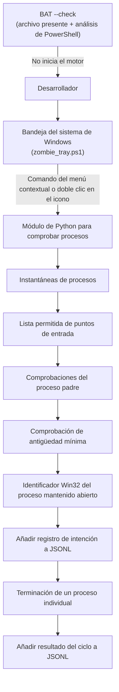
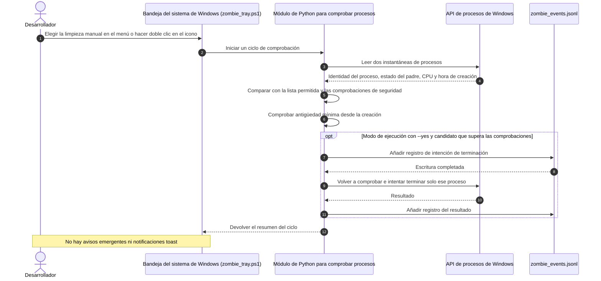

# Zombie Killer Tray

> Utilidad prudente para la bandeja del sistema de Windows. Permite revisar procesos huérfanos seleccionados de servidores Model Context Protocol (MCP) y de servidores de lenguaje, y puede intentar terminarlos individualmente tras las comprobaciones previstas. No termina indiscriminadamente árboles completos de procesos.

[](NOTICE)
[](CHANGELOG.md)
[](https://github.com/dev-bricks/zombie-killer-tray/actions/workflows/tests.yml)
[](pyproject.toml)
[](#)
[](https://github.com/astral-sh/ruff)
[](LICENSE)
[](THIRD_PARTY_LICENSES.md)
[](https://github.com/dev-bricks)
[](https://github.com/open-bricks)
[](llms.txt)

[Inglés](README.md) · [Deutsch](README_de.md) · [Español](README_es.md) · [简体中文](README_zh.md) · [日本語](README_ja.md) · [Русский](README_ru.md)

> [!NOTE]
> Las notas legibles por máquina sobre el comportamiento, la instalación y los límites del proyecto para agentes de IA están en [llms.txt](llms.txt).

---

### 🧭 Navegación rápida

- [1. Descripción general y planteamiento del problema](#overview--problem-statement)
- [2. Arquitectura y topología del sistema](#system-architecture--topology)
- [3. Secuencia completa del ciclo de vida](#complete-lifecycle-sequence)
- [4. Salvaguardas documentadas en tiempo de ejecución](#governance--runtime-invariants)
- [5. Usuarios objetivo y visibilidad](#target-personas--discoverability)
- [6. Alcance y alternativas](#comparative-matrix--alternatives)
- [7. Proyectos relacionados](#sibling-ecosystem--partner-tools)
- [8. Características y capacidades](#features--capabilities)
- [9. Interfaz y uso de la bandeja del sistema de Windows](#windows-tray-interface--ux)
- [10. Requisitos y compatibilidad de plataforma](#requirements--platform-compatibility)
- [11. Modos de inicio y ejecución](#start--execution-modes)
- [12. Lista de permitidos y reglas para procesos candidatos](#allowlist-configuration--reaping-rules)
- [13. Registro de auditoría y forma de eventos](#audit-logging--forensic-event-schema)
- [14. Pruebas y garantía de calidad](#testing--quality-assurance)
- [15. Política de seguridad y privacidad](#security-policy--privacy-governance)
- [16. Licencias de dependencia de terceros](#third-party-transparency--level-1-sbom)
- [17. Desarrollo, construcción y empaquetado](#development-build--packaging)
- [18. Licencia y atribución](#statutory-notice--521-bgb--license-attribution)

---

<a id="sec-01"></a><a id="overview--problem-statement"></a><a id="ueberblick--problemstellung"></a><a id="überblick--problemstellung"></a>
## 1. Descripción general y problema que aborda

Cuando los marcos locales de agentes de IA (Claude Code, Codex CLI, Gemini Antigravity, Kimi) o los IDE se desconectan o se cierran de forma inesperada, los servidores de Model Context Protocol (MCP) (`node.exe`, `python.exe`) y los servidores de lenguaje (`rust-analyzer.exe`, `clangd.exe`, `gopls.exe`, `pylsp`) pueden seguir ejecutándose en segundo plano. Con el tiempo, estos procesos que ya no controla el cliente pueden acumularse, consumir memoria y mantener bloqueados archivos de árboles de código activos.

Las técnicas administrativas habituales de limpieza en Windows entrañan riesgos:
- Comandos sencillos de PowerShell o cmd como `taskkill /F /IM node.exe` pueden terminar indiscriminadamente sesiones activas de desarrollo, servidores en primer plano o herramientas web.
- Terminar recursivamente un árbol (`taskkill /T`) puede cerrar sesiones de terminal completas o IDE de desarrollo.
- La inspección simple de PID es vulnerable a condiciones de carrera por reutilización de PID en Windows: antes de ejecutar la orden de terminación, el sistema puede asignar a otro proceso la PID de uno que acaba de terminar.

`zombie-killer-tray` aplica varias comprobaciones conservadoras. Compara la identidad del proceso, el estado del proceso padre en varias observaciones, el tiempo de CPU y una antigüedad mínima desde la creación del proceso (30 minutos de forma predeterminada). El motor de Windows mantiene abierto un identificador del proceso durante las comprobaciones y el intento de terminación. Esto ayuda a no actuar por error sobre otro proceso tras la reutilización de una PID.

---

<a id="sec-02"></a><a id="system-architecture--topology"></a><a id="systemarchitektur--topologie"></a>
## 2. Arquitectura y topología del sistema

La aplicación de la bandeja y el módulo de Python que comprueba procesos examinan un conjunto limitado de procesos candidatos. La opción `--check` del iniciador solo comprueba que exista el script de la bandeja y que PowerShell pueda analizarlo. No inicia el motor ni examina procesos.



Mantener abierto el identificador ayuda a que las comprobaciones y el intento de terminación se refieran al mismo objeto de proceso. El proyecto no afirma que esto elimine todas las posibles condiciones de carrera del sistema operativo.

<a id="sec-03"></a><a id="complete-lifecycle-sequence"></a><a id="vollstaendiger-ausfuehrungsablauf"></a><a id="vollständiger-ausführungsablauf"></a>
## 3. Secuencia completa del ciclo



El motor omite un candidato si falla una comprobación necesaria. La antigüedad se mide desde la creación del proceso, no desde que terminó su proceso padre. En el modo de ejecución con `--yes`, si no se puede añadir el registro previo de intención, no se intenta terminar el proceso. Los registros JSONL se añaden como texto normal y se pueden editar.

<a id="sec-04"></a><a id="governance--runtime-invariants"></a><a id="sicherheitsmodell--governance-invarianten"></a>
## 4. Salvaguardas documentadas en tiempo de ejecución

La tabla describe comportamientos observables en el código actual. Estas notas no constituyen una certificación, un aislamiento impuesto por el sistema operativo ni una garantía frente a todos los fallos.

| Identificador | Comportamiento actual | Límite |
|:---|:---|:---|
| **INV-LOCAL-01** | El código revisado de primera parte para la comprobación de procesos y la bandeja no contiene solicitudes de red salientes. | Esto no bloquea la red a nivel del sistema operativo ni ofrece una garantía independiente sobre cada dependencia o el equipo anfitrión. |
| **INV-SEC-02** | `start-zombie-killer-admin.bat --check` comprueba el archivo de la bandeja y pide a PowerShell que lo analice. | No examina procesos, no valida Python ni reduce el token de seguridad del proceso que lo invoca. |
| **INV-PARENT-03** | Se registra el estado del proceso padre y se vuelve a comprobar antes de intentar una terminación. | Si la comprobación falla o queda incompleta, se omite el candidato. |
| **INV-STABLE-04** | El motor compara dos observaciones del proceso, incluida su identidad y el tiempo de CPU. | Esto limita los casos elegibles, pero no garantiza un funcionamiento sin riesgos. |
| **INV-HANDLE-05** | El motor de Windows mantiene abierto un identificador del proceso durante las comprobaciones y el intento de terminación. | Ayuda a no confundir una PID reutilizada con el proceso original; no elimina todas las condiciones de carrera. |
| **INV-ALLOW-06** | La selección usa un conjunto limitado de puntos de entrada configurados para MCP y servidores de lenguaje. | La lista permitida no es un administrador general de procesos. |
| **INV-NOTREE-07** | El motor intenta terminar un proceso seleccionado de forma individual, no todo un árbol recursivo. | Esto no hace elegible a cualquier proceso ni garantiza que la terminación tenga éxito. |
| **INV-AUDIT-08** | En el modo de ejecución con `--yes`, se añade un registro de intención antes del intento; si no se puede escribir, se cancela ese intento. | El archivo JSONL es un registro local normal al que se añaden líneas; no es a prueba de manipulaciones. |
| **INV-AGE-09** | Se exige una antigüedad mínima desde la creación del proceso. El valor predeterminado es de 1.800 segundos (30 minutos), sujeto a las opciones admitidas. | No se mide el tiempo transcurrido desde que el proceso quedó huérfano. |
| **Tiempo de respuesta** | Las instrucciones para comunicar problemas de seguridad figuran en `SECURITY.md`. | No se promete un plazo de respuesta ni de triaje. |

<a id="sec-05"></a><a id="target-personas--discoverability"></a><a id="zielgruppen--auffindbarkeit"></a>
## 5. Usuarios y contexto de uso

`zombie-killer-tray` es una utilidad de Windows para desarrolladores que desean revisar repetidamente un conjunto limitado de procesos MCP y servidores de lenguaje.

| Contexto de uso | Preocupación habitual | Qué hace este proyecto |
|:---|:---|:---|
| **Desarrollo con IA y varios agentes** | Un cliente que se cierra de forma inesperada puede dejar activo un proceso backend coincidente. | Comprueba puntos de entrada seleccionados y exige que se cumplan las condiciones configuradas del proceso y del proceso padre antes de intentar terminarlo. |
| **Mantenimiento de equipos Windows** | Una limpieza amplia basada solo en nombres puede afectar procesos ajenos. | Limita los candidatos mediante una lista permitida y compara varias observaciones. |
| **Usuarios de servidores de lenguaje** | Un servidor puede seguir activo después de cerrar su editor. | Comprueba el estado del proceso padre y la antigüedad mínima; no calcula cuándo quedó huérfano. |
| **Revisión de datos locales de procesos** | Los registros pueden revelar argumentos de línea de comandos y rutas locales. | Escribe registros JSONL locales; conviene protegerlos y revisarlos según sea necesario. |

#### Términos de búsqueda
- **Inglés (EN):** `windows mcp process cleanup`, `orphaned language server windows`, `node mcp server cleanup`, `zombie-killer-tray`
- **Alemán (DE):** `Windows-MCP-Prozesse prüfen`, `verwaiste Sprachserver unter Windows`, `MCP- und Sprachserverprozesse bereinigen`

<a id="sec-06"></a><a id="comparative-matrix--alternatives"></a><a id="vergleichsmatrix--alternativen"></a>
## 6. Alcance y alternativas

El proyecto cubre un flujo concreto: comprueba un conjunto configurado de procesos MCP y servidores de lenguaje de Windows y, tras las comprobaciones, puede intentar terminar cada proceso por separado. Las herramientas integradas del sistema permiten inspecciones y acciones manuales. Los scripts propios varían en sus criterios de selección y seguridad. Este README no hace afirmaciones sobre el rendimiento, la privacidad, la seguridad ni las funciones de otros productos.

<a id="sec-07"></a><a id="sibling-ecosystem--partner-tools"></a><a id="geschwister-oekosystem--partner-tools"></a><a id="geschwister-ökosystem--partner-tools"></a>
## 7. Proyectos relacionados

Estos enlaces llevan a proyectos de organizaciones de desarrollo relacionadas. Su inclusión no implica integración técnica ni un entorno de ejecución compartido.

- [CareCenter-for-Codex](https://github.com/dev-bricks/CareCenter-for-Codex) - `dev-bricks`
- [safe-start-for-codex](https://github.com/dev-bricks/safe-start-for-codex) - `dev-bricks`
- [MethodenAnalyser](https://github.com/dev-bricks/MethodenAnalyser) - `dev-bricks`
- [ellmos-filecommander-mcp](https://github.com/ellmos-ai/ellmos-filecommander-mcp) - `ellmos-ai`
- [ellmos-codecommander-mcp](https://github.com/ellmos-ai/ellmos-codecommander-mcp) - `ellmos-ai`
- [ellmos-controlcenter-mcp](https://github.com/ellmos-ai/ellmos-controlcenter-mcp) - `ellmos-ai`
- [n8n-manager-mcp](https://github.com/ellmos-ai/n8n-manager-mcp) - `ellmos-ai`
- [CloudLockFixer](https://github.com/file-bricks/CloudLockFixer) - `file-bricks`
- [DokuZen](https://github.com/doc-bricks/DokuZen) - `doc-bricks`

<a id="sec-08"></a><a id="features--capabilities"></a><a id="kernfunktionen--faehigkeiten"></a><a id="kernfunktionen--fähigkeiten"></a>
## 8. Funciones y capacidades

- **Comprobaciones con identificador de proceso (INV-HANDLE-05):** El motor de Windows mantiene un identificador del proceso durante las comprobaciones y el intento de terminación. Esto ayuda a mantener la operación asociada al objeto observado; no significa que sean imposibles todas las condiciones de carrera del sistema operativo.
- **Dos observaciones (INV-STABLE-04):** El motor compara la identidad del proceso y el tiempo de CPU en dos observaciones separadas por una espera. Se omite cualquier candidato que cambie o no supere las comprobaciones.
- **Comprobaciones del proceso padre (INV-PARENT-03):** Se comprueba el estado del proceso padre durante el ciclo y antes de intentar una terminación.
- **Registros JSONL locales (INV-AUDIT-08):** En el modo de ejecución con `--yes`, se añade un registro de intención antes del intento y luego se registra el resultado. Si falla la escritura de la intención, se cancela ese intento. El registro se puede editar.
- **Antigüedad mínima (INV-AGE-09):** El candidato debe alcanzar la antigüedad configurada desde su creación. El valor predeterminado es de 1.800 segundos (30 minutos); la interfaz ofrece un conjunto limitado de opciones.
- **Comprobación de sintaxis del iniciador:** `start-zombie-killer-admin.bat --check` comprueba que exista el script de la bandeja y que PowerShell pueda analizarlo. No inicia el motor de Python ni examina la tabla de procesos.
- **Comportamiento de red:** El código revisado de primera parte para procesos y bandeja no contiene solicitudes salientes. El programa no instala un bloqueo de red del sistema operativo, y este README no afirma que exista un límite de red impuesto por el sistema operativo.

<a id="sec-09"></a><a id="windows-tray-interface--ux"></a><a id="windows-tray-bedienoberflaeche--benutzererlebnis"></a><a id="windows-tray-bedienoberfläche--benutzererlebnis"></a>
## 9. Interfaz y uso de la bandeja del sistema de Windows

La aplicación de la bandeja utiliza PowerShell WinForms y un icono en el área de notificación de Windows.

- **Limpieza manual:** El menú contextual incluye una opción para iniciar una limpieza manual. También se inicia un ciclo manual al hacer doble clic en el icono; un solo clic no lo hace.
- **Menú contextual:** Permite activar la comprobación automática, elegir el intervalo y la antigüedad mínima, seleccionar el idioma, abrir el registro local y cerrar la aplicación de la bandeja.
- **Seis idiomas de interfaz:** El menú, la información emergente y el selector admiten inglés, alemán, español, chino simplificado, japonés y ruso. El idioma inicial sigue la cultura de la interfaz de Windows, con inglés como alternativa. La selección se guarda en `zombie_state.json`; los registros técnicos siguen en inglés.
- **Intervalos:** Se puede elegir entre 5/10/20/30/60 minutos, 3/5/10/15/20 horas o 24 horas. El intervalo predeterminado es de 30 minutos.
- **Antigüedad mínima:** Se puede elegir entre 5/10/15/30/60 minutos o 2/6/12/24 horas. El valor predeterminado es de 30 minutos. El motor admite como límites inferiores 30 segundos para la antigüedad y 3 segundos para el intervalo; el menú solo muestra las opciones indicadas.
- **Notificaciones:** La aplicación utiliza el icono, su información emergente y el menú contextual. No implementa notificaciones en globo ni notificaciones toast.
- **Salir:** Al salir se cierra la aplicación de la bandeja y se detiene su propio proceso de trabajo en segundo plano. No se envía ninguna orden de terminación a los procesos candidatos.

<a id="sec-10"></a><a id="requirements--platform-compatibility"></a><a id="voraussetzungen--plattform-kompatibilitaet"></a><a id="voraussetzungen--plattform-kompatibilität"></a>
## 10. Requisitos y compatibilidad

- **Sistema operativo:** Windows 10 o Windows 11 de 64 bits.
- **Python:** Python 3.12 o posterior, según `pyproject.toml`; el flujo de trabajo actual prueba Python 3.12 en Windows.
- **PowerShell:** Windows PowerShell 5.1 o PowerShell 7 en Windows.
- **Dependencia de ejecución:** Desde la raíz del repositorio, instale la dependencia declarada con `python -m pip install -r requirements.txt` antes de iniciar el motor de comprobación de procesos de Python.
- **Permisos:** El archivo por lotes solicita elevación de administrador para el funcionamiento normal de la aplicación de bandeja. `--check` solo realiza las comprobaciones del archivo y del análisis de PowerShell descritas arriba; no modifica el token de seguridad de quien lo ejecuta ni examina procesos.

<a id="sec-11"></a><a id="start--execution-modes"></a><a id="start--ausfuehrungsmodi"></a><a id="start--ausführungsmodi"></a>
## 11. Inicio y modos de ejecución

### 1. Iniciar la aplicación de la bandeja

Haga doble clic en `start-zombie-killer-admin.bat`. El iniciador solicita elevación mediante el Control de cuentas de usuario (UAC) de Windows e inicia la aplicación:

```bat
start-zombie-killer-admin.bat
```

### 2. Comprobar el script del iniciador

```bat
start-zombie-killer-admin.bat --check
```

Esto comprueba que exista el script de la bandeja y que PowerShell pueda analizarlo. No inicia la aplicación, no valida Python, no examina procesos y no reduce el token de seguridad de quien ejecuta el comando.

### 3. Previsualizar candidatos desde la CLI de Python

```powershell
# Buscar candidatos sin modificar procesos
python zombie_killer.py scan

# Previsualizar un ciclo sin intentar terminar procesos
python zombie_killer.py reap --min-age 900
```

La CLI admite las acciones `scan`, `reap`, `watch` y `broker-report`. `reap` y `watch` solo intentan terminar procesos si se indica `--yes`. Revise el código y los candidatos antes de usar ese modo de ejecución.

### 4. Usar el paquete de Python instalado

El nombre de distribución del paquete es `zombie-killer-tray`. El repositorio también contiene el paquete en `src/zombie_killer_tray/`:

```bash
python -m zombie_killer_tray scan
```

El motor escribe los registros JSONL y los archivos de error del proceso de trabajo en el directorio de trabajo actual del proceso (`Path.cwd()`). La aplicación de la bandeja establece ese directorio en la raíz del repositorio; otros programas que lo invoquen o utilicen el paquete emplean su propio directorio actual.

<a id="sec-12"></a><a id="allowlist-configuration--reaping-rules"></a><a id="allowlist-konfiguration--reaping-regeln"></a>
## 12. Lista permitida y reglas para los procesos candidatos

Para ser candidato, el proceso debe coincidir con uno de los conjuntos de puntos de entrada definidos en [`killer.py`](src/zombie_killer_tray/killer.py#L17-L26):

- **Ejecutables de servidores de lenguaje (LSP):** `rust-analyzer.exe`, `clangd.exe`, `gopls.exe`, `zls.exe`.
- **Puntos de entrada de Node.js:** `typescript-language-server`, `pyright-langserver`, `yaml-language-server`, `bash-language-server`, `vscode-json-languageserver`.
- **Paquetes MCP:** `ellmos-filecommander-mcp`, `ellmos-codecommander-mcp`, `ellmos-controlcenter-mcp`, `ellmos-clatcher-mcp`, `ellmos-n8n-manager-mcp`, `n8n-manager-mcp`, `@modelcontextprotocol/server-filesystem`, `@modelcontextprotocol/server-memory`, `@modelcontextprotocol/server-sequential-thinking`, `@upstash/context7-mcp`.
- **Módulos Python:** `pylsp`, `jedi_language_server`, `mcp_server_git`, `mcp_server_fetch`, `mcp_server_time`.

Estos conjuntos definen los puntos de entrada que se comparan; no sustituyen las demás comprobaciones. En el mismo módulo fuente, el motor también verifica la identidad del proceso, el estado del proceso padre, la antigüedad y otras condiciones de seguridad. Coincidir con un punto de entrada no basta para que el proceso sea elegible.

<a id="sec-13"></a><a id="audit-logging--forensic-event-schema"></a><a id="audit-protokollierung--forensisches-ereignis-schema"></a>
## 13. Registro de auditoría y estructura de los eventos

El motor añade registros JSON a `zombie_events.jsonl` en el directorio de trabajo actual del proceso. La aplicación de la bandeja fija el directorio de trabajo de su proceso auxiliar en la raíz del repositorio; otros programas que lo invoquen usan su propio directorio actual. Git ignora este archivo. Este es un ejemplo de la estructura de un registro:

```json
{
  "at": 1790940000.0,
  "event": "terminate-intent",
  "child": {
    "pid": 14208,
    "ppid": 8192,
    "born": 134000000000000000,
    "cpu": 0,
    "exe": "node.exe",
    "argv": ["node.exe", "<local arguments omitted>"],
    "kind": "mcp",
    "parent_dead": true
  },
  "parent_last_observed": null
}
```

El registro posterior del resultado incluye `child`, `parent_last_observed`, `killed` y `reason`; los resúmenes de ciclo utilizan `cycle_at`, `apply` y `count`. Los campos dependen del evento. Son registros de texto que se añaden al archivo y se pueden editar. Pueden contener identificadores de procesos, nombres de ejecutables, argumentos de línea de comandos y rutas locales; protéjalos. En el modo de ejecución con `--yes`, no se intenta terminar el proceso si no se puede añadir el registro de intención.

<a id="sec-14"></a><a id="testing--quality-assurance"></a><a id="tests--qualitaetssicherung"></a><a id="tests--qualitätssicherung"></a>
## 14. Pruebas y calidad

El repositorio incluye pruebas de Python, comprobaciones de Ruff y verificaciones para Windows en GitHub Actions. Puede ejecutar estos comandos localmente; los resultados dependen del entorno y no se resumen mediante una insignia estática.

```powershell
# Ejecutar las pruebas
python -m pytest -ra -v .

# Ejecutar las comprobaciones compatibles con unittest
python -m unittest -v test_zombie_killer
python -m unittest -v tests/test_metadata.py

# Ejecutar las comprobaciones de Ruff
python -m ruff check .

# Compilar los archivos de Python
python -m compileall -q .
```

<a id="sec-15"></a><a id="security-policy--privacy-governance"></a><a id="sicherheitsrichtlinie--datenschutz-governance"></a>
## 15. Seguridad y privacidad

El código fuente del proyecto y sus registros tienen características de privacidad distintas:
- El código revisado de primera parte para comprobar procesos y la bandeja no contiene solicitudes de red salientes. Es una observación del código fuente, no una función de aislamiento de red ni una garantía absoluta contra la salida de datos.
- El modo `--check` solo comprueba que exista el script de la bandeja y que PowerShell pueda analizarlo. No enumera ni examina procesos y no cambia el token de seguridad de quien ejecuta el comando.
- Los registros JSONL y de diagnóstico locales pueden contener identificadores de procesos, nombres de ejecutables, argumentos de línea de comandos, marcas de tiempo y rutas. Trátelos como datos locales potencialmente sensibles.
- Consulte `SECURITY.md` para ver las instrucciones publicadas para informar de problemas. Este README no afirma que se supervise un buzón concreto ni promete plazos de respuesta o triaje.

<a id="sec-16"></a><a id="third-party-transparency--level-1-sbom"></a><a id="drittanbieter-transparenz--level-1-sbom"></a>

## 16. Licencias de dependencias directas de terceros

`THIRD_PARTY_LICENSES.md` y el archivo de texto `THIRD_PARTY_LICENSES.txt` resumen algunas dependencias directas de ejecución y desarrollo y las licencias registradas para ellas. El resumen se limita a las dependencias directas enumeradas; no es un SBOM completo de dependencias transitivas ni una certificación legal. Los metadatos del proyecto declaran `psutil` como dependencia de ejecución; su licencia de origen es BSD-3-Clause.

<a id="sec-17"></a><a id="development-build--packaging"></a><a id="entwicklung-build--packaging"></a>
## 17. Desarrollo, compilación y empaquetado

Los metadatos del paquete de Python se declaran en `pyproject.toml`; el proyecto se construye con el backend PEP 517 configurado allí:

```powershell
# Instalar dependencias de ejecución
python -m pip install -r requirements.txt

# Instalar las dependencias de desarrollo declaradas
python -m pip install -e .[dev]

# Instalar la herramienta de compilación
python -m pip install build

# Crear las distribuciones de código fuente y wheel
python -m build
```

<a id="sec-18"></a><a id="statutory-notice--521-bgb--license-attribution"></a><a id="gesetzlicher-hinweis--521-bgb--lizenz-attribution"></a>
## 18. Licencia y atribución

Este proyecto se distribuye con la [Licencia MIT](LICENSE). Copyright (c) 2026 Lukas Geiger, dev-bricks y el ecosistema open-bricks.

Esta sección no ofrece una interpretación jurídica específica del proyecto sobre las normas legales de garantía o responsabilidad.
