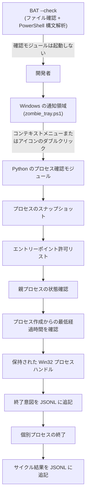
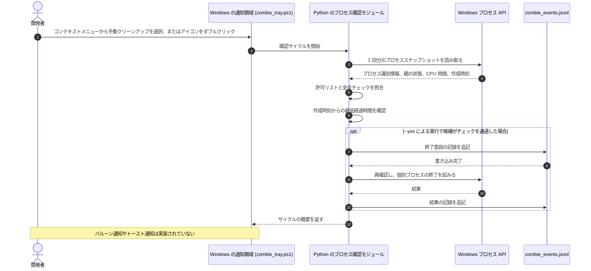

# Zombie Killer Tray

> これは Windows の通知領域で動作する慎重なユーティリティです。選択した MCP（Model Context Protocol）サーバーとランゲージサーバーの孤立プロセスを確認し、所定のチェックを通過した場合に個別終了を試みます。プロセスツリー全体を一括終了することはありません。

[](NOTICE)
[](CHANGELOG.md)
[](https://github.com/dev-bricks/zombie-killer-tray/actions/workflows/tests.yml)
[](pyproject.toml)
[](#)
[](https://github.com/astral-sh/ruff)
[](LICENSE)
[](THIRD_PARTY_LICENSES.md)
[](https://github.com/dev-bricks)
[](https://github.com/open-bricks)
[](llms.txt)

[英語](README.md) · [ドイツ語](README_de.md) · [スペイン語](README_es.md) · [简体中文](README_zh.md) · [日本語](README_ja.md) · [Русский](README_ru.md)

> [!NOTE]
> AI エージェント向けのプロジェクトの動作、セットアップ、制約に関する機械可読な情報は [llms.txt](llms.txt) に記載しています。

---

### 🧭 クイックナビゲーション

- [1. 概要と問題](#overview--problem-statement)
- [2.システム アーキテクチャとトポロジ](#system-architecture--topology)
- [3.完全なライフサイクル シーケンス](#complete-lifecycle-sequence)
- [4. 文書化された実行時の保護策](#governance--runtime-invariants)
- [5.対象ユーザーと見つけやすさ](#target-personas--discoverability)
- [6.範囲と代替案](#comparative-matrix--alternatives)
- [7.関連プロジェクト](#sibling-ecosystem--partner-tools)
- [8.機能](#features--capabilities)
- [9. Windows 通知領域のインターフェースと使い方](#windows-tray-interface--ux)
- [10.要件とプラットフォームの互換性](#requirements--platform-compatibility)
- [11.開始および実行モード](#start--execution-modes)
- [12. 許可リストと候補プロセスの条件](#allowlist-configuration--reaping-rules)
- [13. 監査ログとイベント構造](#audit-logging--forensic-event-schema)
- [14.テストと品質保証](#testing--quality-assurance)
- [15.セキュリティ ポリシーとプライバシー](#security-policy--privacy-governance)
- [16.サードパーティ依存ライセンス](#third-party-transparency--level-1-sbom)
- [17.開発、ビルド、パッケージ化](#development-build--packaging)
- [18. ライセンスと帰属表示](#statutory-notice--521-bgb--license-attribution)

---

<a id="sec-01"></a><a id="overview--problem-statement"></a><a id="ueberblick--problemstellung"></a><a id="überblick--problemstellung"></a>
## 1. 概要と背景

Claude Code、Codex CLI、Gemini Antigravity、Kimi などのローカル AI エージェントフレームワークや IDE が突然切断・終了すると、Model Context Protocol（MCP）サーバー（`node.exe`、`python.exe`）やランゲージサーバー（`rust-analyzer.exe`、`clangd.exe`、`gopls.exe`、`pylsp`）がバックグラウンドに残ることがあります。こうした管理元を失ったプロセスは時間とともに蓄積し、メモリを消費したり、作業中のソースツリー内のファイルをロックしたりする場合があります。

Windows で一般的な管理者向けの一括クリーンアップにはリスクがあります。
- `taskkill /F /IM node.exe` のような単純な PowerShell や cmd のコマンドは、開発セッション、フォアグラウンドサーバー、Web ツールまで無差別に終了させるおそれがあります。
- プロセスツリーを再帰的に終了する `taskkill /T` は、端末セッション全体や開発用 IDE まで終了させる可能性があります。
- 単純な PID 確認では、Windows の PID 再利用による競合状態を防げません。終了コマンドの実行前に、終了済みプロセスの PID が別のプロセスへ再割り当てされる場合があります。

`zombie-killer-tray` は複数段階のチェックを行います。プロセスの識別情報、複数回の観測における親プロセスの状態、CPU 時間、およびプロセス作成からの最低経過時間（既定は 30 分）を比較します。Windows 側ではチェックから終了試行までプロセスハンドルを保持します。これにより PID 再利用後に別のプロセスを誤って操作する可能性を抑えます。

---

<a id="sec-02"></a><a id="system-architecture--topology"></a><a id="systemarchitektur--topologie"></a>
## 2. システム構成

通知領域のプログラムと Python のプロセス確認モジュールは、限定された候補プロセスを調べます。起動用オプション `--check` は、通知領域スクリプトの存在と PowerShell による構文解析だけを確認します。確認モジュールを起動したり、プロセスを調べたりはしません。



プロセスハンドルを保持することで、確認と終了試行を同じプロセスオブジェクトに結び付けやすくなります。これによって OS のあらゆる競合状態がなくなるとは、本プロジェクトは主張していません。

<a id="sec-03"></a><a id="complete-lifecycle-sequence"></a><a id="vollstaendiger-ausfuehrungsablauf"></a><a id="vollständiger-ausführungsablauf"></a>
## 3. 1 回の処理の流れ



必要なチェックに失敗した候補はスキップされます。最低経過時間は親プロセスの終了時ではなく、候補プロセスの作成時から数えます。`--yes` による実行では、終了前の意図記録を追記できない場合、終了を試みません。JSONL の記録は通常の追記であり、編集できます。

<a id="sec-04"></a><a id="governance--runtime-invariants"></a><a id="sicherheitsmodell--governance-invarianten"></a>
## 4. 文書化された実行時の保護策

次の表は、現在のソースコードで確認できる動作を示します。実装に関する説明であり、認証、OS サンドボックス、またはあらゆる障害を防ぐ保証ではありません。

| 識別子 | 現在の動作 | 限界 |
|:---|:---|:---|
| **INV-LOCAL-01** | 確認した自前のプロセス確認コードと通知領域のソースには、外部へのネットワーク要求コードがありません。 | OS レベルのネットワーク遮断ではなく、すべての依存関係やホストについての独立した保証でもありません。 |
| **INV-SEC-02** | `start-zombie-killer-admin.bat --check` は通知領域のファイルを確認し、PowerShell で構文解析します。 | プロセスのスキャンや Python の検証は行わず、呼び出し元のセキュリティトークンも低い権限へ変更しません。 |
| **INV-PARENT-03** | 終了を試みる前に、親プロセスの状態を改めて観測・確認します。 | チェックに失敗した場合や結果が不完全な場合、候補はスキップされます。 |
| **INV-STABLE-04** | モジュールは、プロセス識別情報や CPU 時間を含む 2 回の観測結果を比較します。 | 候補を絞り込みますが、リスクのない動作を保証するものではありません。 |
| **INV-HANDLE-05** | Windows モジュールは、チェックと終了試行の間、プロセスハンドルを保持します。 | PID の再利用による誤操作を避ける助けになりますが、すべての競合状態がなくなるわけではありません。 |
| **INV-ALLOW-06** | MCP とランゲージサーバーの設定済みエントリーポイントから成る限定リストを照合します。 | 許可リストは汎用のプロセスマネージャーではありません。 |
| **INV-NOTREE-07** | モジュールは選択したプロセスを個別に終了しようとし、プロセスツリーを再帰的には終了しません。 | すべてのプロセスが候補になるわけではなく、終了成功も保証されません。 |
| **INV-AUDIT-08** | `--yes` による実行では、終了を試みる前に意図記録を追記します。記録に失敗すると、その終了試行を中止します。 | JSONL ファイルは通常のローカル追記ログであり、改ざん防止機能はありません。 |
| **INV-AGE-09** | プロセス作成からの最低経過時間が必要です。既定値は 1,800 秒（30 分）で、対応する設定により変更できます。 | 孤立してから経過した時間を測るものではありません。 |
| **応答時間** | セキュリティ問題の報告方法は `SECURITY.md` に記載しています。 | 応答やトリアージの所要時間は約束していません。 |

<a id="sec-05"></a><a id="target-personas--discoverability"></a><a id="zielgruppen--auffindbarkeit"></a>
## 5. 想定ユーザーと利用場面

`zombie-killer-tray` は、選択した MCP サーバーやランゲージサーバーのプロセスを定期的に確認したい Windows 開発者向けのユーティリティです。

| 利用者の状況 | よくある懸念 | 本プロジェクトが行うこと |
|:---|:---|:---|
| **AI・マルチエージェント開発者** | クライアントが予期せず閉じると、対応するバックエンドプロセスが残ることがあります。 | 選択したエントリーポイントを確認し、終了試行の前にプロセスと親プロセスの条件を確認します。 |
| **Windows ワークステーションの管理者** | 名前だけで広くクリーンアップすると、関係のないプロセスに影響することがあります。 | 許可リストで候補を限定し、複数回の観測結果を確認します。 |
| **ランゲージサーバーの利用者** | エディターを閉じた後もサーバーが残る場合があります。 | 親プロセスの状態と最低経過時間を確認します。プロセスがいつ孤立したかは推測しません。 |
| **ローカルプロセスデータを確認する開発者** | ログからコマンドライン引数やローカルパスが分かる場合があります。 | ローカル JSONL 記録を書き込みます。必要に応じてファイルを保護し、内容を確認してください。 |

#### 検索語
- **英語 (EN):** `windows mcp process cleanup`、`orphaned language server windows`、`node mcp server cleanup`、`zombie-killer-tray`
- **ドイツ語 (DE):** `Windows-MCP-Prozesse prüfen`、`verwaiste Sprachserver unter Windows`、`MCP- und Sprachserverprozesse bereinigen`

<a id="sec-06"></a><a id="comparative-matrix--alternatives"></a><a id="vergleichsmatrix--alternativen"></a>
## 6. 対象範囲と代替手段

本プロジェクトの対象は、Windows 上で設定された MCP サーバーとランゲージサーバーの候補を確認し、チェック後に個別終了を試みる限定的なワークフローです。OS 標準のプロセスツールでは手動の確認や利用者が指示する操作ができます。独自スクリプトの照合条件や安全ロジックはそれぞれ異なります。この README は他の製品の性能、プライバシー、安全性、機能について主張しません。

<a id="sec-07"></a><a id="sibling-ecosystem--partner-tools"></a><a id="geschwister-oekosystem--partner-tools"></a><a id="geschwister-ökosystem--partner-tools"></a>
## 7. 関連プロジェクト

以下のリンクは、関連する開発組織のプロジェクトを示します。掲載は、技術的な統合や共通の実行環境を意味しません。

- [CareCenter-for-Codex](https://github.com/dev-bricks/CareCenter-for-Codex) - `dev-bricks`
- [safe-start-for-codex](https://github.com/dev-bricks/safe-start-for-codex) - `dev-bricks`
- [MethodenAnalyser](https://github.com/dev-bricks/MethodenAnalyser) - `dev-bricks`
- [ellmos-filecommander-mcp](https://github.com/ellmos-ai/ellmos-filecommander-mcp) - `ellmos-ai`
- [ellmos-codecommander-mcp](https://github.com/ellmos-ai/ellmos-codecommander-mcp) - `ellmos-ai`
- [ellmos-controlcenter-mcp](https://github.com/ellmos-ai/ellmos-controlcenter-mcp) - `ellmos-ai`
- [n8n-manager-mcp](https://github.com/ellmos-ai/n8n-manager-mcp) - `ellmos-ai`
- [CloudLockFixer](https://github.com/file-bricks/CloudLockFixer) - `file-bricks`
- [DokuZen](https://github.com/doc-bricks/DokuZen) - `doc-bricks`

<a id="sec-08"></a><a id="features--capabilities"></a><a id="kernfunktionen--faehigkeiten"></a><a id="kernfunktionen--fähigkeiten"></a>
## 8. 機能

- **プロセスハンドルの確認 (INV-HANDLE-05)：** Windows モジュールは確認から終了試行までプロセスハンドルを保持します。観測したプロセスオブジェクトに対して操作を続ける助けになりますが、OS のすべての競合状態が起きないという意味ではありません。
- **2 回の観測 (INV-STABLE-04)：** 待機時間を挟んだ 2 回の観測で、プロセス識別情報と CPU 時間を比較します。変化した候補やチェックに通らない候補はスキップされます。
- **親プロセスの状態確認 (INV-PARENT-03)：** サイクル中と終了試行の前に、親プロセスの状態を確認します。
- **ローカル JSONL 記録 (INV-AUDIT-08)：** `--yes` による実行では、終了試行の前に意図を追記し、後から結果を記録します。意図を書き込めない場合、その試行は中止されます。ログは編集できます。
- **最低経過時間 (INV-AGE-09)：** 候補はプロセス作成から設定時間を経過している必要があります。既定値は 1,800 秒（30 分）で、画面では限られた選択肢を提供します。
- **起動スクリプトの構文確認：** `start-zombie-killer-admin.bat --check` は通知領域スクリプトの存在と PowerShell 構文を確認します。Python のプロセス確認モジュールやプロセス一覧は調べません。
- **ネットワーク動作：** 確認した自前のプロセス確認コードと通知領域コードには、外部への要求経路がありません。OS レベルのネットワーク遮断は設定しません。この README は OS が強制するネットワーク境界を主張しません。

<a id="sec-09"></a><a id="windows-tray-interface--ux"></a><a id="windows-tray-bedienoberflaeche--benutzererlebnis"></a><a id="windows-tray-bedienoberfläche--benutzererlebnis"></a>
## 9. Windows 通知領域のインターフェースと使い方

通知領域プログラムは PowerShell WinForms と Windows の通知領域アイコンを使用します。

- **手動クリーンアップ：** コンテキストメニューから手動クリーンアップを実行できます。アイコンのダブルクリックでも手動サイクルを開始します。シングルクリックでは開始しません。
- **コンテキストメニュー：** 自動確認、間隔、最低経過時間、言語の選択、ローカルログを開く操作、通知領域プログラムの終了を選べます。
- **6 言語対応：** メニュー、ツールチップ、言語選択は英語、ドイツ語、スペイン語、簡体字中国語、日本語、ロシア語に対応します。初期言語は Windows の UI カルチャに従い、該当しない場合は英語になります。選択言語は `zombie_state.json` に保存され、技術ログは英語のままです。
- **間隔：** 5/10/20/30/60 分、3/5/10/15/20 時間、24 時間から選べます。既定値は 30 分です。
- **最低経過時間：** 5/10/15/30/60 分、2/6/12/24 時間から選べます。既定値は 30 分です。モジュールの下限は最低経過時間が 30 秒、間隔が 3 秒です。メニューには対応する選択肢を表示します。
- **通知：** アイコン、ツールチップ、コンテキストメニューを使用します。バルーン通知やトースト通知は実装されていません。
- **終了：** 終了操作は通知領域プログラムを閉じ、プログラム自身が所有するバックグラウンドワーカーを停止します。候補プロセスに終了命令は送りません。

<a id="sec-10"></a><a id="requirements--platform-compatibility"></a><a id="voraussetzungen--plattform-kompatibilitaet"></a><a id="voraussetzungen--plattform-kompatibilität"></a>
## 10. 動作要件と対応環境

- **OS：** 64 ビット版 Windows 10 または Windows 11。
- **Python：** `pyproject.toml` の宣言どおり Python 3.12 以降が必要です。現在のワークフローは Windows で Python 3.12 をテストします。
- **PowerShell：** Windows PowerShell 5.1 または Windows 上の PowerShell 7。
- **実行時依存関係：** Python のプロセス確認モジュールを起動する前に、リポジトリのルートで `python -m pip install -r requirements.txt` を実行して宣言済みの依存関係をインストールしてください。
- **権限：** 通常の通知領域の実行では、バッチ起動スクリプトが管理者権限への昇格を要求します。`--check` は上記のファイル確認と PowerShell 構文解析だけを行い、現在のトークンを変更したりプロセスを調べたりしません。

<a id="sec-11"></a><a id="start--execution-modes"></a><a id="start--ausfuehrungsmodi"></a><a id="start--ausführungsmodi"></a>
## 11. 起動と実行モード

### 1. 通知領域プログラムを起動

`start-zombie-killer-admin.bat` をダブルクリックします。起動スクリプトは Windows のユーザーアカウント制御（UAC）による昇格を要求し、通知領域プログラムを起動します。

```bat
start-zombie-killer-admin.bat
```

### 2. 起動スクリプトを確認

```bat
start-zombie-killer-admin.bat --check
```

通知領域スクリプトの存在を確認し、PowerShell で構文解析します。通知領域プログラムや Python は起動せず、プロセスを調べず、呼び出し元のトークンも低い権限へ変更しません。

### 3. Python CLI で候補をプレビュー

```powershell
# 候補プロセスを読み取り専用で確認
python zombie_killer.py scan

# 終了を適用せずに 1 回のサイクルをプレビュー
python zombie_killer.py reap --min-age 900
```

CLI の操作は `scan`、`reap`、`watch`、`broker-report` です。`reap` と `watch` が終了を試みるのは `--yes` を指定した場合だけです。その実行モードを有効にする前に、コードと候補を確認してください。

### 4. インストール済みの Python パッケージを使用

配布パッケージ名は `zombie-killer-tray` です。リポジトリ内のパッケージは `src/zombie_killer_tray/` にあります。

```bash
python -m zombie_killer_tray scan
```

モジュールは JSONL 監査ログとワーカーのエラーファイルを、プロセスの現在の作業ディレクトリ（`Path.cwd()`）に書き込みます。通知領域プログラムはワーカーの作業ディレクトリをリポジトリのルートに設定します。それ以外の呼び出し元やパッケージ利用者は、それぞれの作業ディレクトリを使用します。

<a id="sec-12"></a><a id="allowlist-configuration--reaping-rules"></a><a id="allowlist-konfiguration--reaping-regeln"></a>
## 12. 許可リストと候補プロセスの条件

候補は [`killer.py`](src/zombie_killer_tray/killer.py#L17-L26) に定義された次のエントリーポイント群のいずれかに一致する必要があります。

- **LSP 実行ファイル：** `rust-analyzer.exe`、`clangd.exe`、`gopls.exe`、`zls.exe`。
- **Node.js エントリーポイント：** `typescript-language-server`、`pyright-langserver`、`yaml-language-server`、`bash-language-server`、`vscode-json-languageserver`。
- **MCP パッケージ：** `ellmos-filecommander-mcp`、`ellmos-codecommander-mcp`、`ellmos-controlcenter-mcp`、`ellmos-clatcher-mcp`、`ellmos-n8n-manager-mcp`、`n8n-manager-mcp`、`@modelcontextprotocol/server-filesystem`、`@modelcontextprotocol/server-memory`、`@modelcontextprotocol/server-sequential-thinking`、`@upstash/context7-mcp`。
- **Python モジュール：** `pylsp`、`jedi_language_server`、`mcp_server_git`、`mcp_server_fetch`、`mcp_server_time`。

この一覧は照合対象のエントリーポイントを示すもので、すべてのプロセス確認を列挙したものではありません。同じソースモジュールで、プロセス識別情報、親プロセスの状態、経過時間、その他の安全条件も確認します。エントリーポイントが一致するだけでは終了対象になりません。

<a id="sec-13"></a><a id="audit-logging--forensic-event-schema"></a><a id="audit-protokollierung--forensisches-ereignis-schema"></a>
## 13. 監査ログとイベント構造

モジュールは、プロセスの現在の作業ディレクトリにある `zombie_events.jsonl` に JSON レコードを追記します。通知領域プログラムはワーカーの作業ディレクトリをリポジトリのルートに設定します。他の呼び出し元はそれぞれの作業ディレクトリを使います。このファイルは Git の対象外です。記録の例を示します。

```json
{
  "at": 1790940000.0,
  "event": "terminate-intent",
  "child": {
    "pid": 14208,
    "ppid": 8192,
    "born": 134000000000000000,
    "cpu": 0,
    "exe": "node.exe",
    "argv": ["node.exe", "<local arguments omitted>"],
    "kind": "mcp",
    "parent_dead": true
  },
  "parent_last_observed": null
}
```

後続の結果レコードには `child`、`parent_last_observed`、`killed`、`reason` が含まれます。サイクル概要には `cycle_at`、`apply`、`count` が使われます。フィールドはイベントによって異なります。記録は通常の追記であり、編集可能です。ログにはプロセス ID、実行ファイル名、コマンドライン引数、ローカルパスが含まれる場合があるため、適切に保護してください。`--yes` による実行で意図記録を追記できない場合、終了試行は中止されます。

<a id="sec-14"></a><a id="testing--quality-assurance"></a><a id="tests--qualitaetssicherung"></a><a id="tests--qualitätssicherung"></a>
## 14. テストと品質確認

リポジトリには Python テスト、Ruff の lint チェック、GitHub Actions の Windows チェックがあります。次のコマンドをローカルで実行できます。結果は環境に依存し、固定のバッジで成否を示すものではありません。

```powershell
# テストを実行
python -m pytest -ra -v .

# unittest 互換のチェックを実行
python -m unittest -v test_zombie_killer
python -m unittest -v tests/test_metadata.py

# Ruff の lint チェックを実行
python -m ruff check .

# Python ソースをコンパイル
python -m compileall -q .
```

<a id="sec-15"></a><a id="security-policy--privacy-governance"></a><a id="sicherheitsrichtlinie--datenschutz-governance"></a>
## 15. セキュリティとプライバシー

プロジェクトのソースコードとログでは、プライバシー上の性質が異なります。
- 確認した自前のプロセス確認コードと通知領域コードには、外部へのネットワーク要求がありません。これはソースコード上の観察であり、ネットワーク分離機能や外部通信を完全に防ぐ保証ではありません。
- `--check` は通知領域スクリプトの存在を確認し、PowerShell で構文解析するだけです。プロセスを列挙・確認せず、呼び出し元のセキュリティトークンも変更しません。
- ローカルの JSONL および診断ログには、プロセス ID、実行ファイル名、コマンドライン引数、タイムスタンプ、パスが含まれる場合があります。機微なローカルデータとして扱ってください。
- セキュリティ問題の報告方法は `SECURITY.md` を参照してください。特定のメールボックスが監視されているとも、応答やトリアージの所要時間を約束するものでもありません。

<a id="sec-16"></a><a id="third-party-transparency--level-1-sbom"></a><a id="drittanbieter-transparenz--level-1-sbom"></a>
## 16. サードパーティ直接依存関係のライセンス

`THIRD_PARTY_LICENSES.md` とテキスト版 `THIRD_PARTY_LICENSES.txt` には、一部の直接の実行時・開発依存関係と記録されたライセンスをまとめています。対象は記載した直接依存関係に限られ、推移的依存関係をすべて含む SBOM でも法的認証でもありません。プロジェクトのメタデータでは `psutil` が実行時依存関係として宣言されています。上流のライセンスは BSD-3-Clause です。

<a id="sec-17"></a><a id="development-build--packaging"></a><a id="entwicklung-build--packaging"></a>
## 17. 開発、ビルド、パッケージング

Python パッケージのメタデータは `pyproject.toml` で宣言し、設定済みの PEP 517 バックエンドでビルドします。

```powershell
# 実行時依存関係をインストール
python -m pip install -r requirements.txt

# 宣言済みの開発依存関係をインストール
python -m pip install -e .[dev]

# ビルドフロントエンドをインストール
python -m pip install build

# ソース配布物と wheel をビルド
python -m build
```

<a id="sec-18"></a><a id="statutory-notice--521-bgb--license-attribution"></a><a id="gesetzlicher-hinweis--521-bgb--lizenz-attribution"></a>
## 18. ライセンスと帰属表示

本プロジェクトは [MIT License](LICENSE) に基づいて配布されます。Copyright (c) 2026 Lukas Geiger、dev-bricks、および open-bricks エコシステム。

この節は、法定の保証または責任規則について、本プロジェクトに固有の法的解釈を示すものではありません。
