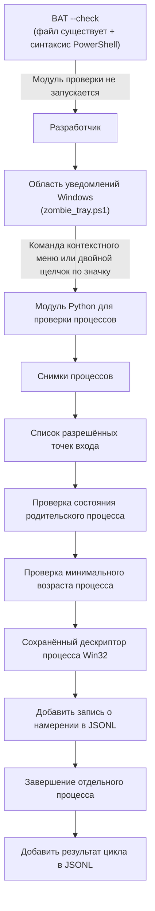
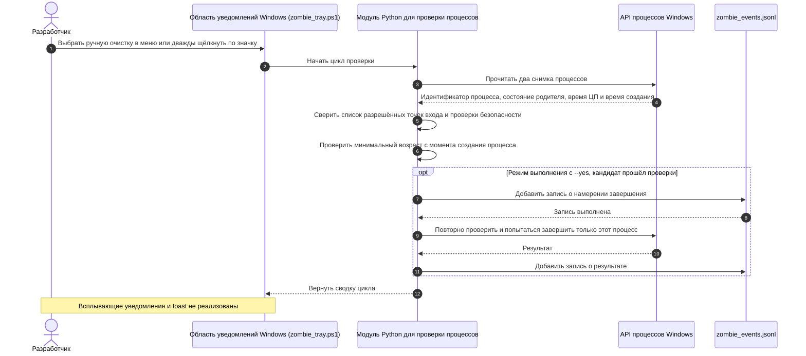

# Zombie Killer Tray

> Осторожная утилита для области уведомлений Windows. Она проверяет выбранные осиротевшие процессы серверов Model Context Protocol (MCP) и языковых серверов и после проверок может попытаться завершить каждый процесс отдельно. Она не завершает целиком дерево процессов по широкому правилу.

[](NOTICE)
[](CHANGELOG.md)
[](https://github.com/dev-bricks/zombie-killer-tray/actions/workflows/tests.yml)
[](pyproject.toml)
[](#)
[](https://github.com/astral-sh/ruff)
[](LICENSE)
[](THIRD_PARTY_LICENSES.md)
[](https://github.com/dev-bricks)
[](https://github.com/open-bricks)
[](llms.txt)
[](CHANGELOG.md)

[Английский](README.md) · [Немецкий](README_de.md) · [Испанский](README_es.md) · [简体中文](README_zh.md) · [日本語](README_ja.md) · [Русский](README_ru.md)

> [!NOTE]
> Машиночитаемые сведения о поведении проекта, настройке и ограничениях для ИИ-агентов приведены в [llms.txt](llms.txt).

---

### 🧭 Быстрая навигация

- [1. Обзор и постановка проблемы](#overview--problem-statement)
- [2. Архитектура и топология системы](#system-architecture--topology)
- [3. Полная последовательность жизненного цикла](#complete-lifecycle-sequence)
- [4. Документированные меры защиты во время работы](#governance--runtime-invariants)
- [5. Целевые пользователи и доступность](#target-personas--discoverability)
- [6. Область применения и альтернативы](#comparative-matrix--alternatives)
- [7. Похожие проекты](#sibling-ecosystem--partner-tools)
- [8. Особенности и возможности](#features--capabilities)
- [9. Интерфейс и работа с областью уведомлений Windows](#windows-tray-interface--ux)
- [10. Требования и совместимость платформ](#requirements--platform-compatibility)
- [11. Режимы запуска и выполнения](#start--execution-modes)
- [12. Список разрешённых точек входа и правила отбора процессов](#allowlist-configuration--reaping-rules)
- [13. Журнал аудита и структура событий](#audit-logging--forensic-event-schema)
- [14. Тестирование и обеспечение качества](#testing--quality-assurance)
- [15. Политика безопасности и конфиденциальности](#security-policy--privacy-governance)
- [16. Лицензии сторонних зависимостей](#third-party-transparency--level-1-sbom)
- [17. Разработка, сборка и упаковка](#development-build--packaging)
- [18. Лицензия и сведения об авторстве](#statutory-notice--521-bgb--license-attribution)

---

<a id="sec-01"></a><a id="overview--problem-statement"></a><a id="ueberblick--problemstellung"></a><a id="überblick--problemstellung"></a>
## 1. Обзор и описание проблемы

Если локальные фреймворки ИИ-агентов (Claude Code, Codex CLI, Gemini Antigravity, Kimi) или IDE неожиданно отключаются или завершаются, их серверы Model Context Protocol (MCP) (`node.exe`, `python.exe`) и языковые серверы (`rust-analyzer.exe`, `clangd.exe`, `gopls.exe`, `pylsp`) могут остаться работать в фоне. Такие оставшиеся без клиента процессы могут накапливаться, занимать память и удерживать блокировки файлов в активных каталогах с исходным кодом.

Обычные административные способы очистки процессов в Windows сопряжены с риском:
- Простые команды PowerShell или cmd, например `taskkill /F /IM node.exe`, могут без разбора завершить активные сеансы разработки, серверы переднего плана или веб-инструменты.
- Рекурсивное завершение дерева процессов (`taskkill /T`) может закрыть целый сеанс терминала или IDE разработчика.
Простая проверка PID не защищает от гонки при повторном использовании PID в Windows: до выполнения команды завершения системе может быть назначен тот же PID другого процесса.

`zombie-killer-tray` выполняет несколько последовательных проверок. Сравниваются идентификатор процесса, состояние родительского процесса в нескольких наблюдениях, время ЦП и минимальный возраст с момента создания процесса (по умолчанию 30 минут). В Windows дескриптор процесса удерживается на протяжении проверок и попытки завершения. Это помогает не затронуть другой процесс после повторного использования PID.

---

<a id="sec-02"></a><a id="system-architecture--topology"></a><a id="systemarchitektur--topologie"></a>
## 2. Архитектура и схема работы

Программа в области уведомлений и модуль Python для проверки процессов рассматривают только ограниченный набор кандидатов. Опция запуска `--check` проверяет лишь наличие скрипта области уведомлений и его синтаксис средствами PowerShell. Она не запускает модуль проверки и не проверяет процессы.



Сохранение дескриптора процесса помогает связать проверку и попытку завершения с одним и тем же объектом процесса. Проект не утверждает, что это устраняет все возможные гонки в операционной системе.

<a id="sec-03"></a><a id="complete-lifecycle-sequence"></a><a id="vollstaendiger-ausfuehrungsablauf"></a><a id="vollständiger-ausführungsablauf"></a>
## 3. Последовательность одного цикла



Если обязательная проверка не пройдена, модуль пропускает кандидата. Минимальный возраст отсчитывается от создания процесса, а не от завершения родительского процесса. При выполнении с `--yes` процесс не завершается, если не удалось предварительно добавить запись о намерении. Записи JSONL добавляются обычным способом и могут редактироваться.

<a id="sec-04"></a><a id="governance--runtime-invariants"></a><a id="sicherheitsmodell--governance-invarianten"></a>
## 4. Документированные меры защиты во время работы

В таблице приведено поведение, видимое в текущем исходном коде. Это описание реализации, а не сертификация, песочница операционной системы или гарантия от всех сбоев.

| Идентификатор | Текущее поведение | Ограничение |
|:---|:---|:---|
| **INV-LOCAL-01** | В проверенном исходном коде проекта для проверки процессов и области уведомлений нет исходящих сетевых запросов. | Это не блокировка сети на уровне ОС и не независимая гарантия для каждой зависимости или хоста. |
| **INV-SEC-02** | `start-zombie-killer-admin.bat --check` проверяет файл области уведомлений и его синтаксис в PowerShell. | Команда не сканирует процессы, не проверяет Python и не понижает привилегии токена безопасности вызывающего процесса. |
| **INV-PARENT-03** | Перед попыткой завершения состояние родительского процесса снова считывается и проверяется. | При неудачной или неполной проверке кандидат пропускается. |
| **INV-STABLE-04** | Модуль сравнивает два наблюдения процесса, включая его идентификатор и время ЦП. | Это сужает круг кандидатов, но не гарантирует работу без риска. |
| **INV-HANDLE-05** | В Windows дескриптор процесса сохраняется на время проверок и попытки завершения. | Это помогает не принять повторно использованный PID за исходный процесс, но не устраняет все гонки. |
| **INV-ALLOW-06** | Для отбора используется ограниченный набор настроенных точек входа MCP и языковых серверов. | Список разрешённых точек входа не является универсальным менеджером процессов. |
| **INV-NOTREE-07** | Модуль пытается завершить выбранный процесс отдельно, а не рекурсивно завершать всё дерево процессов. | Это не делает любой процесс кандидатом и не гарантирует успех. |
| **INV-AUDIT-08** | При выполнении с `--yes` перед попыткой завершения добавляется запись о намерении. Если запись не удаётся, попытка отменяется. | Файл JSONL — обычный локальный журнал с добавлением записей; он не защищён от изменения. |
| **INV-AGE-09** | Требуется минимальный возраст процесса с момента его создания. По умолчанию это 1 800 секунд (30 минут); значение зависит от поддерживаемых настроек. | Время с момента осиротения процесса не измеряется. |
| **Срок ответа** | Инструкции по сообщению о проблемах безопасности приведены в `SECURITY.md`. | Срок ответа или первичного разбора не обещается. |

<a id="sec-05"></a><a id="target-personas--discoverability"></a><a id="zielgruppen--auffindbarkeit"></a>
## 5. Для кого предназначен проект

`zombie-killer-tray` — утилита для Windows-разработчиков, которым нужно регулярно проверять ограниченный набор процессов MCP и языковых серверов.

| Ситуация пользователя | Типичная проблема | Что делает проект |
|:---|:---|:---|
| **Разработка с ИИ и несколькими агентами** | После неожиданного закрытия клиента соответствующий серверный процесс может продолжить работу. | Проверяет выбранные точки входа и перед попыткой завершения проверяет процесс и состояние его родителя. |
| **Обслуживание рабочих станций Windows** | Очистка только по имени может затронуть посторонние процессы. | Ограничивает кандидатов списком разрешённых точек входа и сравнивает несколько наблюдений. |
| **Пользователи языковых серверов** | Сервер может продолжить работу после закрытия редактора. | Проверяет состояние родительского процесса и минимальный возраст; время осиротения не вычисляет. |
| **Проверка локальных данных о процессах** | Журналы могут раскрывать аргументы командной строки и локальные пути. | Создаёт локальные записи JSONL; защищайте эти файлы и проверяйте их при необходимости. |

#### Поисковые запросы
- **Английский (EN):** `windows mcp process cleanup`, `orphaned language server windows`, `node mcp server cleanup`, `zombie-killer-tray`
- **Немецкий (DE):** `Windows-MCP-Prozesse prüfen`, `verwaiste Sprachserver unter Windows`, `MCP- und Sprachserverprozesse bereinigen`

<a id="sec-06"></a><a id="comparative-matrix--alternatives"></a><a id="vergleichsmatrix--alternativen"></a>
## 6. Область применения и альтернативы

Проект решает одну узкую задачу: проверяет заданный набор серверов MCP и языковых серверов Windows и после проверок может попытаться завершить процессы по одному. Встроенные системные инструменты подходят для ручной проверки и действий по команде пользователя. Пользовательские скрипты различаются логикой отбора и защиты. README не делает заявлений о производительности, конфиденциальности, безопасности или функциях сторонних продуктов.

<a id="sec-07"></a><a id="sibling-ecosystem--partner-tools"></a><a id="geschwister-oekosystem--partner-tools"></a><a id="geschwister-ökosystem--partner-tools"></a>
## 7. Связанные проекты

Ссылки ведут на проекты связанных организаций разработчиков. Их присутствие в списке не означает техническую интеграцию или общую среду выполнения.

- [CareCenter-for-Codex](https://github.com/dev-bricks/CareCenter-for-Codex) - `dev-bricks`
- [safe-start-for-codex](https://github.com/dev-bricks/safe-start-for-codex) - `dev-bricks`
- [MethodenAnalyser](https://github.com/dev-bricks/MethodenAnalyser) - `dev-bricks`
- [ellmos-filecommander-mcp](https://github.com/ellmos-ai/ellmos-filecommander-mcp) - `ellmos-ai`
- [ellmos-codecommander-mcp](https://github.com/ellmos-ai/ellmos-codecommander-mcp) - `ellmos-ai`
- [ellmos-controlcenter-mcp](https://github.com/ellmos-ai/ellmos-controlcenter-mcp) - `ellmos-ai`
- [n8n-manager-mcp](https://github.com/ellmos-ai/n8n-manager-mcp) - `ellmos-ai`
- [CloudLockFixer](https://github.com/file-bricks/CloudLockFixer) - `file-bricks`
- [DokuZen](https://github.com/doc-bricks/DokuZen) - `doc-bricks`

<a id="sec-08"></a><a id="features--capabilities"></a><a id="kernfunktionen--faehigkeiten"></a><a id="kernfunktionen--fähigkeiten"></a>
## 8. Возможности

- **Проверки с дескриптором процесса (INV-HANDLE-05):** В Windows дескриптор сохраняется на время проверок и попытки завершения. Это помогает привязать действие к наблюдавшемуся объекту процесса, но не исключает все возможные гонки в ОС.
- **Два наблюдения (INV-STABLE-04):** Модуль сравнивает идентификатор процесса и время ЦП в двух наблюдениях, разделённых паузой. Изменившийся кандидат или кандидат, не прошедший проверку, пропускается.
- **Проверка родительского процесса (INV-PARENT-03):** Состояние родительского процесса проверяется в течение цикла и перед попыткой завершения.
- **Локальные записи JSONL (INV-AUDIT-08):** При выполнении с `--yes` перед попыткой добавляется запись о намерении, а затем записывается результат. Если запись о намерении не удаётся, попытка отменяется. Журнал можно редактировать.
- **Минимальный возраст (INV-AGE-09):** Процесс-кандидат должен достичь заданного возраста с момента создания. По умолчанию это 1 800 секунд (30 минут); в интерфейсе предлагается ограниченный набор значений.
- **Проверка синтаксиса запускающего скрипта:** `start-zombie-killer-admin.bat --check` проверяет наличие скрипта области уведомлений и разбирает его средствами PowerShell. Модуль Python и список процессов не запускаются и не проверяются.
- **Сетевое поведение:** В проверенном собственном коде проверки процессов и области уведомлений нет исходящих запросов. Программа не устанавливает сетевую блокировку ОС; README не утверждает, что ОС принудительно обеспечивает сетевую границу.

<a id="sec-09"></a><a id="windows-tray-interface--ux"></a><a id="windows-tray-bedienoberflaeche--benutzererlebnis"></a><a id="windows-tray-bedienoberfläche--benutzererlebnis"></a>
## 9. Интерфейс области уведомлений Windows

Программа использует PowerShell WinForms и значок в области уведомлений Windows.

- **Ручная очистка:** В контекстном меню есть команда ручной очистки. Двойной щелчок по значку также запускает цикл; одинарный щелчок этого не делает.
- **Контекстное меню:** Оно позволяет включить автоматические проверки, выбрать интервал, минимальный возраст и язык, открыть локальный журнал или закрыть программу в области уведомлений.
- **Шесть языков интерфейса:** Меню, подсказка и выбор языка поддерживают английский, немецкий, испанский, упрощённый китайский, японский и русский. Начальный выбор следует языку интерфейса Windows; если сопоставление не найдено, используется английский. Выбор сохраняется в `zombie_state.json`; технические журналы остаются на английском языке.
- **Интервалы:** В меню доступны 5/10/20/30/60 минут, 3/5/10/15/20 часов или 24 часа. Значение по умолчанию — 30 минут.
- **Минимальный возраст:** В меню доступны 5/10/15/30/60 минут или 2/6/12/24 часа. Значение по умолчанию — 30 минут. Нижние пределы модуля остаются 30 секунд для минимального возраста и 3 секунды для интервала; меню показывает поддерживаемые значения.
- **Уведомления:** Уведомления Windows типа balloon и toast не реализованы.
- **Выход:** При выходе программа закрывается и останавливает принадлежащий ей фоновый рабочий процесс. Команда завершения кандидатам не отправляется.

<a id="sec-10"></a><a id="requirements--platform-compatibility"></a><a id="voraussetzungen--plattform-kompatibilitaet"></a><a id="voraussetzungen--plattform-kompatibilität"></a>
## 10. Требования и совместимость

- **Операционная система:** Windows 10 или Windows 11, 64-разрядная версия.
- **Python:** версия 3.12 или новее, как указано в `pyproject.toml`; текущий рабочий процесс проверяет Python 3.12 на Windows.
- **PowerShell:** Windows PowerShell 5.1 или PowerShell 7 в Windows.
- **Зависимость времени выполнения:** Перед запуском модуля Python для проверки процессов установите объявленную зависимость из корневого каталога репозитория: `python -m pip install -r requirements.txt`.
- **Права:** При обычном запуске пакетный файл запрашивает права администратора. `--check` выполняет только описанные выше проверки наличия файла и синтаксиса PowerShell; он не меняет токен безопасности и не проверяет процессы.

<a id="sec-11"></a><a id="start--execution-modes"></a><a id="start--ausfuehrungsmodi"></a><a id="start--ausführungsmodi"></a>
## 11. Запуск и режимы выполнения

### 1. Запуск программы в области уведомлений

Дважды щёлкните `start-zombie-killer-admin.bat`. Запускающий файл запрашивает повышение прав через контроль учётных записей Windows (UAC) и запускает программу:

```bat
start-zombie-killer-admin.bat
```

### 2. Проверка запускающего скрипта

```bat
start-zombie-killer-admin.bat --check
```

Проверяется только наличие скрипта области уведомлений и его синтаксис средствами PowerShell. Программа не запускается, Python не проверяется, процессы не просматриваются, а токен безопасности вызывающего процесса не понижается.

### 3. Предварительный просмотр кандидатов в Python CLI

```powershell
# Только чтение: поиск процессов-кандидатов
python zombie_killer.py scan

# Предпросмотр цикла без попытки завершения процессов
python zombie_killer.py reap --min-age 900
```

CLI поддерживает действия `scan`, `reap`, `watch` и `broker-report`. Действия `reap` и `watch` пытаются завершать процессы только при наличии `--yes`. Перед включением этого режима выполнения проверьте код и кандидатов.

### 4. Использование установленного пакета Python

Имя дистрибутива пакета — `zombie-killer-tray`. Исходный пакет в репозитории находится в `src/zombie_killer_tray/`:

```bash
python -m zombie_killer_tray scan
```

Модуль записывает журнал JSONL и файлы ошибок рабочего процесса в текущий рабочий каталог процесса (`Path.cwd()`). Программа в области уведомлений устанавливает для рабочего процесса каталог корня репозитория; другие вызывающие программы и пользователи пакета используют собственный текущий каталог.

<a id="sec-12"></a><a id="allowlist-configuration--reaping-rules"></a><a id="allowlist-konfiguration--reaping-regeln"></a>
## 12. Список разрешённых точек входа и правила отбора процессов

Процесс-кандидат должен соответствовать одной из групп точек входа, определённых в [`killer.py`](src/zombie_killer_tray/killer.py#L17-L26):

- **Исполняемые файлы LSP:** `rust-analyzer.exe`, `clangd.exe`, `gopls.exe`, `zls.exe`.
- **Точки входа Node.js:** `typescript-language-server`, `pyright-langserver`, `yaml-language-server`, `bash-language-server`, `vscode-json-languageserver`.
- **Пакеты MCP:** `ellmos-filecommander-mcp`, `ellmos-codecommander-mcp`, `ellmos-controlcenter-mcp`, `ellmos-clatcher-mcp`, `ellmos-n8n-manager-mcp`, `n8n-manager-mcp`, `@modelcontextprotocol/server-filesystem`, `@modelcontextprotocol/server-memory`, `@modelcontextprotocol/server-sequential-thinking`, `@upstash/context7-mcp`.
- **Модули Python:** `pylsp`, `jedi_language_server`, `mcp_server_git`, `mcp_server_fetch`, `mcp_server_time`.

Эти группы описывают точки входа для отбора, а не все проверки процессов. В том же исходном модуле дополнительно проверяются идентификатор процесса, состояние родительского процесса, возраст и другие условия безопасности. Совпадения с точкой входа недостаточно, чтобы процесс стал подходящим кандидатом.

<a id="sec-13"></a><a id="audit-logging--forensic-event-schema"></a><a id="audit-protokollierung--forensisches-ereignis-schema"></a>
## 13. Журнал аудита и структура событий

Модуль добавляет записи JSON в `zombie_events.jsonl` в текущем рабочем каталоге процесса. Программа в области уведомлений задаёт рабочий каталог своего фонового процесса как корень репозитория; другие вызывающие программы используют собственный каталог. Git игнорирует этот файл. Ниже приведён пример структуры записи:

```json
{
  "at": 1790940000.0,
  "event": "terminate-intent",
  "child": {
    "pid": 14208,
    "ppid": 8192,
    "born": 134000000000000000,
    "cpu": 0,
    "exe": "node.exe",
    "argv": ["node.exe", "<local arguments omitted>"],
    "kind": "mcp",
    "parent_dead": true
  },
  "parent_last_observed": null
}
```

В записи результата могут быть поля `child`, `parent_last_observed`, `killed` и `reason`; сводка цикла использует `cycle_at`, `apply` и `count`. Набор полей зависит от события. Записи обычно добавляются в файл и могут редактироваться. Журналы могут содержать идентификаторы процессов, имена исполняемых файлов, аргументы командной строки и локальные пути; храните их с соответствующей осторожностью. При выполнении с `--yes` отсутствие записи о намерении отменяет попытку завершения.

<a id="sec-14"></a><a id="testing--quality-assurance"></a><a id="tests--qualitaetssicherung"></a><a id="tests--qualitätssicherung"></a>
## 14. Тестирование и качество

В репозитории есть тесты Python, проверки Ruff и проверки Windows в GitHub Actions. Следующие команды можно выполнить локально; результаты зависят от среды и не сводятся к статическому значку.

```powershell
# Запустить тесты
python -m pytest -ra -v .

# Запустить проверки, совместимые с unittest
python -m unittest -v test_zombie_killer
python -m unittest -v tests/test_metadata.py

# Выполнить проверки Ruff
python -m ruff check .

# Скомпилировать исходный код Python
python -m compileall -q .
```

<a id="sec-15"></a><a id="security-policy--privacy-governance"></a><a id="sicherheitsrichtlinie--datenschutz-governance"></a>
## 15. Политика безопасности и конфиденциальность

Исходный код проекта и его журналы имеют разные свойства конфиденциальности:
- В проверенном собственном коде проверки процессов и области уведомлений нет исходящих сетевых запросов. Это наблюдение по исходному коду, а не функция сетевой изоляции и не абсолютная гарантия отсутствия исходящего трафика.
- Режим `--check` только проверяет наличие скрипта области уведомлений и просит PowerShell выполнить его синтаксический разбор. Он не перечисляет и не проверяет процессы и не меняет токен безопасности вызывающего процесса.
- В локальных журналах JSONL и диагностики могут быть идентификаторы процессов, имена исполняемых файлов, аргументы командной строки, временные метки и пути. Считайте эти файлы потенциально чувствительными локальными данными.
- Инструкции по сообщению об уязвимостях находятся в `SECURITY.md`. README не утверждает, что конкретный почтовый ящик отслеживается, и не обещает сроки ответа или первичного разбора.

<a id="sec-16"></a><a id="third-party-transparency--level-1-sbom"></a><a id="drittanbieter-transparenz--level-1-sbom"></a>
## 16. Лицензии прямых сторонних зависимостей

В `THIRD_PARTY_LICENSES.md` и сопровождающем текстовом файле `THIRD_PARTY_LICENSES.txt` приведены сведения о прямых зависимостях времени выполнения и разработки и записанных для них лицензиях. Обзор ограничен перечисленными прямыми зависимостями; это не полный SBOM транзитивных зависимостей и не юридическая сертификация. Метаданные проекта сейчас указывают `psutil` как зависимость времени выполнения; лицензия upstream-проекта `psutil` — BSD-3-Clause.

<a id="sec-17"></a><a id="development-build--packaging"></a><a id="entwicklung-build--packaging"></a>
## 17. Разработка, сборка и упаковка

Метаданные пакета Python объявлены в `pyproject.toml`; сборка выполняется настроенным backend PEP 517:

```powershell
# Установить зависимости времени выполнения
python -m pip install -r requirements.txt

# Установить объявленные зависимости для разработки
python -m pip install -e .[dev]

# Установить инструмент сборки
python -m pip install build

# Собрать исходный архив и wheel
python -m build
```

Инструкции по настройке для участников и проверочный список приведены в [CONTRIBUTING.md](CONTRIBUTING.md).

<a id="sec-18"></a><a id="statutory-notice--521-bgb--license-attribution"></a><a id="gesetzlicher-hinweis--521-bgb--lizenz-attribution"></a>
## 18. Лицензия и указание авторства

Проект распространяется на условиях [лицензии MIT](LICENSE). Copyright (c) 2026 Lukas Geiger, dev-bricks и экосистема open-bricks.

В этом разделе не приводится юридическое толкование правил гарантий или ответственности применительно к этому конкретному проекту.
