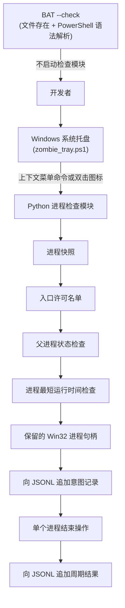
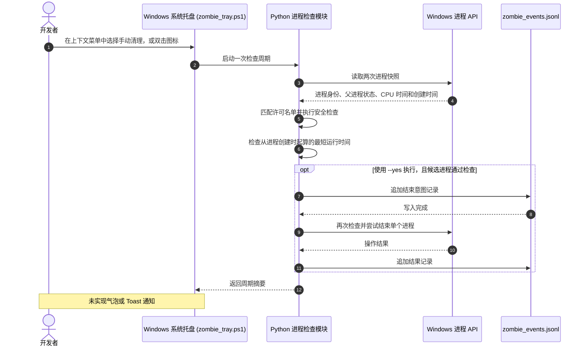

# Zombie Killer Tray

> 这是一个谨慎的 Windows 系统托盘工具，用于检查选定的 MCP（Model Context Protocol）服务器和语言服务器遗留进程，并可在检查通过后逐个尝试结束进程。它不会笼统地结束整个进程树。

[](NOTICE)
[](CHANGELOG.md)
[](https://github.com/dev-bricks/zombie-killer-tray/actions/workflows/tests.yml)
[](pyproject.toml)
[](#)
[](https://github.com/astral-sh/ruff)
[](LICENSE)
[](THIRD_PARTY_LICENSES.md)
[](https://github.com/dev-bricks)
[](https://github.com/open-bricks)
[](llms.txt)

[英语](README.md) · [德语](README_de.md) · [西班牙语](README_es.md) · [简体中文](README_zh.md) · [日本语](README_ja.md) · [Русский](README_ru.md)

> [!NOTE]
> 面向 AI 代理的项目行为、安装方法和使用边界机器可读说明见 [llms.txt](llms.txt)。

---

### 🧭 快速导航

- [1.概述及问题陈述](#overview--problem-statement)
- [2.系统架构与拓扑](#system-architecture--topology)
- [3.完整的生命周期序列](#complete-lifecycle-sequence)
- [4. 已记录的运行时防护措施](#governance--runtime-invariants)
- [5.目标用户和可发现性](#target-personas--discoverability)
- [6.范围和替代方案](#comparative-matrix--alternatives)
- [7.相关项目](#sibling-ecosystem--partner-tools)
- [8.特性与功能](#features--capabilities)
- [9. Windows 系统托盘界面与使用说明](#windows-tray-interface--ux)
- [10.要求和平台兼容性](#requirements--platform-compatibility)
- [11.启动和执行模式](#start--execution-modes)
- [12. 许可名单与候选进程规则](#allowlist-configuration--reaping-rules)
- [13. 审计日志与事件结构](#audit-logging--forensic-event-schema)
- [14.测试与质量保证](#testing--quality-assurance)
- [15.安全政策与隐私](#security-policy--privacy-governance)
- [16.第三方依赖许可证](#third-party-transparency--level-1-sbom)
- [17.开发、构建和封装](#development-build--packaging)
- [18. 许可证与归属说明](#statutory-notice--521-bgb--license-attribution)

---

<a id="sec-01"></a><a id="overview--problem-statement"></a><a id="ueberblick--problemstellung"></a><a id="überblick--problemstellung"></a>
## 1. 概述与问题背景

本地 AI 代理框架（Claude Code、Codex CLI、Gemini Antigravity、Kimi）或 IDE 意外断开或退出时，Model Context Protocol（MCP）后端服务器（`node.exe`、`python.exe`）和语言服务器（`rust-analyzer.exe`、`clangd.exe`、`gopls.exe`、`pylsp`）可能继续在后台运行。这些不再受客户端管理的进程可能逐渐累积，占用内存，并锁定活动代码目录中的文件。

Windows 上常用的管理员清理方法存在风险：
- 像 `taskkill /F /IM node.exe` 这样的 PowerShell 或 cmd 命令会不加区分地结束活动开发会话、前台服务器或 Web 工具。
- 递归结束进程树（`taskkill /T`）可能关闭整个终端会话或开发 IDE。
- 简单检查 PID 容易受到 Windows PID 重用竞态的影响：进程结束后、结束命令执行前，系统可能已将该 PID 分配给另一个进程。

`zombie-killer-tray` 采用多阶段检查。它比较进程身份、多个观测时的父进程状态、CPU 时间，以及从进程创建时起算的最短运行时间（默认 30 分钟）。Windows 端会在检查和结束尝试期间保留进程句柄，这有助于避免 PID 重用后误操作另一个进程。

---

<a id="sec-02"></a><a id="system-architecture--topology"></a><a id="systemarchitektur--topologie"></a>
## 2. 系统架构与拓扑

系统托盘程序和 Python 进程检查模块只检查一组有限的候选进程。启动器的 `--check` 选项只确认托盘脚本存在且能通过 PowerShell 语法解析；它不会启动检查模块或检查进程。



保留进程句柄有助于让检查和结束尝试始终针对同一个进程对象。本项目不声称这能消除操作系统中的所有竞态。

<a id="sec-03"></a><a id="complete-lifecycle-sequence"></a><a id="vollstaendiger-ausfuehrungsablauf"></a><a id="vollständiger-ausführungsablauf"></a>
## 3. 完整运行周期



必要检查失败时，模块会跳过该候选进程。最短运行时间从进程创建时起算，而不是从父进程退出时起算。使用 `--yes` 执行时，如果无法写入结束前的意图记录，就不会尝试结束进程。JSONL 记录采用普通追加写入，可以编辑。

<a id="sec-04"></a><a id="governance--runtime-invariants"></a><a id="sicherheitsmodell--governance-invarianten"></a>
## 4. 已记录的运行时防护措施

下表描述当前源码中可见的行为。这些实现说明不构成认证、操作系统沙箱，也不保证不会发生任何故障。

| 标识 | 当前行为 | 边界 |
|:---|:---|:---|
| **INV-LOCAL-01** | 经检查的一方进程检查代码和托盘源码中没有发出网络请求的代码。 | 这不是操作系统级网络阻断，也不构成对每项依赖或每台主机的独立保证。 |
| **INV-SEC-02** | `start-zombie-killer-admin.bat --check` 检查托盘文件，并请求 PowerShell 对其进行语法解析。 | 它不会扫描进程、验证 Python，也不会降低调用进程的安全令牌权限。 |
| **INV-PARENT-03** | 在尝试结束进程前，会重新采样并检查父进程状态。 | 检查失败或不完整时会跳过候选进程。 |
| **INV-STABLE-04** | 模块比较两次进程观测结果，包括进程身份和 CPU 时间。 | 这会缩小候选范围，但不代表没有风险。 |
| **INV-HANDLE-05** | Windows 模块在检查及结束尝试期间保留进程句柄。 | 这有助于避免针对已重用的 PID 操作；它并未消除所有竞态。 |
| **INV-ALLOW-06** | 候选匹配使用一组有限的 MCP 和语言服务器入口。 | 许可名单不是通用进程管理器。 |
| **INV-NOTREE-07** | 模块尝试单独结束选定进程，而不是递归结束整个进程树。 | 这不意味着所有进程都符合条件，也不保证操作成功。 |
| **INV-AUDIT-08** | 使用 `--yes` 执行时，会先追加结束意图记录；若写入失败，就取消该次结束尝试。 | JSONL 文件是普通的本地追加日志，不具备防篡改保证。 |
| **INV-AGE-09** | 要求进程从创建起达到最短运行时间。默认值为 1,800 秒（30 分钟），具体取决于支持的设置。 | 它不计算进程成为孤儿后的时间。 |
| **响应时间** | `SECURITY.md` 列出了安全问题报告说明。 | 不承诺响应或分诊时限。 |

<a id="sec-05"></a><a id="target-personas--discoverability"></a><a id="zielgruppen--auffindbarkeit"></a>
## 5. 目标用户与使用场景

`zombie-killer-tray` 是一款 Windows 工具，适合需要定期检查一小组 MCP 和语言服务器进程的开发者。

| 用户场景 | 常见顾虑 | 本项目的作用 |
|:---|:---|:---|
| **AI 与多代理开发者** | 客户端意外关闭后，匹配的后端进程可能仍在运行。 | 检查选定入口，并在尝试结束前验证配置的进程及父进程状态条件。 |
| **Windows 工作站维护者** | 仅按名称大范围清理可能误伤其他工作负载。 | 使用许可名单限制候选，并比较多次观测结果。 |
| **语言服务器用户** | 编辑器关闭后，语言服务器可能仍在运行。 | 检查父进程状态和最短运行时间；不推断进程何时成为孤儿。 |
| **检查本地进程数据的开发者** | 日志可能暴露命令行参数和本地路径。 | 写入本地 JSONL 记录；用户应按需保护和检查这些文件。 |

#### 搜索词
- **英语 (EN):** `windows mcp process cleanup`、`orphaned language server windows`、`node mcp server cleanup`、`zombie-killer-tray`
- **德语 (DE)：** `Windows-MCP-Prozesse prüfen`、`verwaiste Sprachserver unter Windows`、`MCP- und Sprachserverprozesse bereinigen`

<a id="sec-06"></a><a id="comparative-matrix--alternatives"></a><a id="vergleichsmatrix--alternativen"></a>
## 6. 范围与替代方案

本项目只处理一种有限的工作流程：检查配置的一组 Windows MCP 和语言服务器候选进程，并可在检查后尝试逐个结束。系统自带的进程工具可用于手动检查和由用户发起的操作。自定义脚本的匹配与安全逻辑各不相同。本 README 不对第三方产品的性能、隐私、安全或功能作出评价。

<a id="sec-07"></a><a id="sibling-ecosystem--partner-tools"></a><a id="geschwister-oekosystem--partner-tools"></a><a id="geschwister-ökosystem--partner-tools"></a>
## 7. 相关项目

以下链接指向相关开发组织中的项目。列出这些项目不代表存在技术集成或共享运行时。

- [CareCenter-for-Codex](https://github.com/dev-bricks/CareCenter-for-Codex) - `dev-bricks`
- [safe-start-for-codex](https://github.com/dev-bricks/safe-start-for-codex) - `dev-bricks`
- [MethodenAnalyser](https://github.com/dev-bricks/MethodenAnalyser) - `dev-bricks`
- [ellmos-filecommander-mcp](https://github.com/ellmos-ai/ellmos-filecommander-mcp) - `ellmos-ai`
- [ellmos-codecommander-mcp](https://github.com/ellmos-ai/ellmos-codecommander-mcp) - `ellmos-ai`
- [ellmos-controlcenter-mcp](https://github.com/ellmos-ai/ellmos-controlcenter-mcp) - `ellmos-ai`
- [n8n-manager-mcp](https://github.com/ellmos-ai/n8n-manager-mcp) - `ellmos-ai`
- [CloudLockFixer](https://github.com/file-bricks/CloudLockFixer) - `file-bricks`
- [DokuZen](https://github.com/doc-bricks/DokuZen) - `doc-bricks`

<a id="sec-08"></a><a id="features--capabilities"></a><a id="kernfunktionen--faehigkeiten"></a><a id="kernfunktionen--fähigkeiten"></a>
## 8. 功能与能力

- **进程句柄检查 (INV-HANDLE-05)：** Windows 模块在检查和结束尝试期间保留进程句柄。这有助于让操作继续指向已观测到的进程对象，但不代表操作系统中的所有竞态都不可能发生。
- **两次观测 (INV-STABLE-04)：** 模块比较两次间隔等待的进程身份和 CPU 时间。候选进程发生变化或未通过检查时会被跳过。
- **父进程状态检查 (INV-PARENT-03)：** 在周期检查期间及尝试结束前检查父进程状态。
- **本地 JSONL 记录 (INV-AUDIT-08)：** 使用 `--yes` 执行时，会在尝试结束前追加意图记录，之后再记录结果。意图记录写入失败时会取消该次尝试。日志可以编辑。
- **最短运行时间 (INV-AGE-09)：** 候选进程必须达到从创建时起算的设定时间。默认值为 1,800 秒（30 分钟）；界面提供有限的一组选项。
- **启动器语法检查：** `start-zombie-killer-admin.bat --check` 检查托盘脚本是否存在并用 PowerShell 解析。它不会启动 Python 模块，也不会检查进程表。
- **网络行为：** 经检查的一方进程检查代码和托盘代码中没有发出网络请求的路径。程序不会安装操作系统级网络阻断；本 README 不声称存在操作系统强制实施的网络边界。

<a id="sec-09"></a><a id="windows-tray-interface--ux"></a><a id="windows-tray-bedienoberflaeche--benutzererlebnis"></a><a id="windows-tray-bedienoberfläche--benutzererlebnis"></a>
## 9. Windows 系统托盘界面与使用说明

托盘程序使用 PowerShell WinForms 和 Windows 通知区域图标。

- **手动清理：** 上下文菜单提供手动清理命令。双击托盘图标也会启动一次手动检查；单击不会启动该操作。
- **上下文菜单：** 可设置自动检查、检查间隔、最短运行时间和界面语言，也可打开本地日志或退出托盘程序。
- **六种界面语言：** 菜单、工具提示和语言选择器支持英语、德语、西班牙语、简体中文、日语和俄语。首次选择依据 Windows 界面区域设置，无法匹配时使用英语。所选语言保存到 `zombie_state.json`；技术日志仍为英文。
- **检查间隔：** 菜单提供 5/10/20/30/60 分钟、3/5/10/15/20 小时或 24 小时；默认间隔为 30 分钟。
- **最短运行时间：** 菜单提供 5/10/15/30/60 分钟或 2/6/12/24 小时；默认值为 30 分钟。模块的下限仍为最短运行时间 30 秒、检查间隔 3 秒；菜单只显示受支持的选项。
- **通知：** 托盘程序通过图标、工具提示和上下文菜单提供信息；未实现气泡通知或 Toast 通知。
- **退出：** 退出时会关闭托盘程序并停止它自己启动的后台工作进程；不会向候选进程发送结束命令。

<a id="sec-10"></a><a id="requirements--platform-compatibility"></a><a id="voraussetzungen--plattform-kompatibilitaet"></a><a id="voraussetzungen--plattform-kompatibilität"></a>
## 10. 要求与平台兼容性

- **操作系统：** 64 位 Windows 10 或 Windows 11。
- **Python：** 按 `pyproject.toml` 声明，需要 Python 3.12 或更高版本；当前工作流在 Windows 上测试 Python 3.12。
- **PowerShell：** Windows 上的 Windows PowerShell 5.1 或 PowerShell 7。
- **运行依赖：** 启动 Python 进程检查模块前，请在仓库根目录执行 `python -m pip install -r requirements.txt` 安装所声明的依赖。
- **权限：** 普通托盘运行时，批处理启动器会请求管理员权限。`--check` 只执行上述文件存在性和 PowerShell 语法检查；不会修改当前安全令牌，也不会检查进程。

<a id="sec-11"></a><a id="start--execution-modes"></a><a id="start--ausfuehrungsmodi"></a><a id="start--ausführungsmodi"></a>
## 11. 启动与执行模式

### 1. 启动托盘程序

双击 `start-zombie-killer-admin.bat`。启动器会请求 Windows 用户账户控制（UAC）提升权限，然后启动托盘程序：

```bat
start-zombie-killer-admin.bat
```

### 2. 检查启动器脚本

```bat
start-zombie-killer-admin.bat --check
```

此操作只检查托盘脚本是否存在并能否通过 PowerShell 语法解析。它不会启动托盘程序、验证 Python、检查进程，也不会降低调用进程的权限令牌。

### 3. 使用 Python CLI 预览候选进程

```powershell
# 只读扫描候选进程
python zombie_killer.py scan

# 预览一次清理周期，不执行结束操作
python zombie_killer.py reap --min-age 900
```

CLI 支持 `scan`、`reap`、`watch` 和 `broker-report` 操作。只有提供 `--yes` 时，`reap` 或 `watch` 才会尝试结束进程。启用该执行模式前，请检查代码和候选进程。

### 4. 使用已安装的 Python 包

发行包名称为 `zombie-killer-tray`。仓库中的包位于 `src/zombie_killer_tray/`：

```bash
python -m zombie_killer_tray scan
```

模块会将 JSONL 日志和工作进程错误文件写入当前进程工作目录（`Path.cwd()`）。托盘程序将其工作进程的工作目录设为仓库根目录；其他调用者或包使用者使用各自的当前工作目录。

<a id="sec-12"></a><a id="allowlist-configuration--reaping-rules"></a><a id="allowlist-konfiguration--reaping-regeln"></a>
## 12. 许可名单与候选进程规则

候选进程必须匹配 [`killer.py`](src/zombie_killer_tray/killer.py#L17-L26) 中定义的以下某一组入口：

- **LSP 可执行文件：** `rust-analyzer.exe`、`clangd.exe`、`gopls.exe`、`zls.exe`。
- **Node.js 入口：** `typescript-language-server`、`pyright-langserver`、`yaml-language-server`、`bash-language-server`、`vscode-json-languageserver`。
- **MCP 包：** `ellmos-filecommander-mcp`、`ellmos-codecommander-mcp`、`ellmos-controlcenter-mcp`、`ellmos-clatcher-mcp`、`ellmos-n8n-manager-mcp`、`n8n-manager-mcp`、`@modelcontextprotocol/server-filesystem`、`@modelcontextprotocol/server-memory`、`@modelcontextprotocol/server-sequential-thinking`、`@upstash/context7-mcp`。
- **Python 模块：** `pylsp`、`jedi_language_server`、`mcp_server_git`、`mcp_server_fetch`、`mcp_server_time`。

这些列表只规定入口匹配范围，不替代其他进程检查。模块还会在同一源码中检查进程身份、父进程状态、运行时间和其他安全条件。仅匹配入口并不足以使进程符合结束条件。

<a id="sec-13"></a><a id="audit-logging--forensic-event-schema"></a><a id="audit-protokollierung--forensisches-ereignis-schema"></a>
## 13. 审计日志与事件结构

模块会将 JSON 记录追加到当前进程工作目录下的 `zombie_events.jsonl`。托盘程序将其工作进程目录设为仓库根目录；其他调用者使用自己的当前工作目录。Git 会忽略此文件。以下是记录结构示例：

```json
{
  "at": 1790940000.0,
  "event": "terminate-intent",
  "child": {
    "pid": 14208,
    "ppid": 8192,
    "born": 134000000000000000,
    "cpu": 0,
    "exe": "node.exe",
    "argv": ["node.exe", "<local arguments omitted>"],
    "kind": "mcp",
    "parent_dead": true
  },
  "parent_last_observed": null
}
```

后续结果记录包含 `child`、`parent_last_observed`、`killed` 和 `reason`；周期摘要使用 `cycle_at`、`apply` 和 `count`。字段因事件而异。这些日志采用普通追加写入，可以编辑。日志可能包含进程标识符、可执行文件名、命令行参数和本地路径；请妥善保护。使用 `--yes` 执行时，如果无法追加意图记录，就会取消结束尝试。

<a id="sec-14"></a><a id="testing--quality-assurance"></a><a id="tests--qualitaetssicherung"></a><a id="tests--qualitätssicherung"></a>
## 14. 测试与质量检查

仓库包含 Python 测试、Ruff 检查以及 GitHub Actions 中的 Windows 检查。可在本地运行以下命令；结果取决于环境，不由静态徽章代表。

```powershell
# 运行测试
python -m pytest -ra -v .

# 运行兼容 unittest 的检查
python -m unittest -v test_zombie_killer
python -m unittest -v tests/test_metadata.py

# 运行 Ruff 检查
python -m ruff check .

# 编译 Python 源文件
python -m compileall -q .
```

<a id="sec-15"></a><a id="security-policy--privacy-governance"></a><a id="sicherheitsrichtlinie--datenschutz-governance"></a>
## 15. 安全与隐私

项目源码和日志具有不同的隐私属性：
- 经检查的一方进程检查代码和托盘代码中没有发出网络请求的代码。这只是源码观察结果，不是网络隔离功能，也不保证没有任何出站流量。
- `--check` 只检查托盘脚本是否存在并请求 PowerShell 进行语法解析。它不会枚举或检查进程，也不会修改调用进程的安全令牌。
- 本地 JSONL 和诊断日志可能包含进程标识符、可执行文件名、命令行参数、时间戳和路径。请将其视为可能敏感的本地数据。
- 安全问题报告说明见 `SECURITY.md`。本 README 不声称任何特定邮箱有人监控，也不承诺响应或分诊时限。

<a id="sec-16"></a><a id="third-party-transparency--level-1-sbom"></a><a id="drittanbieter-transparenz--level-1-sbom"></a>
## 16. 第三方直接依赖的许可证

`THIRD_PARTY_LICENSES.md` 和纯文本文件 `THIRD_PARTY_LICENSES.txt` 汇总部分直接运行依赖和开发依赖及其记录的许可证。该概览仅涉及列出的直接依赖，不是完整的传递依赖 SBOM，也不是法律认证。项目元数据将 `psutil` 声明为运行依赖；其上游许可证为 BSD-3-Clause。

<a id="sec-17"></a><a id="development-build--packaging"></a><a id="entwicklung-build--packaging"></a>
## 17. 开发、构建与打包

Python 包元数据在 `pyproject.toml` 中声明；项目使用配置的 PEP 517 后端构建：

```powershell
# 安装运行依赖
python -m pip install -r requirements.txt

# 安装已声明的开发依赖
python -m pip install -e .[dev]

# 安装构建前端工具
python -m pip install build

# 构建源码包和 wheel 分发包
python -m build
```

<a id="sec-18"></a><a id="statutory-notice--521-bgb--license-attribution"></a><a id="gesetzlicher-hinweis--521-bgb--lizenz-attribution"></a>
## 18. 许可证与归属说明

本项目依据 [MIT License](LICENSE) 发布。Copyright (c) 2026 Lukas Geiger、dev-bricks 和 open-bricks 生态体系。

本节不对适用于本项目的法定保证或责任规则作具体法律解释。
